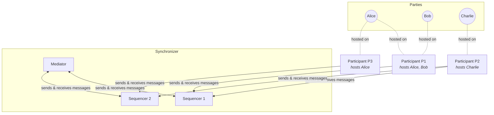

<picture>
 <source media="(prefers-color-scheme: dark)" srcset="https://github.com/digital-asset/.github/raw/main/images/Canton - Horizontal-stack-Logo-White.png">
 
</picture>

  

Canton is a next-generation Daml ledger interoperability protocol that implements Daml's built-in models of
authorization and privacy faithfully.

* By partitioning the global state it solves both the privacy problems and the scaling bottlenecks of platforms such as
  a single Ethereum instance.

* It allows developers to balance auditability requirements with the right to forget, making it well-suited for building
  GDPR-compliant systems.

* Canton handles authentication and data transport through our so-called synchronizers.

* Synchronizers can be deployed at will to address scalability, operational or trust concerns.

* Synchronizers are permissioned but can be federated at no interoperability cost, yielding a virtual global ledger that
  enables truly global workflow composition.

Refer to the [Canton Whitepaper](https://www.canton.io/publications/canton-whitepaper.pdf) for further details.

## Architecture

The diagram below shows how participants, sequencers, and mediators interact within a single synchronizer.

Key points:

- **Participant nodes never communicate directly** with each other; all messages flow through sequencers.
- **Sequencers** provide a total-order multicast with privacy: recipients do not learn the sender's identity.
- The **mediator** coordinates a two-phase commit protocol to achieve consensus, connecting to sequencers (not directly to participants).
- A party can be **multi-hosted** across several participant nodes (e.g., Alice on P1 and P3).
- Participants can connect to **multiple synchronizers** to address scalability, regulatory, or trust requirements. Contracts can be reassigned between synchronizers.

For the full architecture reference, see the [in-repo documentation](docs-open/src/sphinx/overview/explanations/canton/protocol.rst)
or the published [Canton documentation](https://docs.digitalasset.com/).

## Documentation

Please refer to the [Documentation](https://docs.digitalasset.com/) for
for instructions on how to operate a participant node or a synchronizer.

## Development

Please read our [CONTRIBUTING guidelines](CONTRIBUTING.md).
