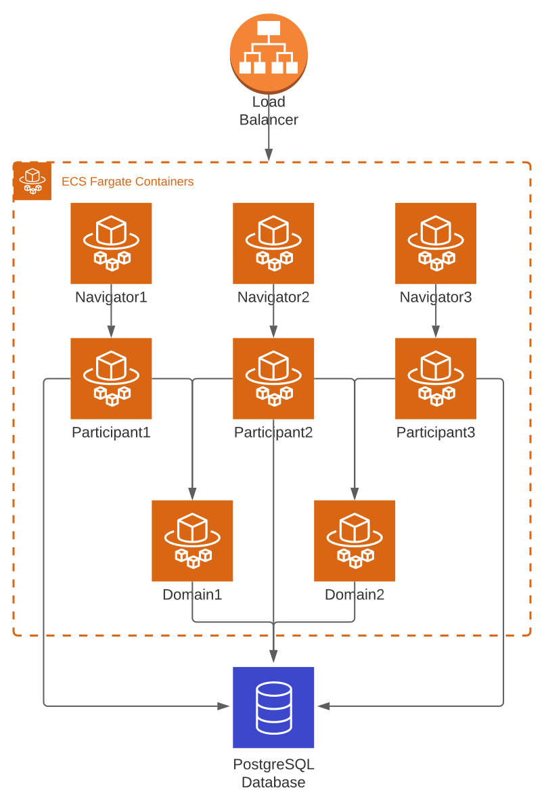
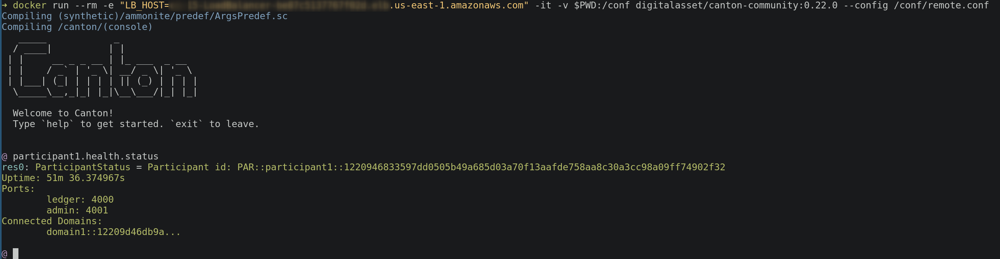

# Canton AWS CloudFormation Deployment

## Purpose

This presents an example AWS CloudFormation deployment template for deploying a multi-node Canton topology to AWS.

[](https://lucid.app/lucidchart/6a3c1fb2-f58c-4d5d-bd0f-1b9153b60dd7/edit?beaconFlowId=4585C3F48181BDE0&page=0_0#)

 * Three Canton Participants and two Canton Domains are connected.
 * Participant1 and Participant2 is connected to Domain1.
 * Participant2 and Participant3 is connected to Domain2.
 * Each Participant is fronted by an instance of [Daml Navigator](https://docs.daml.com/tools/navigator/index.html) to allow exploring their view of the Virtual Global Ledger.
 * Each node has its own database but all are hosted on the same PostgreSQL instance (each application has a dedicated user only permitting access to their database).

To allow generating configuration and creating databases based on values from the CloudFormation template parameters they are provisioned using [AWS Lambda Functions](https://aws.amazon.com/lambda/) during the deployment.

## Limitations

 * All Canton APIs are exposed publicly without authentication.
   For any moderately real use either the load balancer should limit access or [client authentication should be enabled](https://www.canton.io/docs/stable/user-manual/usermanual/static_conf.html#api-configuration).


## Deployment

 * Click `Create Stack` in the [AWS CloudFormation Console](https://console.aws.amazon.com/cloudformation/home) and specify the Template source to be the Amazon S3 URL: `https://canton-aws-quickstart.s3.amazonaws.com/canton.yaml`.
 * Enter a stack name and specify a password for the databases (ensure to meet the constraints in each field description).
 * The default settings for the remainder of the configuration should be sufficient.
 * Finally acknowledge that the template may create resources with custom names and click `Create Stack`.
 * The deployment should run through in about 15 minutes and will show a status of `CREATE_COMPLETE` once ready.

## Usage

After stack is provisioned, in the _Outputs_ section of the CloudFormation Console you can find the AWS NLB DNS name together with ports for all services. 
For example `http://your-load-balancer.elb.eu-central-1.amazonaws.com:4100` will bring up Navigator for participant1.

The default port assignments are as follows:

| Node | Service | Port |
|------|---------|------|
|domain1|public-api|3000|
|domain1|admin-api|3001|
|domain1|public-api|3010|
|domain1|admin-api|3011|
|participant1|public-api|4000|
|participant1|admin-api|4001|
|participant1|navigator|4100|
|participant2|public-api|4010|
|participant2|admin-api|4011|
|participant2|navigator|4200|
|participant3|public-api|4020|
|participant3|admin-api|4021|
|participant3|navigator|4300|


## Remote Administration

The supplied [`remote.conf`](./remote.conf) Canton configuration can be used to remotely administer all deployed Canton nodes.
To run using docker execute the following from a directory container the `remote.conf` file:

```sh
docker run --rm -it \
  -e "LB_HOST=your-load-balancer-host.elb.us-east-1.amazonaws.com" \
  -v $PWD:/conf digitalasset/canton-open-source:2.0.0 --config /conf/remote.conf
```



## Interacting with the Daml Ledger API

### Deploying the Model

Upload the desired dar file from any project with:

`daml ledger upload-dar --host <ledger_api_host> --port <ledger_api_port> <path_to_dar_file>`

This step will have to be repeated for any nodes that should be in communication with one another.

### JSON API

In order to interact with the models using a JSON/REST API, we can use Damls JSON Api:

```
daml json-api \
  --ledger-host <ledger_api_host> \
  --ledger-port <ledger_api_port> \  
  --http-port <port_for_json_api> \   
  --package-reload-interval 5s \
  --allow-insecure-tokens
```

In this case we are allowing insecure tokens to facilitate testing and swapping between acting parties in the ledger. For this we can use [JWT](https://jwt.io/) to generate tokens based on this JSON argument:

```json
{
    "https://daml.com/ledger-api": {   
        "ledgerId": "<ledger_id>",
        "applicationId": <application_id>,
        "actAs": [
        <party_identifier>
        ]
    }
}
```

Where:
-  __ledger_id__ - Name of the service defined on node configuration for canton
-  __application_id__ - Identifier to be used for commands submitted using the token. Configuration defaults to "HTTP-JSON-API-Gateway"
-  __party_identifier__ - Identifier of the party to act in the ledger, as present in "party" field for Daml Assistant command `daml ledger list-parties --host <ledger_api_host> --port <ledger_api_port>`