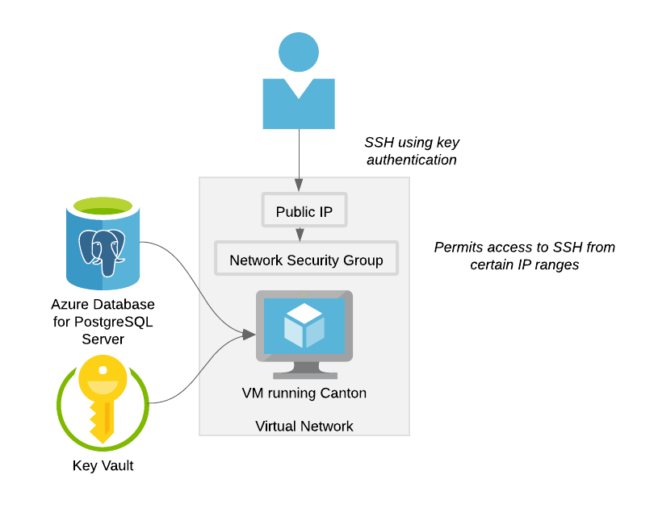
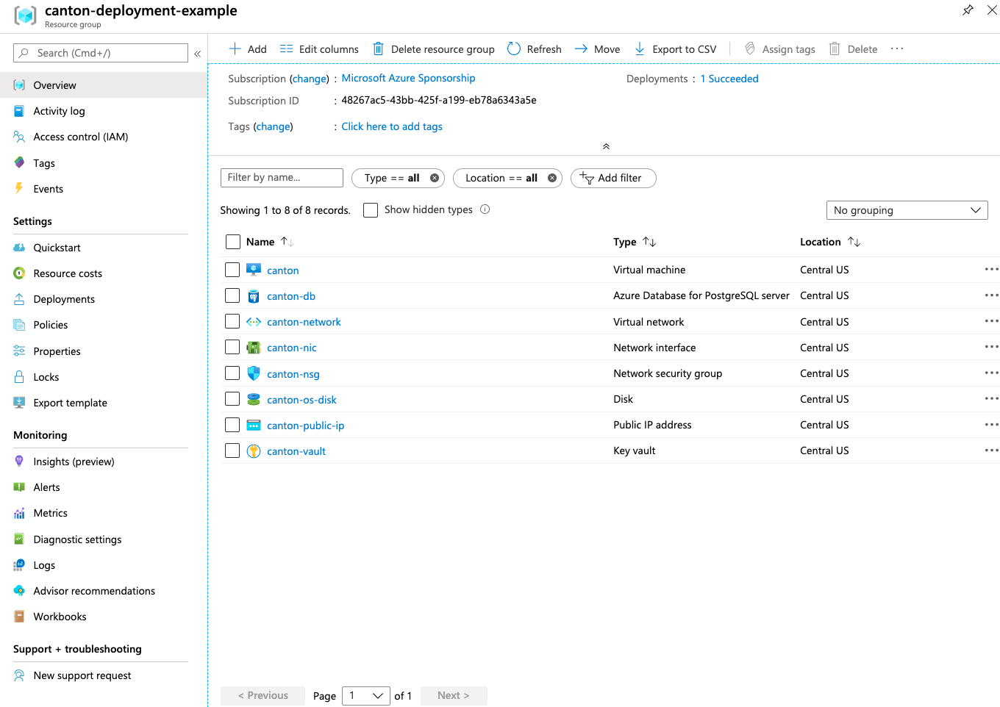
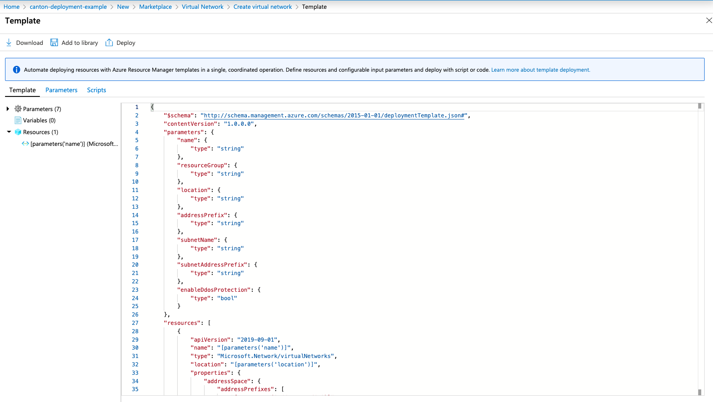
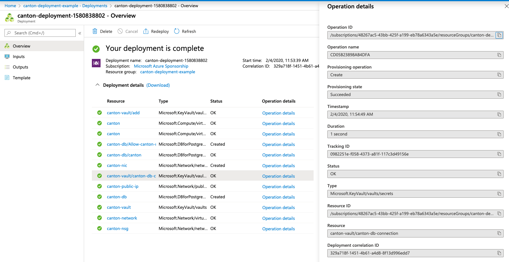

# Canton Deployment on Azure

Canton itself is a simple Java binary requiring only JVM11+ to run, and is typically paired with a Postgres database for storage.
This demonstrates deploying Canton within Azure using:
 - a simple Ubuntu virtual machine
   - configured using [cloud-init](https://cloudinit.readthedocs.io/en/latest/topics/examples.html)
   - running OpenJDK 11
   - downloads a [Canton release from Github](https://github.com/digital-asset/canton/releases) on first boot
   - runs Canton as a [systemd unit](https://www.freedesktop.org/software/systemd/man/systemd.unit.html)
 - [Azure Database for PostgreSQL](https://docs.microsoft.com/en-us/azure/postgresql/)
 - [Azure Key Vault](https://docs.microsoft.com/en-us/azure/key-vault/)
   - for securely storing and sharing the database connection string with the virtual machine

If following these steps the Virtual Machine will expose its SSH server on a public IP but limited to a configured source IP address range.
The SSH server will be configured to use key authentication.
The Canton instance will be available to other applications running within the virtual network,
or can be exposed to a local machine for development using SSH port forwarding.

[](https://www.lucidchart.com/documents/edit/b97b24e3-10cb-4441-a561-4ab2879af97d/mXwzAnnOLpm1)

These templates are intended to be used to easily deploy a Canton topology for demonstrations or testing easy. We recommend that a deployment intended for real use and containing senstive data that further review and additions should be made to thoroughly secure your node. To further secure the virtual network where Canton is running the public IP could be removed and a [VPN Gateway](https://docs.microsoft.com/en-us/azure/vpn-gateway/) added instead. Database access should also be tightened.

# Steps

## Prerequisites

Ensure that you have the azure-cli installed ([instructions](https://docs.microsoft.com/en-us/cli/azure/install-azure-cli?view=azure-cli-latest))
and logged into the Azure subscription you want to deploy to (`az login`).

## Security

By default this deployment will expose the virtual machine on a public IP address.
However a network security group policy prevents all traffic to the machine except port 22 for ssh when coming from certain IP address ranges.
The allowable source addresses are set using the parameter `sourceAddressPrefixes` where the items are a CIDR address ranges.
To set just your IP use the value `your-ip/32` (although remember this is your public ip, so this may likely still permit everyone within your LAN to connect to the SSH server).

To find the public IP of your current location to use to connect to the canton virtual machine run:

```sh
dig +short myip.opendns.com @resolver1.opendns.com
```

To authenticate with the SSH server you will need a key pair.
If you are uncomfortable using your system key pair or would like to be able share the private key with others so they can connect to your canton deployment,
create a new key pair using:

```sh
ssh-keygen -t rsa -b 4096
```

_Make sure to not override your current system key by specifying an alternative destination. It also appears only RSA keys are currently supported by the virtual machines._

## Create Resource Group

Everything we need to create to run canton in subsequent steps needs to be created in a resource group.

```sh
az deployment sub create \
  --name create-resource-group \
  --location centralus \
  --template-file templates/resource-group.json \
  --parameters name=canton-deployment location=centralus
```

## Canton Deployment

For the main canton deployment you need to specify a number of parameters to the Azure deployment tool.
If a parameter value starts with a `@` prefix then its value will be read from the supplied file path.

 * `nodeName`: the name of virtual machine to run the canton node and a prefix for all related resources
 * `topologyName`: name used for shared infrastructure which can be used to run one or more nodes
 * `cantonVersion`: version of canton to download and run on the virtual machine.
   Available versions can be found on the [Github Releases page](https://github.com/digital-asset/canton/releases).
 * `cantonConfig`: `@` then the file path of the [canton configuration](https://www.canton.io/docs/stable/user-manual/usermanual/static_conf.html) you want to use
   * Example configurations are provided in `canton-domain.conf` and `canton-participant.conf` to deploy a domain or participant respectively
   * You are also able to use your own configuration file.
     Currently only one node is supported as only a single database is provisioned.
     To use this database set the configuration to use a `postgres` database for storage and set its `url` property to `${CANTON_DB_URL}` (see the example configurations for details).
 * `cantonBootstrap`: `@` then the file path of the canton bootstrap script to use (can be replaced by your own for adding automated canton initialization steps)
 * `adminPublicKey`: `@` then the file path of the public key to use to authenticate ssh logins (typically `key-name.pub`)
 * `sourceAddressPrefix`: the IP address range as a [CIDR value](https://en.wikipedia.org/wiki/Classless_Inter-Domain_Routing) permitted to connect to the SSH server.
 * `cloudInit`: `@` then the path to a [cloud-init user data template file](https://cloudinit.readthedocs.io/en/latest/topics/examples.html) for bootstrapping the virtual machine.
   Typically just use `@templates/cloud-init.yaml` in all but advanced cases.

Once the deployment starts you will then be prompted for a password to use for your database account.
> It must contain between 8 and 128 characters. Your password must contain characters from three of the following categories: English uppercase letters, English lowercase letters, numbers (0 through 9), and non-alphanumeric characters (!, $, #, %, etc.).

```sh
az deployment group create \
  --name canton-deployment-$(date +%s) \
  --resource-group canton-deployment \
  --template-file templates/canton.json \
  --parameters cloudInit=@templates/cloud-init.yaml cantonConfig=@templates/canton-domain.conf cantonBootstrap=@templates/bootstrap.canton \
    adminPublicKey=@PATH-TO-PUBLIC-KEY sourceAddressPrefix="your-ip-address/32" cantonVersion=0.27.0 nodeName=domain1
```

**Important Notes**:
 - Please ensure that you're using a unique name for the resources and not reusing a name you've previously used (even if you've deleted the associated resources).
   If you don't, Azure will likely struggle to deploy some resources due to Conflict errors but this will likely result in the deployment stalling and eventually timing out after roughly 20 minutes.

Once deployed you can find the public IP of the instance using the command:
```sh
az network public-ip list --output table --query "[].{name:name, ipAddress:ipAddress}"
```

You can connect to this instance using:
```sh
ssh -i path-to-private-key canton-admin@your-public-ip-address
```

## Deploying Multiple Nodes

After deploying your first node more can be deployed that will reuse resources in your resource group (the database server, the network and the network security group). Simply rerun the same deployment ensuring the `topologyName` parameter name renames the same (this uses a default if not previously supplied), add `deployInfrastructure` to equal `false`, and change the `nodeName` parameter for your additional node. This will create a new virtual machine and database but be available on the same network.

## Viewing Resources in Azure Portal

Once deployed all the resources can be found in the [Resource Group within the Azure Portal](https://portal.azure.com/#blade/HubsExtension/BrowseResourceGroups).

[](https://portal.azure.com/#blade/HubsExtension/BrowseResourceGroups)

## Using Canton

The default canton configuration files (`canton-domain.conf` and `canton-participant.conf`) only bind to `127.0.0.1`.
To access this remotely use ssh port forwarding:

```sh
ssh -i path-to-private-key -NL 8080:127.0.0.1:8080 canton-admin@your-public-ip-address
```

This can now be used like a local port, for instance to connect a local participant to a domain hosted in azure use the canton console commands:

```scala
nodes.local start


participant1.domains.connect("azure", "http://localhost:8080")

participant1.health.ping(participant1)
```


# Developing and Testing Deployment Changes

The JSON configuration files used for deployment are Azure Resource Templates. If editing these the following documentation will be useful:

 - [Template Overview](https://docs.microsoft.com/en-us/azure/azure-resource-manager/templates/overview)
 - [Template file structure](https://docs.microsoft.com/en-us/azure/azure-resource-manager/templates/template-syntax) and all subsequent sections in the `Create templates` how to guide
 - [az group deploy command](https://docs.microsoft.com/en-us/azure/azure-resource-manager/templates/deploy-cli) and its command line parameters

The schemas and documentation for particular resource types can be found within the [Azure Templates Directory](https://docs.microsoft.com/en-us/azure/templates/).

However for getting started with a resource type the easiest thing to do is to manually create an instance in the [Azure Portal UI](https://portal.azure.com) and on the final stage just export the generated resource template it provides.
The provided template will likely require modification to be reusable in a script but provides a good starting point.



Deploy your template with the `az group deploy` command and just ensure that all of your resource names are unique (to keep this easy just specify a single name and then default all resources to use this as a prefix).
Basic errors such as syntax errors, invalid schemes or bad function calls will be caught almost immediately.
Errors with the deployments themselves may take longer to surface but typically canton deployments only take 3-5 minutes to complete successfully.

The `az group deploy` command will print any error messages it encounters.
Sadly the line positions it provides are mostly utter gibberish (I assume they are based on the backing HTTP commands that are happening, not on the template itself).
However you can view the steps the deployment has taken within the Azure Portal by going to the Resource Group and then looking at the Deployments tab.
Clicking on the failing step will provide the full context of the operation that has failed and can typically be used to pinpoint the specific error.



Once you have completed your development and testing simply delete the entire resource group which will immediately tear down all resources it contains.
