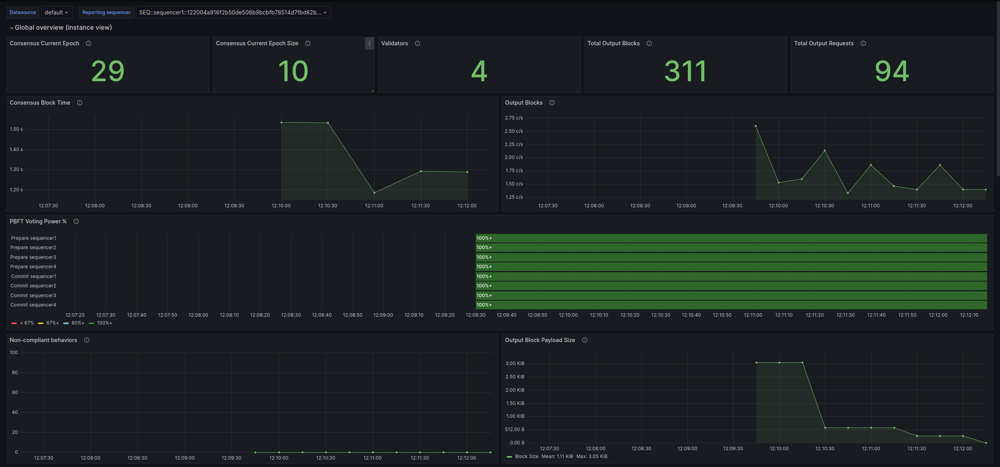
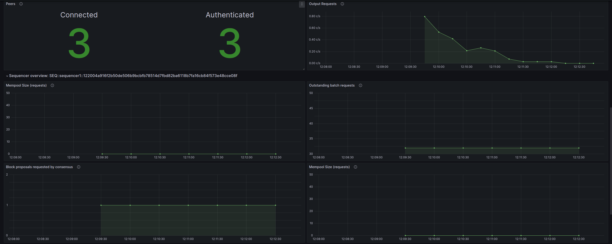
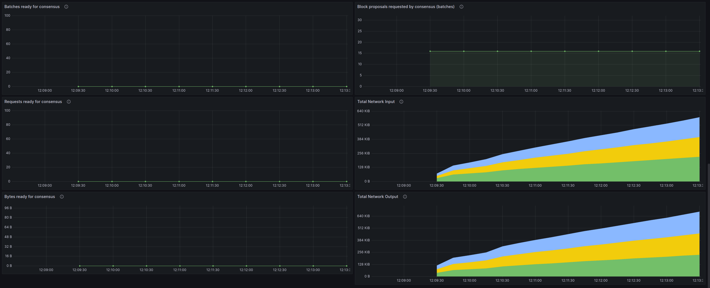

# BFT Sequencers - Observability Example

Observability example of a Canton BFT synchronizer configured with 4 BFT sequencers based on the
[Daml Enterprise Observability Example](https://docs.daml.com/canton/usermanual/monitoring.html#hands-on-with-the-daml-enterprise-observability-example)
in the official documentation.

## 🚦 Prerequisites 🚦

* [**Docker**](https://docs.docker.com/get-docker/).
* [**Docker Compose V2 (as plugin `2.x`)**](https://github.com/docker/compose).
* Build Canton as follows:
  * `sbt packRelease`
  * `cd community/app/target/release/canton`
  * Copy [`Dockerfile`](canton/Dockerfile) there.
  * `docker build . -t canton-community:latest` (or anything matching your [.env](.env)'s `CANTON_IMAGE`).
* A matching ledger API test tool ("LAPITT"):
  * From the **repository root**, build it with `sbt ledger-test-tool-2-1/assembly`.
  * Copy it as `lapitt.jar` into the release pack folder you are working from (created by `sbt packRelease`):
    ```sh
    cp community/ledger-test-tool/.1/target/scala-2.13/ledger-api-test-tool-2.1-*.jar \
       community/app/target/release/canton-open-source-*/examples/13-observability/lapitt.jar
    ```

⚠️ **Docker compose V1 is deprecated and incompatible with this project**, check [Docker documentation](https://docs.docker.com/compose/migrate/).
One sign you are using the wrong version is the command syntax with a dash instead of a space:
`docker compose` (V2 ✔️) VS `docker-compose` (V1 ❌).

## Quickstart

To quickly get up and running, **make sure you have all the prerequisites installed** and then:

* Ensure you have enough CPU/RAM/disk to run this project. **Docker Desktop must be configured with at least 12 GiB of memory** (Settings → Resources → Memory). The full stack allocates ~6 GiB to the main Canton node, ~2 GiB each to sequencer4 and sequencer5, plus memory for PostgreSQL, Prometheus, Grafana, Loki and Promtail. If a container is OOM-killed (exit code 137), increase Docker Desktop's memory limit.
* Start everything: `docker compose -f docker-compose-canton.yml -f docker-compose-observability.yml up`
  (or simply `make up` if you have `make` installed)
* Create workload: there are various scripts that generate load, run them in different terminals:
  * `scripts/generate-load.sh` (runs Ledger API conformance tests in a loop; requires `lapitt.jar` : see [Prerequisites](#-prerequisites-))

> ⚠️ **`generate-load.sh` is expected to report some test failures, this is normal.**
> The purpose of this script is to **generate observable load** on the Canton nodes so that metrics,
> traces and logs appear in Grafana, Jaeger and Loki. It is not a correctness test suite for this
> environment. Several Ledger API conformance tests are known to fail here due to inherent
> limitations of this Docker-based observability setup.
>
> None of these affect the observability data visible in Grafana/Jaeger/Loki, which is the actual
> goal of this example.
* Log in to the Grafana at [http://localhost:3000/](http://localhost:3000/) using the default
user and password `digitalasset`. After you open any dashboard, you can lower the time range to 5 minutes and
refresh to 10 seconds to see results quickly.
* After you stop, you must [cleanup everything](#cleanup-everything) and start fresh next time:
`docker compose -f docker-compose-canton.yml -f docker-compose-observability.yml down --volumes`

The "BFT ordering" dashboard should look like this:




")

## Components

Docker Compose will start the following services:

* PostgreSQL database server
* Canton all-in-one node (`canton` container) hosting:
  * 2 participants (`participant1` on gRPC 10011 / HTTP 10013 / admin 10012, `participant2` on gRPC 10021 / HTTP 10023 / admin 10022)
  * 2 mediators
  * 3 BFT sequencers (`sequencer1`, `sequencer2`, `sequencer3`)
* `sequencer4` : 4th BFT sequencer (separate container)
* `sequencer5` : 5th BFT sequencer, dormant until [onboarded](#onboarding-sequencer5) (separate container)
* Jaeger all-in-one (distributed tracing, UI at http://localhost:16686/)
* Monitoring
  * Prometheus `3.x`
  * Grafana `9.x`
  * Node Exporter
  * PostgreSQL Exporter
  * Loki + Promtail `2.x`

Prometheus and Loki are [preconfigured as datasources for Grafana](grafana/datasources.yml). You can add other
services/exporters in the [Docker compose file](docker-compose-observability.yml) and scrape them changing the
[Prometheus configuration](prometheus/prometheus.yml).

## Startup

Start everything (blocking command, show all logs):

```sh
docker compose -f docker-compose-canton.yml -f docker-compose-observability.yml up
```

Or simply `make up` if you have `make` installed.

Start everything (detached: background, not showing logs)

```sh
docker compose -f docker-compose-canton.yml -f docker-compose-observability.yml up -d
```

Or simply `make upd`.

If you see the error message `no configuration file provided: not found`
please check that you are placed at the root of this project.

### Starting a Canton Console

```sh
docker exec -it daml_observability_canton_console bin/canton -c /canton/config/console.conf
```

For example:

```
@ participant1.synchronizers.list_registered().map(_._1.synchronizerAlias.unwrap)
res0: Seq[String] = Vector("observabilityExample")

@ sequencer1.bft.get_ordering_topology()
res1: com.digitalasset.canton.synchronizer.sequencer.block.bftordering.admin.SequencerBftAdminData.OrderingTopology = OrderingTopology(
  currentEpoch = 44L,
  sequencerIds = Vector(SEQ::sequencer1::1220e3f201ea..., SEQ::sequencer2::1220d2a694d0..., SEQ::sequencer3::1220c4427061..., SEQ::sequencer4::1220ba5cfe72...)
)

@ sequencer1.bft.get_peer_network_status(None)
res2: com.digitalasset.canton.synchronizer.sequencer.block.bftordering.admin.SequencerBftAdminData.PeerNetworkStatus = PeerNetworkStatus(
  endpoint statuses = Seq(
    PeerEndpointStatus(endpointId = Id(url = "http://0.0.0.0:31031", tls = false), health = PeerEndpointHealth(status = Authenticated(sequencerId = SEQ::sequencer2::1220d2a694d0...))),
    PeerEndpointStatus(endpointId = Id(url = "http://0.0.0.0:31032", tls = false), health = PeerEndpointHealth(status = Authenticated(sequencerId = SEQ::sequencer3::1220c4427061...))),
    PeerEndpointStatus(endpointId = Id(url = "http://0.0.0.0:31033", tls = false), health = PeerEndpointHealth(status = Authenticated(sequencerId = SEQ::sequencer4::1220ba5cfe72...)))
  )
)
```

#### Crashing a node (`sequencer4`)

Use `docker stop sequencer4` to stop the container. After a while, use `docker start sequencer4`,
and check Grafana if everything is back to normal. Alternatively, use the Docker UI (on Mac).

#### Onboarding `sequencer5`

```scala
val existingSequencers = Set[com.digitalasset.canton.console.InstanceReference](sequencer1, sequencer2, sequencer3, sequencer4)
val synchronizerAlias = "observabilityExample"
val synchronizerId = participant1.synchronizers.id_of(synchronizerAlias)
bootstrap.onboard_new_sequencer(synchronizerId.logical,sequencer5,sequencer1,existingSequencers,isBftSequencer = true)

// set up connections to new sequencer5
// sequencer5's connections are set up as part of the initial network config
import com.digitalasset.canton.synchronizer.sequencer.block.bftordering.core.BftBlockOrdererConfig.{EndpointId, P2PEndpointConfig}
import com.digitalasset.canton.config.RequireTypes.Port

sequencer1.bft.add_peer_endpoint(P2PEndpointConfig("sequencer5", Port.tryCreate(31034), None))
sequencer2.bft.add_peer_endpoint(P2PEndpointConfig("sequencer5", Port.tryCreate(31034), None))
sequencer3.bft.add_peer_endpoint(P2PEndpointConfig("sequencer5", Port.tryCreate(31034), None))
sequencer4.bft.add_peer_endpoint(P2PEndpointConfig("sequencer5", Port.tryCreate(31034), None))

// profit
sequencer5.health.wait_for_initialized()
```

#### Testing catch-up state transfer without crashing nodes

Because a remote console (i.e., remote instance references) is used here, nodes cannot be easily restarted.
The easiest way to trigger catch-up is to remove some of the connections (copy-paste ready):

```
import com.digitalasset.canton.synchronizer.sequencer.block.bftordering.core.driver.BftBlockOrdererConfig.{EndpointId, P2PEndpointConfig}
import com.digitalasset.canton.config.RequireTypes.Port
sequencer1.bft.remove_peer_endpoint(EndpointId("0.0.0.0", Port.tryCreate(31031), false))
sequencer3.bft.remove_peer_endpoint(EndpointId("0.0.0.0", Port.tryCreate(31031), false))
sequencer4.bft.remove_peer_endpoint(EndpointId("0.0.0.0", Port.tryCreate(31031), false))
sequencer2.bft.remove_peer_endpoint(EndpointId("0.0.0.0", Port.tryCreate(31030), false))
sequencer2.bft.remove_peer_endpoint(EndpointId("0.0.0.0", Port.tryCreate(31032), false))
sequencer2.bft.remove_peer_endpoint(EndpointId("0.0.0.0", Port.tryCreate(31033), false))
```

And then add them back:

```
sequencer2.bft.add_peer_endpoint(P2PEndpointConfig("0.0.0.0", Port.tryCreate(31030), None))
sequencer2.bft.add_peer_endpoint(P2PEndpointConfig("0.0.0.0", Port.tryCreate(31032), None))
sequencer2.bft.add_peer_endpoint(P2PEndpointConfig("0.0.0.0", Port.tryCreate(31033), None))
sequencer1.bft.add_peer_endpoint(P2PEndpointConfig("0.0.0.0", Port.tryCreate(31031), None))
sequencer3.bft.add_peer_endpoint(P2PEndpointConfig("0.0.0.0", Port.tryCreate(31031), None))
sequencer4.bft.add_peer_endpoint(P2PEndpointConfig("0.0.0.0", Port.tryCreate(31031), None))
```

## Stopping

* If you used a blocking `docker compose up`, just cancel via keyboard with `[Ctrl]+[c]`

* If you detached compose: `docker compose -f docker-compose-canton.yml -f docker-compose-observability.yml down`

### Cleanup Everything

Stop everything, remove networks and all Canton, Prometheus & Grafana data stored in volumes:

```sh
docker compose -f docker-compose-canton.yml -f docker-compose-observability.yml down --volumes
```

Or simply `make down`.

## Important Endpoints to Explore

* Prometheus: http://localhost:9090/
* Grafana: http://localhost:3000/ (default user and password: `digitalasset`)
* Jaeger: http://localhost:16686/ (distributed tracing)
* Participant 1 : gRPC Ledger API: `localhost:10011`, HTTP (JSON) Ledger API: http://localhost:10013/v2/parties
* Participant 2 : gRPC Ledger API: `localhost:10021`, HTTP (JSON) Ledger API: http://localhost:10023/v2/parties

> **Note:** The root URL (`/`) returns a 404 : use a valid API path. For example, [`/v2/version`](http://localhost:10013/v2/version) returns the Canton version and [`/v2/parties`](http://localhost:10013/v2/parties) lists known parties.

Check all exposed services/ports in the different [Docker compose YAML] files:
* [Canton](docker-compose-canton.yml)
* [Observability stack](docker-compose-observability.yml)

### Logs

```sh
docker logs daml_observability_canton
docker logs daml_observability_postgres
docker logs daml_observability_prometheus
docker logs daml_observability_grafana
```
You can open multiple terminals and follow logs (blocking command) of a specific container:

```
docker logs -f daml_observability_canton
docker logs -f daml_observability_postgres
docker logs -f daml_observability_prometheus
docker logs -f daml_observability_grafana
```

You can query Loki for logs [using Grafana in the `Explore` section](http://localhost:3000/explore?left=%7B%22datasource%22:%22loki%22%7D).

### Metrics

You can query Prometheus for metrics [using Grafana in the `Explore` section](http://localhost:3000/explore?left=%7B%22datasource%22:%22prometheus%22%7D).

## Configuration

### Prometheus

[`prometheus.yml`](prometheus/prometheus.yml) [[documentation]](https://prometheus.io/docs/prometheus/latest/configuration/configuration/)

Reload or restart on changes:
* Reload:
  * Signal: `docker exec -it daml_observability_prometheus kill -HUP 1`
  * HTTP: `curl -X POST http://localhost:9090/-/reload`
* Restart: `docker compose restart prometheus`

### Grafana

* Grafana itself: [`grafana.ini`](grafana/grafana.ini) [[documentation]](https://grafana.com/docs/grafana/latest/setup-grafana/configure-grafana/)
* Data sources: [`datasources.yml`](grafana/datasources.yml) [[documentation]](https://grafana.com/docs/grafana/latest/datasources/)
* Dashboard providers: [`dashboards.yml`](grafana/dashboards.yml) [[documentation]](https://grafana.com/docs/grafana/latest/administration/provisioning/#dashboards)

Restart on changes: `docker compose restart grafana`

#### Dashboards

All dashboards (JSON files) are auto-loaded from directory
[`grafana/dashboards/`](grafana/dashboards)

* Automatic: place your JSON files in the folder (loaded at startup, reloaded every 30 seconds)
* Manual: create/edit via Grafana UI

### Loki

* Loki itself: [`loki.yaml`](loki/loki.yaml) [[documentation]](https://grafana.com/docs/loki/latest/configure/)

Restart on changes: `docker compose restart loki`

* Promtail: [`promtail.yaml`](loki/promtail.yaml) [[documentation]](https://grafana.com/docs/loki/latest/send-data/promtail/configuration/)

Restart on changes: `docker compose restart promtail`

##### Examples Source

* Prometheus and Grafana [[source]](https://github.com/grafana/grafana/tree/main/public/app/plugins/datasource/prometheus/dashboards/)
* Node exporter full [[source]](https://grafana.com/grafana/dashboards/1860-node-exporter-full/)
* Loki and Promtail [[source]](https://grafana.com/grafana/dashboards/14055-loki-stack-monitoring-promtail-loki/)
