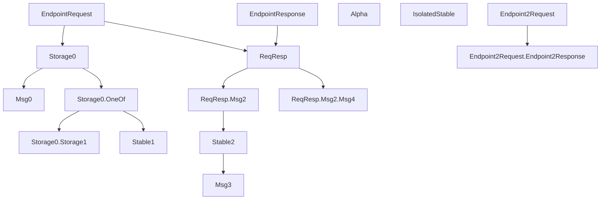

```mermaid
    flowchart TD
    EndpointRequest --> Storage0
    EndpointRequest --> ReqResp
    EndpointResponse --> ReqResp
    ReqResp --> ReqRespMsg2["ReqResp.Msg2"]
    ReqResp --> ReqRespMsg2Msg4["ReqResp.Msg2.Msg4"]
    ReqRespMsg2 --> Stable2
    Storage0 --> Msg0
    Storage0 --> Storage0OneOf["Storage0.OneOf"]
    Storage0OneOf --> Storage0Storage1["Storage0.Storage1"]
    Storage0OneOf --> Stable1
    Stable2 --> Msg3
    Alpha
    IsolatedStable
    Endpoint2Request --> Endpoint2Response["Endpoint2Request.Endpoint2Response"]
```
