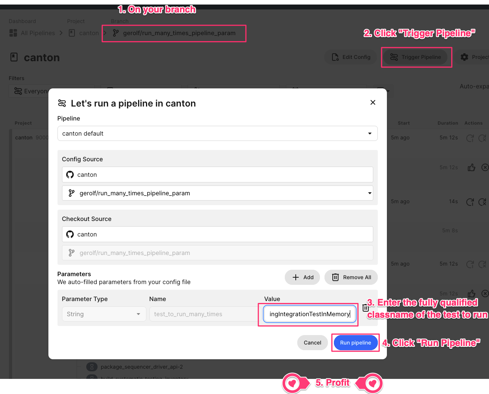

CI Usage
========

Canton uses CircleCI for continuous integration and deployment.
The configuration for the CI/CD pipeline lives in [.circleci](../.circleci).

# CI Cost

Keep in mind that our CI cost is quite high, and we appreciate any help to reduce it!
Therefore, if CI does not have to run on a commit,
either do not push the commit or make sure that the first line of the commit message ends with `[skip ci]`.

# Incremental Compilation
To speed up build time, CircleCi preloads class files from previous builds and incrementally compiles the source code.
To prevent creating corrupted builds, CircleCi will only load class files:
- that use the same libraries as the HEAD revision.
- that are built from the same branch or from the main branch.

Sometimes incremental compilation fails to compile,
in that case add the name of your branch to `.circleci/branches_to_be_fully_recompiled_in_ci.txt` to force a full compilation.

# Test Execution

Due to the huge amount of tests, tests need to be split across different test jobs.
We partition tests by required infrastructure, e.g.:

- Tests that require a Canton release
- ...
- Ordinary tests, i.e., none of the above

We also partition tests by topic:

- Ordinary tests
- Crash recovery tests
- Toxiproxy tests
- ...

The job in which a test is executed is mainly determined by the name of the test.
We have the following rules:

- Every test in `com.digitalasset.canton.integration.tests.crashrecovery` is executed by `crash_recovery_test`
- By default, a test is executed by the `test`, `sequential_test`, `stability_test`, `stability_sequential_test` and
  `test_protocol_version_dev` jobs.
- Every test in `com.digitalasset.canton.integration.tests.variations` is executed only by `variations_test`. These
  tests in themselves already introduce alterations in the config parameter space, so they don't need to be subjected
  to the same parameter changing cycle of jobs mentioned in the point above.

The current naming conventions can be looked up in `.circleci/config/commands/@test.yml`
and `.circleci/config/jobs/@test.yml`

Furthermore, note:

- Tests annotated with `@Ignore` or `ignore` won't be executed at all.
- Tests annotated with `@UnstableTest` or `UnstableTest` are only executed by `unstable_test` so that test failures are still reported as flaky.
  But such tests will not prevent merging of pull requests.

# Downloading All Artifacts From a CI Job

See [circleci Docs – Downloading all artifacts for a build on CircleCI](https://circleci.com/docs/artifacts/#downloading-all-artifacts-for-a-build-on-circleci).

*Hint*: You may have to export your personal CircleCI API token from your `.envrc.private` file.

# Run a Manual Job

Certain expensive jobs are not run by default on your branch (or main), and need to be kicked off manually.
To avoid crowding PRs with these manual jobs, they are now available to be kicked off from the `Trigger Pipeline`
button in CircleCI on your branch

1. Ensure that the jobs for your branch have finished running.
2. In CircleCI on your branch, click the `Trigger Pipeline` button.
3. In the `Parameters` section, select the text to run in the `Value` dropdown for the parameter `manual_job`.
4. Click the `Run Pipeline`.
5. Once approved, the selected job will be run.

> **NOTICE**: There is one caveat: triggering the pipeline manually cancels the currently running pipeline, including any currently running "manual_job" or “test flake many times”.
> **WARNING**: Do NOT run this with `main` as the `Checkout Source`, as this would cancel a currently running main build.


# Run a Test Many Times

To reproduce a "flake" (i.e., a test failing sometimes, but not always),
we have the capability to run a specific test many times on CircleCI.



1. In CircleCI on your branch, click the `Trigger Pipeline` button.
2. In the `Parameters` section, put the fully qualified classname in the `Value` textbox for the parameter `test_to_run_many_times`.
3. Click the `Run Pipeline`.
4. Once approved, the tests will be run 5 times on each one of 10 build runners (50 times in total).

> **NOTICE**: There is one caveat: triggering the pipeline manually (regardless of whether the parameter `test_to_run_many_times`
> parameter is empty or not) cancels the currently running pipeline, including a currently running “test flake many times”.

> **WARNING**: Do NOT run this with `main` as the `Checkout Source`, as this would cancel a currently running main build.

If you suspect that a flake has a fail rate below 2%, you can consider slightly increasing one of the numbers.
But in general, avoid using this workflow to save CI costs.

The above workflow uses a custom SBT command called `testManyTimes`. It can be used for running tests multiple times
even locally. Note that it runs tests sequentially and can take much time to complete. However, it can be used as
a background process to run until a test breaks. The command looks as follows:

```bash
sbt "testManyTimes <number of times> <test qualifier>"
```

# Regenerating TLS certificates

Our TLS tests use custom TLS certificates with an expiry date that are checked into git. When they expire, the TLS tests
will fail with an error such as `OPENSSL_internal:SSLV3_ALERT_CERTIFICATE_EXPIRED`. To regenerate the certificates, run
the following scripts and commit the files:

```bash
base/daml-tls/src/test/resources/gen-test-certificates.sh
community/app/src/test/resources/tls/gen-test-certs.sh
```
