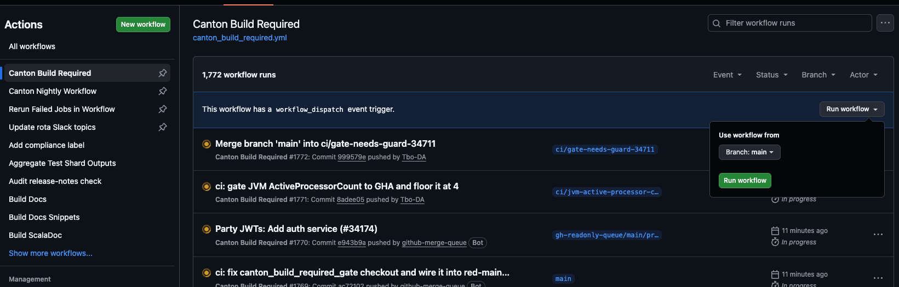
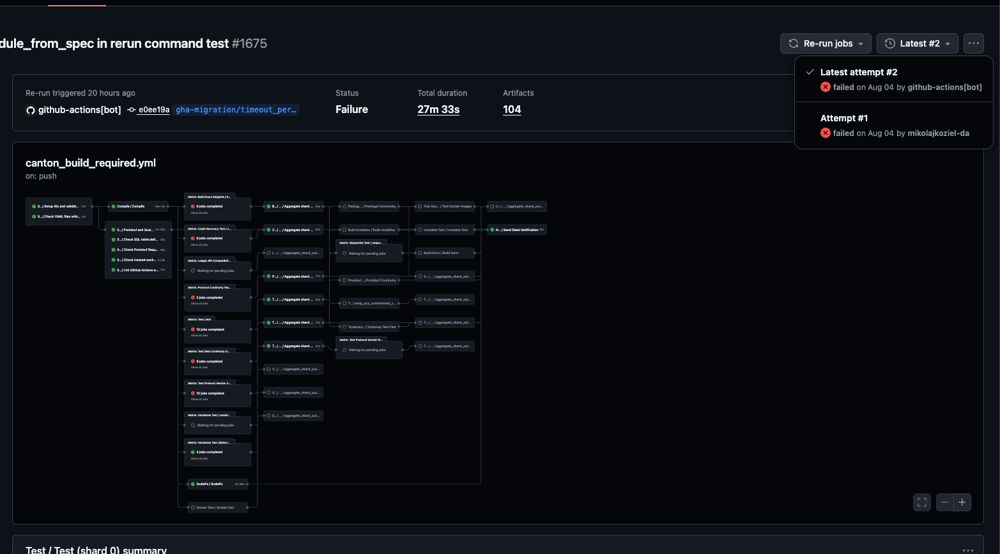
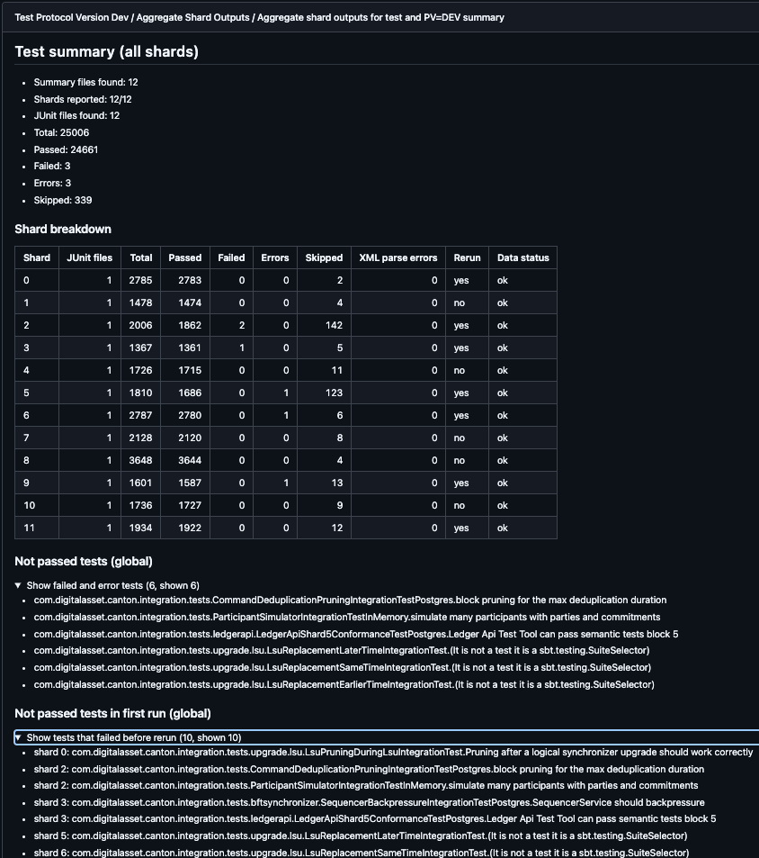
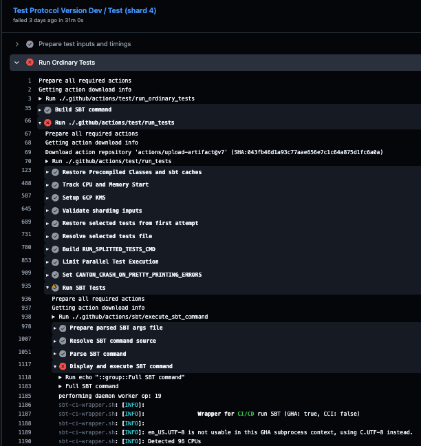
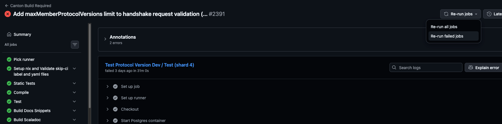

CI Usage: GitHub Actions
========================

Canton is using Github Actions for the CI pipelines.
This page gives a practical entry point for contributors, including users who are new to GitHub Actions.

GitHub Actions workflow files in this repository live in:
`/.github/workflows`

# GitHub Actions summary

Quick glossary:
- **Pipeline**: an informal name for a full CI flow. In this document, it usually means a GitHub Actions workflow.
- **Workflow**: one CI pipeline file in `/.github/workflows`. There are two kinds:
  - **Top-level workflow**: triggered directly by events (for example `push`, `pull_request`, `workflow_dispatch`). This is what shows up in the GitHub `Actions` tab and PR checks. Example: `canton_build_required.yml`.
  - **Reusable workflow**: a workflow designed to be called by other workflows via `uses:`. It is not triggered by events directly. Files prefixed with `_` follow this convention in this repo (for example `_compile.yml`, `_test.yml`). When it fails, the failure surfaces in the calling top-level workflow. This is the closest equivalent to a reusable job or command in CircleCI.
- **Job**: one block inside a workflow (for example compile, test, docs).
- **Run**: one execution of a workflow.
- **Check**: the status shown on a PR.

Common GitHub Actions job results:
- `success`
- `failure`
- `cancelled`
- `skipped`

---

## How to trigger manually

1. Open repository `Actions`.
2. Select `Canton Build Required`.
3. Click `Run workflow`.
4. Select branch and start the run.
5. Open failed job logs/artifacts if debugging is needed.

Example view of the manual trigger for `Canton Build Required`:

---

# How to inspect auto-rerun attempts

When a workflow is rerun, GitHub keeps attempts under the same run.

1. Open the workflow run page in `Actions`.
2. In the run header, find the attempt selector (for example `Attempt #1`, `Latest attempt #2`).
3. Switch between attempts and compare failed jobs.
4. For each attempt, open the same job name and check:
   - error message
   - failing step
   - timestamps
5. Use the latest attempt for final status, but keep earlier attempts for diagnosis.

Tip: if attempt 1 failed and attempt 2 passed, treat this as a possible flake.

---

# How to find failed tests quickly

Use the workflow run summary:

1. Open the workflow run page.
2. Scroll down to the GitHub summary section.
3. Find the test summary blocks (table + failed-tests list) appended by test jobs.
4. Use that list as the primary source of failed test names.

Note: stack traces are being added to failed-test reporting, but this may depend on whether the related PR has already merged.

---

# How to find test logs

To inspect detailed test logs:

1. Open the workflow run.
2. Open the specific failed test job (or the shard you want).
3. Expand the test step, usually named one of:
   - `Run Ordinary Tests`
   - `Run Data Continuity Tests`
   - or a similar test-run step name
4. Inside that step, expand:
   - `Run SBT Tests`
   - or `Run SBT Tests (Failed-only Rerun)`
5. Then expand:
   - `Display and execute SBT command`

If the run failed in that area, GitHub usually auto-expands the failing section.

Raw log files are also available as artifacts. Open the same workflow run, go to `Artifacts`,
download the shard bundle for the job/shard you need, and inspect files under `log/`.

---

# How to find artifacts

1. Open the workflow run page.
2. Scroll to the `Artifacts` section.
3. Download the artifact for the job/shard you need.
4. Common examples:
   - `test-full-class-names` (test list from compile)
   - `<job>-shard-bundle-<run_id>-<shard>` (logs, summary, timings, test reports)
   - `<job>-timings-latest` (merged timings for future shard balancing)

Tip: for test debugging, start with the shard bundle and inspect `log/`, `summary/`, and `timings/`.

---

# How to inspect historic runs

Use historic runs when you need to compare behavior over time.

1. Open `Actions` and select the workflow (for example `Canton Build Required`).
2. Browse older runs for the same branch or PR.
3. Compare:
   - failed jobs
   - failed tests
   - whether a rerun recovered the failure
4. Use this to distinguish a stable failure from a flaky one.

Tip: combine this with the attempt selector described above. Attempts show retries within one run, historic runs show behavior across different commits.

---

# How to rerun failed tests

There are two rerun paths:

1. **Automatic failed-jobs rerun workflow**
   - We have `Rerun Failed Jobs in Workflow`.
   - It observes selected workflows and requests one failed-jobs rerun when policy allows.

2. **Manual rerun from GitHub UI**
   - Open the workflow run.
   - Use `Re-run jobs` and choose `Re-run failed jobs`.
   - This reruns only failed jobs from that run attempt.

After rerun, use the attempt selector to compare attempt 1 and attempt 2.

---

# Related docs

- Legacy CircleCI usage and background: [5_ci-usage.md](5_ci-usage.md)
- Git and PR process: [6_github.md](6_github.md)

