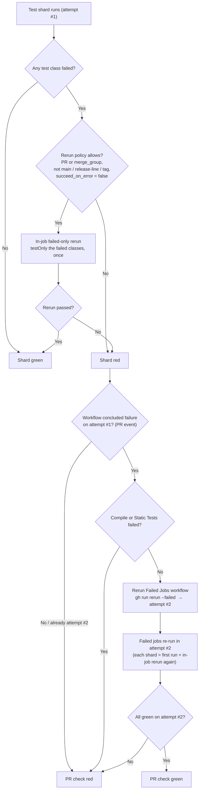

GitHub Actions: Rerun Strategy for Failed Tests
===============================================

This page explains what happens when a test fails on CI, how many times a failing
test is retried, and which failures are retried at all. It complements
[7_ci-github-actions-usage.md](7_ci-github-actions-usage.md), which covers how to
navigate runs, attempts, and logs in the GitHub UI.

# Overview: two rerun layers

A failing test on a PR goes through up to two independent rerun layers before the PR
check is declared red:

1. **Quick rerun (in-job failed-only rerun)** happens inside the same test job, in the same
   workflow attempt. Only the failed test classes are rerun.
2. **Long rerun (cross-attempt failed-jobs rerun)** happens after the whole workflow
   concludes as a failure. A second workflow attempt is started that reruns only the jobs
   that failed.

The two layers are **sequential and nested**. The quick rerun runs to completion first. Only
if the job (and therefore the whole workflow) still ends red does the long rerun start a
second attempt, and each re-run job in that second attempt again performs its own quick
rerun internally. Because of that nesting, a single flaky test class can be executed
**up to four times** before the PR goes honestly red.

The intent is to absorb genuine flakes on PRs without hiding deterministic failures and
without letting flakes silently pass on `main`.

# Layer 1: quick rerun (in-job failed-only rerun)

- Code: [`.github/actions/test/run_tests/action.yml`](../.github/actions/test/run_tests/action.yml)
  and [`scripts/ci/prepare_rerun_command.py`](../scripts/ci/prepare_rerun_command.py).
- After a shard finishes its first run, the failed test classes are collected from the
  JUnit reports and rerun once by a step named `Run SBT Tests (Failed-only Rerun)`, using
  `testOnly <ClassA> <ClassB> ...` in the same job. Cleanup and summaries run afterwards.
  The shard is green if that failed-only rerun passes.
- The rerun is gated by the `Failed-only rerun policy` step. It is enabled on
  `pull_request` and `merge_group` events, and disabled on `push` to `main`,
  `release-line*`, or a tag, so that a flake reddens a protected branch honestly rather
  than being papered over. It is also disabled when `succeed_on_error=true`.
- Timeout special case: if the per-test watchdog stopped the shard early
  (`testcase_timeout_triggered`), the rerun covers the failed classes **plus** the
  selected classes that never got a chance to run in the first pass.

# Layer 2: long rerun (cross-attempt failed-jobs rerun)

- Code: [`.github/workflows/rerun_failed_jobs_in_workflow.yml`](../.github/workflows/rerun_failed_jobs_in_workflow.yml)
  and [`scripts/ci/rerun_failed_jobs_gate.py`](../scripts/ci/rerun_failed_jobs_gate.py).
- The `Rerun Failed Jobs in Workflow` workflow watches `Canton Build Required` (and, as an
  experimental extension, `Canton Nightly Workflow`). When a run concludes as a failure on
  attempt number 1, it calls `gh run rerun --failed` to start attempt number 2 with only the
  failed jobs. This is the exact equivalent of opening the run in the GitHub UI and clicking
  `Re-run jobs` then `Re-run failed jobs`.
- The `run_attempt == 1` guard means this happens **exactly once**. Attempt number 2 never
  triggers an attempt number 3.
- It is limited to PRs. It skips `push` and `merge_group` events for Canton Build Required,
  so there is no automatic long rerun on `main` or in the merge queue. A failed check in the
  merge queue already ejects the PR, so a green rerun there would never merge anyway.
- Policy gate: for Canton Build Required, if `Compile` or `Static Tests` failed, the rerun
  is skipped entirely. Those failures are deterministic and not worth retrying. Timeouts
  and cancellations are treated as failures for this decision.

# When is a failure retried?

| Trigger / branch                    | In-job failed-only rerun | Cross-attempt failed-jobs rerun |
| ----------------------------------- | ------------------------ | ------------------------------- |
| `pull_request`                      | yes                      | yes (once, unless a blocked job failed) |
| `merge_group` (merge queue)         | yes                      | no                              |
| `push` to `main` / `release-line*`  | no                       | no                              |
| `push` to a tag (`v*`)              | no                       | no                              |
| `succeed_on_error=true` job         | no                       | n/a                             |
| `Compile` or `Static Tests` failed  | n/a (that job)           | no (whole workflow skipped)     |

# How many chances does a flaky test get on a PR?

- Attempt 1: first run, then in-job failed-only rerun. That is 2 executions.
- Attempt 2, started only if the whole workflow was red on attempt 1 and no blocked job
  (`Compile` / `Static Tests`) failed: first run, then in-job failed-only rerun. That is
  2 more executions.
- Worst case: **4 executions** of a flaky class before the PR check stays red.

A deterministic failure in `Compile` or `Static Tests` short-circuits layer 2, so those
never consume a second attempt.

# Job ordering: some tests start after the normal test run

A few jobs depend on the normal test jobs via `needs:`, so they only start once those have
finished, including up to the four executions described above. The external-KMS jobs are the
main example. `test_requires_external_kms` has `needs: [pick_runner, test]`, so it starts
only after the `test` job (and its quick rerun) completes. The same holds for
`crash_recovery_test_requires_external_kms`, `test_protocol_version_35_requires_external_kms`,
and `toxiproxy_test_fast_requires_external_kms`.

The exact placement of the external-KMS tests is still under discussion and the execution
order may be adjusted, so treat this as the current behavior rather than a fixed contract.

# Which tests run only on main / nightly, and not on PRs

There is no separate hand-maintained list. The source of truth is the job `if:` conditions in
[`.github/workflows/canton_build_required.yml`](../.github/workflows/canton_build_required.yml).
Nightly runs live in a separate workflow (`Canton Nightly Workflow`), not in Canton Build
Required.

Rules of thumb when reading a job's `if:`:

- `github.event_name == 'push'` means the job runs on push events only, that is `main`,
  `release-line*`, and `v*` tag pushes, never on PRs. Example: `test_protocol_version_dev`
  has `if: github.event_name == 'push'`, so it also runs on `v*` tag builds. Pair it with
  `github.ref_type != 'tag'` (below) to exclude tags.
- `github.event_name != 'merge_group'` means the job is skipped in the merge queue.
- `github.ref_type != 'tag'` excludes tag pushes. The `push` trigger fires on branches
  (`main`, `release-line*`) and on tags (`v*`), so combining `event_name == 'push'` with
  `ref_type != 'tag'` narrows a job to branch pushes only, never tag builds.
- A job whose `if:` never admits `pull_request` does not run on PRs at all.

# Flow

# Limitations

Because reruns are disabled on `main` and PRs do not run dedicated flake detection, a flake
cannot be attributed to the PR that introduced it. A PR-introduced flake usually stays green
on the PR, since the failing schedule may not trigger or a quick rerun recovers it, and it
only surfaces once it fails on `main`. By then it is much harder to trace the flake back to
the PR that introduced it, and telling a pre-existing flake apart from a newly introduced one
takes manual bisection or history inspection.

# Related docs

- Navigating runs, attempts, logs, and artifacts: [7_ci-github-actions-usage.md](7_ci-github-actions-usage.md)
- Testing guide: [4_testing.md](4_testing.md)
- Legacy CircleCI usage and background: [5_ci-usage.md](5_ci-usage.md)
