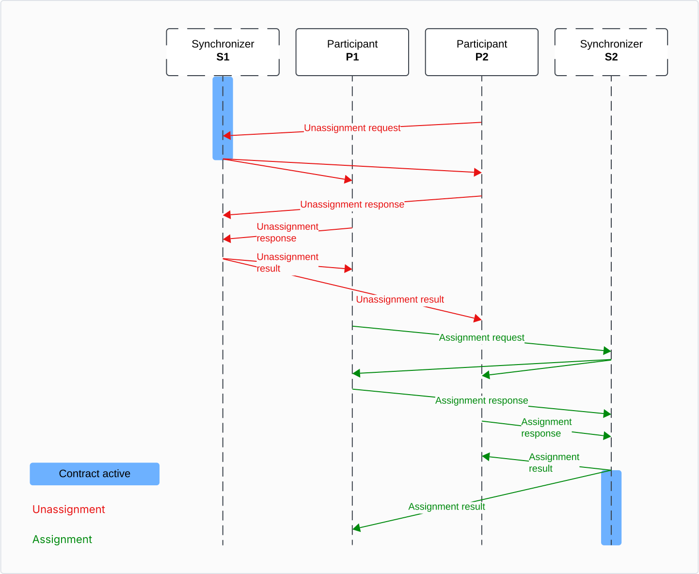
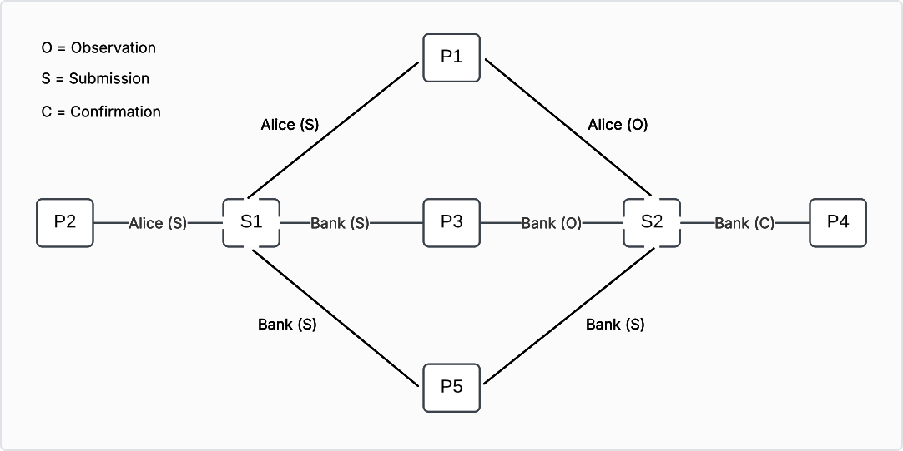

..
   Copyright (c) 2026 Digital Asset (Switzerland) GmbH and/or its affiliates. All rights reserved.
..
   SPDX-License-Identifier: Apache-2.0

.. _multiple-synchronizers:

Multiple Synchronizers
######################

Motivation
**********

Participant Nodes execute Daml transactions using a Synchronizer :ref:`Synchronizer <synchronizer-architecture>`, which can be either
the Global Synchronizer or a privately operated Synchronizer. There are multiple reasons why you might require
more than one Synchronizer:

* **Regulations**

  Some regulated environments require you to have control of the core infrastructure.
  Alternatively, data domicile laws may forbid you from connecting to Synchronizers that are not deployed
  in your zone of operations.

* **Performance**

  Different Synchronizers have different performance characteristics: some might favor high throughput, while others
  might target low latency. You must pick the Synchronizer which fits your non-functional requirements.

* **Governance**

  The governance of a Synchronizer might be centralized or decentralized.

* **Cost**

  For a high throughput use case, the fees of the Global Synchronizer might be too high and you might favor another Synchronizer.

* **Application restrictions**

  As an application provider, you might decide to restrict the use of your application to a specific Synchronizer.

To allow for the different use cases, a Participant Node can be connected to several Synchronizers.

.. _def-multi-sync-assignation:

Definition **assignation** of a contract:
    For any Daml contract, the participants hosting at least one stakeholder of the contract agree on which Synchronizer
    to use to coordinate changes on that contract. This agreed-upon Synchronizer is called the *assignation* of the contract.

More generally, the guiding principle is that for any piece of shared state, the participants maintaining this state
agree which Synchronizer to use to coordinate changes of this state.

The stakeholders of a contract can agree to change the assigned Synchronizer of a contract.
This procedure, which is called a *reassignment*, is described :ref:`below <reassignment-protocol>`.
Reassignments are needed because a Daml transaction executes on a single synchronizer, i.e., all input
contracts must be assigned to this synchronizer.

.. important ::
   Synchronizers are commodities used by stakeholders to coordinate changes on contracts but the contracts are stored
   only in the Participant Nodes. The assignation is an agreement between the stakeholders which they can change
   over time using reassignments.

Transactions with Multiple Synchronizers
****************************************

Suppose a user wants to execute a Daml transaction that involves contracts that are currently assigned to different Synchronizers.
The transaction can be execute by performing the following steps, which are made more precise below:

#. Find a suitable Synchronizer for the transaction, let's call it `S`

   The conditions that `S` should fulfill are made more precise below in `reassignment-validations`_.
   At minimum, all the stakeholders should be hosted on `S`, and every package of every input contract
   should be vetted on `S`.

#. Change the assignation of all input contracts to `S` (that is, reassign all the input contracts to `S`).

#. Execute the transaction on `S`.

#. If desired, change the assignation of output contracts to another Synchronizer.

There are two ways to change the assignation of a contract:

* **Automatically**

  When a user submits the transaction, Canton's Synchronizer router tries to identify the
  :ref:`best Synchronizer <automatic-synchronizer-selection>` which can be used to submit the transaction.
  Then, it submits reassignment confirmation requests so that the transaction's inputs contracts are reassigned
  to the selected Synchronizer.
  Once all the reassignments have been completed, the Synchronizer router submits the Daml transaction to the selected Synchronizer.

  Note that in that case, the user does not have to worry about choosing a Synchronizer and performing reassignments.
  This allows applications to be designed without taking Synchronizers into account.
  However, an application can influence the routing using inhomogeneous topologies (per-synchronizer package vetting
  or party hosting) as well as explicitly disclosed contracts.

* **Explicitly**

  Users can control the Synchronizer routing precisely as follows:

  * Ledger API accepts commands to submit :externalref:`reassignments <com.daml.ledger.api.v2.ReassignmentCommands>`.

  * When submitting a Daml transaction, the user can prescribe which Synchronizer to use.
    If the prescribed Synchronizer is not suited for the transaction, the submission fails.

.. _automatic-synchronizer-selection:

Automatic selection of the Synchronizer
=======================================

When the transaction cannot be executed on a single Synchronizer because not all input contracts are assigned to
the same Synchronizer, the Synchronizer router attempts to find the best common Synchronizer for the submission.

For each input contract `c`\ :sub:`i`, denote by `S`\ :sub:`i` its assignation (at the submission time).
A Synchronizer `S` is admissible for the transaction if:

* The reassignment of `c`\ :sub:`i` from `S`\ :sub:`i` to `S` is :ref:`valid <reassignment-validations>`.
* The submitting participant is a :ref:`reassigning participant <def-multi-sync-reassigning-participant>`
  for the submitting party for each `c`\ :sub:`i`.

Among all admissible Synchronizers, the router will pick the one which satisfies (in order of importance):

* has the highest priority,
* minimize the number of reassignments,
* has the lowest Synchronizer id.

Importance of the Global Synchronizer
=====================================

As mentioned above, for a Daml transaction to be executed, all stakeholders of all input contracts must trust
single a Synchronizer. Moreover, all input packages must be vetted on this common Synchronizer. The purpose of the
Global Synchronizer is to be the standard Synchronizer that every party trusts so that it can be used to
settle most of the transactions.

.. _reassignment-protocol:

Reassignment protocol
*********************

When a contract `c` is created using a Synchronizer `S` the stakeholders agree to use this Synchronizer to coordinate
further changes to the contract (for example, exercise and archive).
At this point, the :ref:`assignation <def-multi-sync-assignation>` of the `c` is `S`.
To change the assignation of `c` to a different Synchronizer `S'`, the stakeholders of `c` perform the *reassignment*
of `c` from `S` to `S'`.

In this section, we describe the reassignment protocol.

Overview
========

Reassigning a contract `c` from Synchronizer `S1` (called the *source* Synchronizer) to Synchronizer `S2`
(called the *target* Synchronizer) allows the stakeholders to change the assignation from `S1` to `S2`.
The procedure consists of two steps:

* **Unassignment**

  A stakeholder of the contract submits the command to unassign the contract from the source Synchronizer.
  Once the unassignment is committed, `c` is inactive on the source Synchronizer and cannot be used anymore.

  The unassignment goes though the same phases as the :ref:`transaction protocol <protocols>`.

* **Assignment**

  A stakeholder of the contract (not necessarily the same one who submitted the unassignment) submits the command to
  assign the contract on the target Synchronizer. Once the assignment is committed, `c` becomes active on the target
  Synchronizer and can be used again.

  The assignment goes though the same phases as the :ref:`transaction protocol <protocols>`.

The two steps can be visualized in the following diagram:

.. _reassignment-high-level:

.. https://lucid.app/lucidchart/39152dc8-e236-433c-87da-a5ff4e9659c6/edit

The reassignment of a contract is thus a **non-atomic** procedure involving two confirmation requests on two distinct
Synchronizers (the source and the target). Once the unassignment is successful, the contract is marked as **pending
assignment** and cannot be used until the assignment is performed.

Before presenting the reassignments from the point of view of the Ledger API, consider the following definition.

.. _def-multi-sync-reassignment-counter:

Definition: **reassignment counter**
    The **reassignment counter** tracks the number of times a contract was reassigned.
    It is set to zero when the contract is created and increased by one with each unassignment.
    The unassignment event and the corresponding assignment event have the same reassignment counter.

Reassignment from Ledger API and application point of view
==========================================================

The unassign command consists of the following fields:

* contracts to be reassigned (all contracts in the batch must have same set of signatories and same set of stakeholders),
* source Synchronizer (current assignation),
* target Synchronizer.

A successful unassignment yield an unassigned event which contains the following fields:

* unassign id: Opaque identifier which uniquely identifies the reassignment and is used to submit the assignment.
* :ref:`reassignment counter<def-multi-sync-reassignment-counter>`: Number of times the contract was reassigned.
* assignment exclusivity: Before this time (measured on the target Synchronizer), only the submitter of the unassignment can initiate the assignment.

The assign command consists of the following fields:

* unassign id,
* source Synchronizer (previous assignation),
* target Synchronizer.

A successful assignment yield an assigned event which contains the following fields:

* unassign id: Can be used to correlate unassigned and assigned events.
* reassignment counter: The value is the same as in the unassigned event.
* created event: Contract data (see :ref:`entering-leaving-visibility` to learn about the purpose).

Running example
===============

To illustrate the different scenarios and definitions, we consider an `Iou` whose signatory is
the Bank and observer (owner) is Alice and we will discuss reassignments of the `Iou` from `S1` to `S2`.

The topology of the network is the following:

* Five participants `P1`, ..., `P3` and two Synchronizers `S1` and `S2`.
* Hosting relationships as shown in the picture below.
  The letter in parenthesis indicates the permission (Submission, Confirmation, Observation).

.. _multi-synchronizer-running-example:

.. https://lucid.app/lucidchart/39152dc8-e236-433c-87da-a5ff4e9659c6/edit

Main definitions around reassignments
=====================================

Before we present the validations which are done as part of the confirmation of unassignment and assignment
requests, we need a few definitions.

.. _def-multi-sync-target-timestamp:

Target timestamp
----------------

When processing an unassignment request, confirming participants need to check that the target Synchronizer
meets some requirements (for example, the required package are vetted). These requirements depends on the topology
on the target Synchronizer which can change over time. To ensure that all involved participant perform the same
validations and reach the same conclusion, the unassignment request contains a timestamp of the target Synchronizer
which is used for all topology related validations.

Definition: **target timestamp**
    When an unassignment is submitted, a time proof is requested on the target Synchronizer.
    This timestamp is used to perform validations related to the target Synchronizer (package is vetted,
    stakeholders are hosted on the target Synchronizer, and so forth) during unassignment processing.
    This timestamp is called the **target timestamp**.

.. _def-multi-sync-reassigning-participant:

Reassigning participant
-----------------------

Because stakeholders can be hosted on several Participant Nodes and because topology can be inhomogeneous (for example,
a Participant Node might host a party only on some Synchronizers it is connected to), a Participant Node involved
in a reassignment might be an informee of only the unassignment request or only the assignment request (see
discussion about contracts :ref:`entering and leaving the visibility <entering-leaving-visibility>` of a Participant
Node below). Such Participant Nodes cannot perform all the validations (which would require it to be connected to both the source and
target Synchronizers) and cannot protect against double spends (reassigned contract being active both on the source
and target Synchronizers). This motivates the following definition.

Definition: **reassigning participant**
    For a contract `c`, a participant `P` is a **reassigning participant** for a party `S` if the following hold:

    #. `S` is a stakeholder of `c`.
    #. `S` is hosted by `P` on the target Synchronizer at the :ref:`target timestamp <def-multi-sync-target-timestamp>`.
    #. `S` is hosted by `P` on the source Synchronizer.

    The last condition is checked during submission using a recent topology snapshot and during phase 3 of the protocol
    using a topology snapshot at request time.

In the :ref:`running example <multi-synchronizer-running-example>`, `P1`, `P3` and `P5` are reassigning participants.
`P2` is not a reassigning participant since it is not connected to the target Synchronizer. Similarly, `P4` is not
connected to the source Synchronizer and therefore is not a reassigning participant.

.. _def-multi-sync-signatory-unassigning-participant:

Signatory unassigning participant
---------------------------------

One key ingredient to describing the confirmation policies of reassignments is to derive the conditions that must be met for a
Participant Node to be a confirmer of the unassignment request. As mentioned previously, one requirement is that
the nodes is a :ref:`reassigning participant <def-multi-sync-reassigning-participant>`.

Moreover, we only want the contract signatories to confirm. Since signatories could archive the
contract on the source Synchronizer and (re)create it on the target Synchronizer, it does not bring additional safety
to demand other parties like observers to confirm the unassignment requests.

This motivates the following definition.

Definition: **signatory unassigning participant**
    For a contract `c`, a participant `P` is a **signatory unassigning participant** for a party `S` if the following hold:

    #. `S` is a **signatory** of `c`.
    #. `P` is a :ref:`reassigning participant <def-multi-sync-reassigning-participant>` for `S`.
    #. `S` is hosted on `P` with at least confirmation rights on the source Synchronizer.

In the :ref:`running example <multi-synchronizer-running-example>`, the signatory unassigning participants are `P3` and `P5`.
Participant `P1` does not host a signatory of the contract and `P2` and `P4` are not reassigning participants for any party.

.. _def-multi-sync-signatory-assigning-participant:

Signatory assigning participant
---------------------------------

Definition: **signatory assigning participant**
    For a contract `c`, a participant `P` is a **signatory assigning participant** for a party `S` if the following hold:

    #. `S` is a **signatory** of c.
    #. `P` is a :ref:`reassigning participant <def-multi-sync-reassigning-participant>` for `S`.
    #. `S` is hosted on `P` with at least confirmation rights on the target Synchronizer.

    Informally, a signatory assigning participant is informed of both the unassignment and the assignment of a contract
    and is a confirmer of the assignment request.

In the :ref:`running example <multi-synchronizer-running-example>`, the only signatory assigning participant is `P5`:

* `P1` does not host a signatory of the contract.
* `P3` hosts a signatory but only with observation rights.

.. _def-multi-sync-re-assignment-confirmation-policy:

Confirmation policies
=====================

In this section, we discuss which informee participants should send confirmation responses for an unassignment or an
assignment request.

Since some of the validations can be performed only by :ref:`reassigning participants <def-multi-sync-reassigning-participant>`
and since only signatories of the contract should confirm the reassignment requests, it follows that confirmers of an
unassignment are exactly the :ref:`signatory unassigning participants <def-multi-sync-signatory-unassigning-participant>`
and confirmers of an assignment are exactly the :ref:`signatory assigning participants <def-multi-sync-signatory-assigning-participant>`.

The number of confirmations expected by the mediator for one of the signatory is exactly the confirmation threshold
of the signatory (on the source Synchronizer for the unassignment and on the target Synchronizer for the assignment).

.. _reassignment-validations:

Validation of unassignment and assignment requests
==================================================

The guiding principles behind validation rules for reassignments are:

* Reassigning a contract should not deprive a stakeholder from being able to use a contract.
* The risk that a contract cannot be assigned after it has been unassigned should be reduced to the
  bare minimum (recall that a reassignment is non-atomic).

We can now formalize the validations that need to be done as part of the processing of the unassignment request:

* The contract `c` is active on the source Synchronizer.
* Every stakeholder is hosted on a :ref:`reassigning participant <def-multi-sync-reassigning-participant>`.
* Each signatory `S` is hosted on sufficiently many :ref:`signatory assigning participants <def-multi-sync-signatory-assigning-participant>`.
  More precisely, if the confirmation threshold on the target Synchronizer for `S` is `t`,
  then `S` needs to have at least `t` signatory assigning participants. This removes the risk that there are not enough
  signatory assigning participants, which would mean that the reassignment cannot be completed.
* The package corresponding to the contract has to be vetted on the target Synchronizer.
* If the request contains several contracts, all the contracts in the batch must
  have the same signatories and stakeholders.

Validations that need to be done as part of the processing of the assignment request are simpler.
Confirming participants need to ensure:

* The assignment corresponds to a reassignment which is not yet completed.
* The package corresponding to the contract is vetted.

Some additional validations that are not specific to unassignments or assignments and are also done for regular Daml
transactions are performed:

* views can be decrypted correctly,
* the recipient list is correct,
* root hash messages is correct,
* etc.

.. note ::
   If the topology changes between the unassignment and the assignment, it might be impossible to complete the reassignment.
   Either topology can be changed again to make the assignment possible or the repair service can be used to manually
   change the assignation to the contract. Such a repair operation has to be performed on every relevant participant.

Submission policies
===================

The reassignment (unassignment or assignment) of a contract `c` can be submitted by a participant `P` if `P` hosts at least a
stakeholder `S` of `c` for which it is a reassigning participant.
It is *not* required that `P` hosts `S` with submission permission.

There are several reasons to not require the submission permission to submit a reassignment:

* In the :ref:`running example <multi-synchronizer-running-example>`, Alice loses the ability to exercise
  choices on the `Iou` when it is reassigned to `S2` as she is not hosted with submission permissions on Synchronizer `S2`.
  Because she is allowed to initiate a reassignment back to `S1`, she has a way to regain the possibility to exercise
  choices on the `Iou`.
* :ref:`Decentralized parties <decentralized-parties>` cannot submit Daml transactions but should be able to submit
  reassignments for composability of applications.

.. todo:: Mention external parties use case once implemented <https://github.com/DACH-NY/canton/issues/25878>

.. _entering-leaving-visibility:

Contracts entering and leaving the visibility of the participant
================================================================

Consider the :ref:`running example <multi-synchronizer-running-example>` of this page.

Participant `P2` is an informee participant of the unassignment confirmation request but not of the assignment
request because it does not host alice on `S2`.
Hence, from `P2` point of view, the contract does not become active when the assignment is completed:
the contract becomes unusable on that participant (this is allowed
only because Alice is hosted on `P1` on both `S1` and `S2`).
In such a scenario, we say that the contract *leaves the visibility* of `P2`.

Now consider the "opposite" scenario. Participant `P4` is an informee participant of the assignment confirmation request
(as a participant hosting the Bank on `S2`) and learns about the contract as part of the assignment.
Once completed, the contract can be used on `P4`.
In such a scenario, we say that the contract *enters the visibility* of `P4`.
Because the created event is included in the assigned event, applications can learn about the payload of a contract
when it enters the visibility of a Participant Node.

From the point of view of a participant, a contract can enter and leave its visibility several times during its
life cycle. This can happen if all stakeholders hosted on the participant are multi-hosted.

Non causality of the updates stream
===================================

In this section, we focus on the **updates stream** which contains only (de)activations of contracts:
``Created``, ``Archived``, ``Unassigned`` and ``Assigned``. The content can easily be extended to cover
update trees streams that also contains non-consuming exercises.

For a contract `c` and a Participant Node which hosts a stakeholder of `c`, we consider the list of all events emitted
on the updates stream for `c`. When only a single Synchronizer is involved, this list contains exactly at most two elements:

* The first element is the ``Created`` of `c` (activation).
* When the contract is not active, the last element is either an ``Archived`` or an ``Exercised`` (deactivation).
* The record time of the activation is strictly smaller then then record time of the deactivation.
  More generally, the events on the updates stream are ordered by their record time.

When the Participant Node is connected to several Synchronizers, the updates stream consists of the events of all
Synchronizers merged together. Since time cannot be compared across Synchronizers, we decided to not offer any
guarantees with respect to global ordering of events. In particular, it means:

* No assumption can be made with respect to ordering of events which happened on different Synchronizers.
* The ordering can be different from one participant to the order.

Hence, in a multi Synchronizers scenario, **there is no global causality on the updates stream**.

For example, consider the following scenario:

* Contract `c` is created on Synchronizer `S1`.
* `c` is unassigned from `S1` to `S2`.
* `c` is assigned to `S2`.
* `c` is archived.

On the updates stream of a participant hosting a stakeholder on both `S1` and `S2`, the events might appear in
any of the following orders:

* ``created``, ``unassigned``, ``assigned``, ``archived``
* ``created``, ``assigned``, ``unassigned``, ``archived``
* ``assigned``, ``created``, ``unassigned``, ``archived``
* ``assigned``, ``archived``, ``created``, ``unassigned``
* ``created``, ``assigned``, ``archived``, ``unassigned``
* ``assigned``, ``created``, ``archived``, ``unassigned``

In particular, the ``created`` event is not necessarily the first event nor is the ``archived`` necessarily the last event.

Note that the projection of events for each Synchronizer is causally consistent which means that

* the ``created`` always appears before all ``unassigned`` or ``archived``, and
* the ``archived`` always appears after all the ``assigned`` or ``created``,
* there are no consecutive activations or deactivations (and in particular no consecutive
  ``assigned`` or ``unassigned``).

Finally, recall from :ref:`above <entering-leaving-visibility>` that a Participant Node might learn about
a contract with an assignment, so the updates stream isn't guaranteed to contain a ``Created`` or ``Archived``.

Reassignments and contention
============================

An assignment is an activation and thus has a impact similar to a create.
Similarly, an unassignment is a deactivation and has a similar impact than an archive.
In particular, both assignments and unassignments lock the contract, which means that reassignments
lead to contention with other workflows, including read-only transactions.
This additional contention might be unexpected and difficult to debug if reassignments are done automatically
by the Synchronizer router as part of transaction submission.
It is advised to consider reassignments explicitly when designing Daml workflows such that contention can be minimized.

Multi-Synchronizer Time
***********************

.. todo:: Fill that section <https://github.com/DACH-NY/canton/issues/25859>

Relate to time monotonicity of the ledger model

Contrast to command dedup time model
