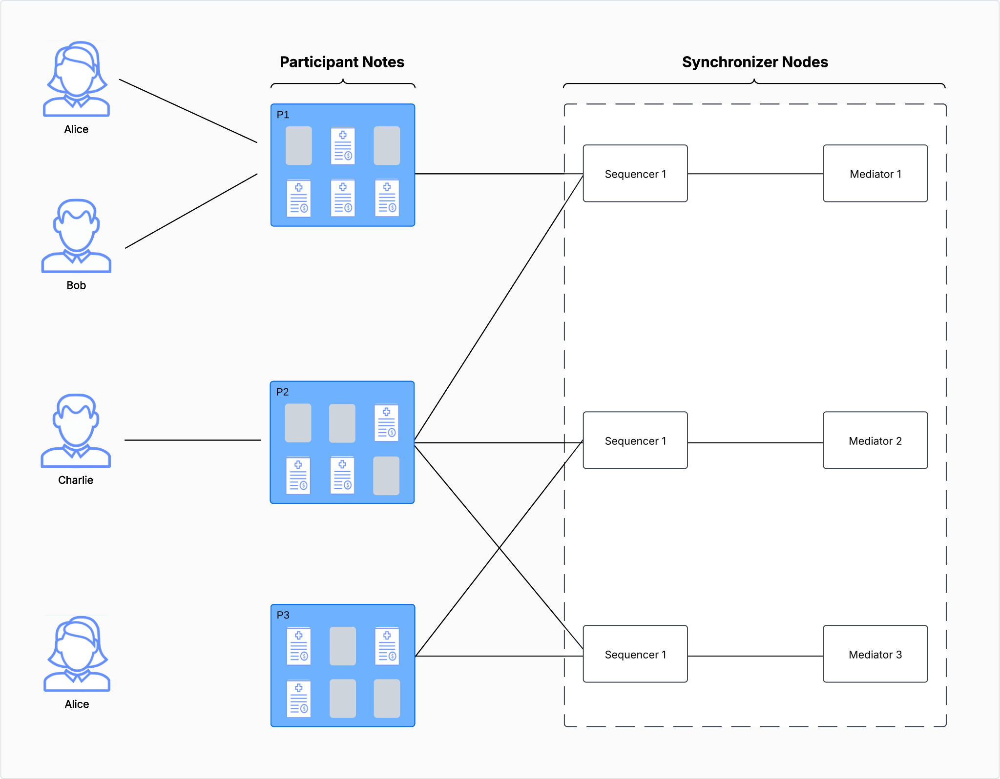

..
   Copyright (c) 2026 Digital Asset (Switzerland) GmbH and/or its affiliates. All rights reserved.
..
   SPDX-License-Identifier: Apache-2.0

.. wip::
    Finish this page (see content in docs-open-parking-lot/overview/explanations/canton/protocol.rst).

.. _protocols:

Protocols on One Synchronizer
#############################

.. note::
    This page focuses on a single Synchronizer deployment.
    :ref:`Multi-synchronizer <multiple-synchronizers>` support is discussed separately.

The execution of Canton protocols involves users and nodes (see diagram below):

* Daml parties represent business entities that are involved in transactions.
* A Daml party is hosted on one or more :ref:`Participant Nodes <protocol-participant-nodes>`.
* Participant Nodes connect to :ref:`Sequencers <protocol-sequencer-nodes>` to submit transactions (either Daml transactions
  or reassignments) and receive messages from other members (participants, sequencers, and mediators).
* Consensus is achieved by a :ref:`two-phase commit protocol <protocol-two-phase-commit>` whose coordinators are
  :ref:`Mediator Nodes <protocol-mediator-nodes>`.
* The term **member** denotes a sequencer, a mediator, or a participant node.

.. note::
    * Participant and mediator nodes connect only to sequencer nodes.
      In particular, they do not exchange messages directly.
    * Participant Nodes can connect to one or several sequencers.

To illustrate the above description, consider the following example:

.. https://lucid.app/lucidchart/39152dc8-e236-433c-87da-a5ff4e9659c6/edit

* Alice, Bob and Charlie are Daml parties.
* Participant Nodes are `P1`, `P2` and `P3`.
  Alice is hosted on `P1` and `P3` (in other words, Alice is a **multi-hosted party**), Bob is hosted on `P1` and Charlie on `P2`.
* `P1` is connected to a single sequencer, while `P2` and `P3` are connected to several sequencers.

Synchronizer Functionality
**************************

.. _protocol-sequencer-nodes:

Sequencer Nodes
---------------

Sequencer Nodes allow members of the Synchronizer to send messages to each other.
More precisely, they allow for secure multi-cast with privacy:

* Secure

  * Endpoints of the sequencer service to send messages and subscribe to streams of events are authenticated
    (see :externalref:`security of Synchronizer APIs <secure-synchronizer-apis>`).
  * :externalref:`Traffic management <sequencer-traffic>` can be used to protect against DDoS attacks.
  * Maximum rate of confirmation requests can be enforced (see :externalref:`dynamic Synchronizer parameters <dynamic_synchronizer_parameters>`).
  * Sequencers forward opaque messages.
    Protocols using the sequencer can therefore encrypt the payloads so that the Sequencers do not see the payload of exchanged messages, only their metadata.

* Multi-cast

  * The sender can send a batch of messages and each message can have different recipients.
  * The Sequencers assign a timestamp to each batch of messages (see section about :ref:`Sequencers <synchronizers-sequencer>`)
    and deliver the messages to each recipient in the order of the timestamps.

* Privacy preserving

  Recipients of a message don't learn the identity of the sender.

.. _protocol-mediator-nodes:

Mediator Nodes
--------------

Mediator Nodes are coordinators of the two-phase commit protocol.
They ensure that a transaction is committed only if all required confirmers send their confirmation before the decision deadline.

.. _protocol-participant-nodes:

Participant Node Functionality
******************************

Daml parties are hosted on Participant Nodes on one or several Synchronizers.
If Participant Node `P` hosts party Alice, then:

* `P` maintains the set of active contracts (equivalent to unspent transaction outputs, or UTXOs, in some models)
  for Alice. In particular, Alice can subscribe to the stream of events for her contracts (creations, archivals and
  exercises) and request a snapshot of her active contract set (ACS).

* `P` maintains the transaction history for Alice and offers querying capabilities.

* `P` confirms transaction on behalf of Alice if she is hosted with at least :ref:`confirmation permission <topology-parties>`.

* `P` submits transactions authorized by Alice if she is hosted with at least :ref:`submission permission <topology-parties>`.

Protocol types
**************

In this section, we present the different kind of protocols supported by Canton:

* :ref:`protocol-channel-broadcast` to broadcast a message to some or all members of a Synchronizer.
* :ref:`protocol-two-phase-commit` to coordinate changes on state (for example, :ref:`Daml transactions <canton-overview-tx-processing>`
  to change the state of a contract, or :ref:`reassignments <reassignment-protocol>` to change assignation of a contract).
* :ref:`protocol-point-to-point` to enable pairs of member to exchange messages (note that members always exchange
  messages through Sequencers).

.. _protocol-channel-broadcast:

Channel broadcast
-----------------

Definition: **channel**
    A **channel** is a well-defined group of recipients.

Channel broadcast ensures that all members of the channel receive the same set of messages.
Because of the ordering guarantees offered by the Sequencers, channel members can use state machine replication
for updating the state managed by the group.

Examples:

* :ref:`Topology state <identity-manager-1>` is broadcasted to all members of the synchronizer.
* :externalref:`Traffic management <sequencer-traffic>` uses broadcasts to all sequencers of the synchronizer.

.. _protocol-two-phase-commit:

Two-phase commit
----------------

.. todo:: Write this section <https://github.com/DACH-NY/canton/issues/25689>

Required properties
^^^^^^^^^^^^^^^^^^^

.. todo:: Write this section <https://github.com/DACH-NY/canton/issues/25689>

.. _protocol-point-to-point:

Point-to-point
--------------

Point-to-point protocols allow a member of the Synchronizer to send messages to another member of the same Synchronizer.
Since Sequencers are used as gateways, such messages are ordered with respect to other messages of the other protocols.
One use case of point-to-point communication is :ref:`ACS commitments <pruning-non-repudiation>`.

.. todo:: Write this section <https://github.com/DACH-NY/canton/issues/25689>

Running example
---------------

.. todo:: Unify with example of the daml ledger model (SimpleAsset, SimpleDvp) <https://github.com/DACH-NY/canton/issues/25689>

We illustrate the different aspects of Canton two-phase commit protocol using a simple DvP example.
Alice and Bob want to exchange an `IOU` given to Alice by a bank for some shares that Bob owns.
Ingredients of the example are the following:

* Four parties: Alice (A), Bob (B), a Bank and a share registry (SR).
* Each party is hosted on a participant with the same name.
* Three types of contracts:
    * an `Iou` contract, always with Bank as the backer
    * a `Share` contract, always with SR as the registry
    * a `DvP` contract between Alice and Bob.

The Daml transaction consists of Alice exercising choice `Swap` on her IOU, leading to the following transaction:

.. _canton-overview-tx-processing:

Canton's Transaction Protocol
*****************************

.. todo:: Write this section <https://github.com/DACH-NY/canton/issues/25689>

.. todo:: Use image found in  https://docs.daml.com/canton/architecture/overview.html to show all messages <https://github.com/DACH-NY/canton/issues/25689>
