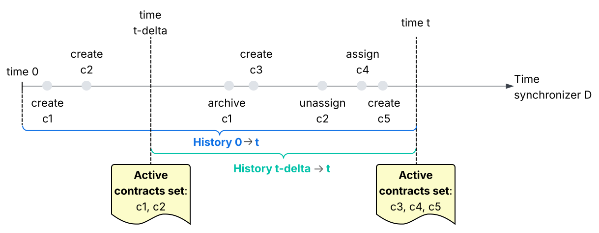

..
   Copyright (c) 2025 Digital Asset (Switzerland) GmbH and/or its affiliates. All rights reserved.
..
   SPDX-License-Identifier: Apache-2.0

.. _pruning-overview:

#######
Pruning
#######

As a synchronizer orchestrates the execution of commands, the sequencers, mediators and participant persist records of
the data/changes that they process:

* For participants, the stored data represents the activated and deactivated contracts, and their associated transactions
  and events
* For sequencers, the stored data represents the messages they process and the changes in participants' subscription status
* For mediators, the stored data represents the verdicts they send to participants, based on the confirmation responses
  that the participants sent to the mediator
* In addition, all nodes store both the current and the past topology data for the synchronizers they are connected to

Because these nodes operate continuously for an indefinite amount of time, the stored data they accumulate, or put
differently, the history of the ledger, keeps growing.

.. todo:: Add a link to the data they actually accumulate, probably in one of Raf's section <https://github.com/DACH-NY/canton/issues/26154>

Accumulating and storing history forever on nodes is problematic for several reasons:

* First, nodes have a limited amount of storage that they will eventually exhaust if the stored data keeps growing

* Second, regulation concerning privacy may require removing Personally Identifiable Information (PII) upon request.
  For example, to comply with the General Data Protection Regulation (GDPR) in Europe, Canton operators must declare reasonable
  retention periods and make sure that the data is deleted afterwards. Another example, in the context of health
  information, the Health Insurance Portability and Accountability Act (HIPAA) aims to protect sensitive patient data,
  deciding how long the data should be kept and when it should be deleted.

Pruning addresses these issues around the accumulation and storage of history.
First, instead of storing the whole history, nodes can forget a prefix of the history, and instead store a state snapshot
that summarizes the history.
That is, pruning refers to the removal of old, stale, or unneeded data from participants, sequencers and mediators.
This means that data necessary for operation is not deleted, e.g., pruning never removes active (i.e., non-archived)
Daml contracts.
Second, each operator of a participant, sequencer or mediator can set and customize pruning schedules according to their
and their customers' needs, and according to the requirements of the regulatory frameworks they operate in.
The node operator decides on when to prune and what data to retain, subject to the constraints imposed by the
Canton implementation. Please refer to the :externalref:`how-to guide on participant pruning <participant-node-pruning-howto>`,
and :externalref:`how-to guide on sequencer and mediator pruning <synchronizer-pruning>` for details on how to configure pruning.

.. note:: Pruning means that nodes can forget a prefix of the history, and instead store a state snapshot that summarizes
          the history.

The following sections explain the differences between history and state snapshot, then introduce pruning safeguards in
order to ensure nodes do not delete data that is needed, and finally explain how nodes agree on the state snapshot before
pruning history.

History vs. State Snapshot
***************************

*History* represents the list of all changes *up to a particular point in time*, whereas *state snapshot* (or snapshot
for brevity) represents the summary of all changes *at a particular point in time*.
One analogy to think about history vs snapshot is imagining an operator that wants to bootstrap a node in a working
system at time t.
For example, the operator wants to add a fresh participant node and host some parties on it, or may want to restore an
existing participant from backup.
The snapshot represents all the data that the participant needs to be operational in the system at the time it joins,
which includes but is not limited to the active contracts that have as stakeholders the parties hosted on the participant
at time t.
In contrast, history represents all events changing the stakeholder contracts, e.g., creations, archivals, reassignments,
since the system's inception and up to time t.
The operator could simply bootstrap from the snapshot at time t. Alternatively, if that is not available for some reason,
the operator could bootstrap from the snapshot at a prior time t-delta, and then replay the history between timestamps t-delta
and t. The figure below illustrates the contrast between history and snapshot in an example concerning the
active contracts.

.. _history_v_snapshot:

.. https://lucid.app/lucidchart/6e815c36-b8e8-4f77-919b-2ff1d02d169f/edit?invitationId=inv_cfe298c2-1432-46df-b1b0-270878f6e253

.. note:: The participant retains some of its historical data in a long-term store, called the
          `Participant Query Store (PQS) <https://docs.digitalasset-staging.com/build/3.3/component-howtos/pqs/>`__.
          The PQS is a store separate from the Canton internal stores.
          The PQS stores a distilled version of history and its role is to answer queries about the past, for example for
          regulatory purposes.

.. note:: Pruning a node at time t deletes the history stored on that node up to time t, but retains the node's snapshot
          at time t.
          A node's snapshot depends on the type of node: participant, synchronizer, mediator.
          Once a node has been pruned up to time t, it will not be able to serve events that precede t.

For clarity, it is worth distinguishing between the pruning timestamp versus the latest timestamp that the application
processed. Consider a participant node whose ledger end is at offset off_end, and its operator that wants to prune this
participant node up to offset off_prune. off_prune defines the time t of the snapshot. Assume that t_end corresponds to off_end.
From the point of view of the snapshot at t, changes between off_prune and off_end take place in the "future",
and the snapshot at t cannot
summarize them; whereas from the application's point of view, which processed
up to off_end, the changes between off_prune and off_end are already part of the history.
Clearly, pruning at time t (or offset off_prune) does not delete the changes after off_prune, even though these changes
are not part of the snapshot at t.

A participant node's snapshot at t consists of the following:

* The set of active contracts at time t that have stakeholders hosted on that participant.
  This set is fundamental for the participant node in order to participate correctly in Canton's transaction processing,
  e.g., the participant safeguards double spending by rejecting such transactions.

* The in-flight reassignments at time t.
  A participant that is a reassigning participant for a contract must retain reassignment data while the reassignment
  is in-flight, i.e., while either the unassign or the assign commands did not complete.
  Otherwise, the participant would not be able to approve or reject reassignments correctly.
  For more details on reassignments, refer to the reassignments section.
  For now, participants do not prune their reassignment data, however, this is planned for the future.

.. todo:: Add link to reassignments section. <https://github.com/DACH-NY/canton/issues/26154>

* The participant's private keys. For now, the participant requires all key material, not just the keys
  valid at time t. The participant uses these keys to authenticate the messages it sends
  to other nodes by signing these messages.

* All past topology snapshots up to and including t.
  The past topology snapshots are necessary because the participant may need to
  serve them in order to validate future requests, e.g., validating the target timestamp in an unassignment request.
  The topology snapshot at t is necessary because it informs the participant of which nodes are present (mediators,
  sequencers, participants), which restrictions each synchronizer imposes on participants (e.g. the maximum number of
  parties a participant may host), which parties are hosted on which participants, etc. Thus, all nodes participating
  in the Canton transaction protocol know which participants are involved in a transaction at time t, which keys they
  use, etc.

* Command deduplication data, in some cases. Each participant accumulates the commands submitted
  through that participant, which it uses as deduplication information to not submit a transaction multiple times.
  The participant retains this deduplication information for a window of time ending at t_end. If the configured deduplication
  window ending at t_end is large enough to contain t, then the snapshot at t contains deduplication data for a window
  ending at t of duration `deduplication window - (t_end - t)`. Otherwise, the snapshot at t does not contain any
  deduplication data.

A mediator's snapshot consists of:

* The topology state at time t.
  The topology information enables the mediator to know which participants are involved in a transaction and should
  thus send a confirmation responses or rejecting the transaction.

* The deduplication information, in some cases (similar to the participant command deduplication data).
  The deduplication information contains the transactions that the mediator saw for a recent window of time, which
  is necessary so that the mediator can prevent multiple executions of the same transaction.

* The mediator's private keys valid at time t, needed for authentication purposes.

A sequencer's snapshot consists of:

* All past topology snapshots up to and including t.
  The sequencer needs past topology snapshots because participants may specify a topology timestamp on their submission
  requests that affects how the sequencer resolves group addresses.
  Moreover, a sequencer is supposed to serve as the ground truth for all topology transactions, because participants download
  their onboarding topology data from the sequencer, which needs to include all the past topology transactions, as we
  explained above.
  The sequencer requires the topology information at time t to learn about synchronizer members (participants,
  sequencers, mediators) at time t.

* The previous timestamp for every member registered on the synchronizer.
  The sequencer provides a global total-order multicast, where events are uniquely timestamped and members derive
  global ordering from these timestamps.
  By storing with each event the timestamp of the previous event for the same member, the sequencer enables each member
  to detect gaps in the stream of events for that member.
  The previous timestamps are essential for participant auditing, because they enable a participant to prove to an auditor
  that the participant revealed the complete sequence of messages it received from the sequencer.

* Data items pertaining to the ordering layer when using the BFT Orderer.
  The BFT Orderer organizes transactions in a sequence of ordered blocks, and it needs to retain these blocks in order
  to catch up and onboard other BFT nodes, and for retransmitting blocks to nodes that missed recent messages in order to
  get them unstuck.

  .. note::
    For ordering layers other than the BFT orderer, such as those based on external drivers, pruning is handled separately.

* The sequencer's private keys valid at time t, needed for authentication purposes.

Pruning Safeguards
******************

Pruning needs to ensure that we do not delete data that is still needed for the node's operation.
There are three considerations when deciding what data to prune: snapshots for operational continuity,
crash recovery data, and non-repudiation guarantees.

Snapshots for operational continuity
====================================

In order to operate properly, each node needs its snapshot at time t, described above. Therefore:

**A participant**:

* Never deletes contracts that are active.
* Never deletes its most recently observed transaction in the deduplication window, which has a `configurable length <https://docs.digitalasset-staging.com/build/3.3/sdlc-howtos/applications/develop/command-deduplication>`__
  `ledger-api.max-deduplication-duration`.
  This means that the minimal retention period for pruning is at least the configured maximum deduplication period.
* Never deletes its in-flight reassignments.
  In fact, participants do not yet prune reassignment data, although this is planned for the future.

**A mediator**:

* Never deletes data in the deduplication window, which has a configurable length.

**A sequencer**:

* Never deletes data, e.g., member's previous timestamp, unless the member acknowledges that it no longer needs it.
  However, as a safeguard to unresponsive members, a sequencer operator can specify a data retention
  window and prune without acknowledgements from members. If members do need older data, they will not be able to recover it.
  Please refer to the `global synchronizer documentation <https://docs.dev.sync.global/sv_operator/sv_pruning.html#sequencer-pruning>`__ and the
  :externalref:`how-to guide on sequencer pruning <synchronizer-pruning>` for details.

* Never deletes ordering layer data (when using the BFT Orderer) in the retention period, specified in time.
  For retransmissions, when using the BFT Orderer, sequencers need to keep ordering layer data for a few epochs.
  For helping other sequencers
  catch up, they need to keep the data for as long as at least one node in the network still needs help catching up.
  However, as a safeguard to unresponsive nodes, a sequencer operator prunes once the data retention
  window elapses, by default 30 days. If nodes do need older data, they need to leave the network and join fresh.
  Moreover, if the entire system is down for a period of time longer than the pruning retention period, we do not want
  that the sequencers prune everything when the come back up. To protect against such cases, the operator can also specify
  a minimum amount of blocks to keep.

**General**

* Nodes do not yet implement pruning of topology state. Although topology state does not grow
  too quickly for system where the topology changes infrequently, it is a limitation of the system that Canton does
  not prune topology state. Pruning of topology is planned as future work.

Crash recovery data
====================

Nodes do not delete data relevant for crash recovery.
The precise data depends on the participant/mediator/sequencer processing pipelines.

Non-repudiation guarantees
===========================

A participant never prunes history older than time t unless it has an undeniable proof of agreement with other participants
on their set of shared active contracts at time t.
The participant can use such a proof in legal disputes with other participants.
To this extent, participants exchange ACS (active contract set) commitments, which are undeniable summaries of their
shared active contracts at specific points in time. ACS commitments are described in detail in the
:ref:`non-repudiation section <pruning-non-repudiation>` below.

A participant prunes its history at time t only if it has received a matching pairwise commitment message from every
counter-participant at time t.
The participant also prunes all commitments for timestamps before the pruning timestamp.

Manual pruning
===============

There are also data items that the operator must manage manually instead of via a pruning schedule.

* The participant node operator manually manages the pruning of its DAR (Daml Archive Repository) and package store,
  which contain the contracts that the participant vetted. These stores can become sizeable in a CI/CD model with
  long-running participants. The operator needs to decide when it no longer needs this data, and manually prune these
  stores via console commands.
* Nodes operators manually manage the pruning of cryptographic material, and in particular private keys. Operators
  can manually delete keys via console commands.
* Node operators manually manage the pruning configuration data such as sequencer connections, domain aliases,
  static domain parameters, etc. However, configuration data should normally be small.

.. _pruning-non-repudiation:

Non-repudiation
****************

.. note::
    A fork represents a situation where two or more participant nodes in the network diverge in their view of their shared
    state. Forks can happen due to misconfiguration, e.g., when changing contract stores via the repair service, bugs, or
    malicious behavior.

For the protection of each participant node's operations, the Canton protocol includes a fork-detection mechanism by ensuring
that any two participant nodes sharing contracts agree on
the state of those contracts, for two reasons. First, when participant nodes are in agreement regarding their shared state,
and are honest, they should behave the same
when it comes to approving or rejecting a transaction. For example, if Alice and the bank agree that Alice has an IOU at the bank,
then Alice can use the IOU for payments. Second, participant nodes that agree
on their shared state can prune history: It is not so important how participant nodes have arrived at some state, as long as
the state matches.

From a legal perspective, however, mere agreement is insufficient if a counter-participant can later claim otherwise.
Thus, participant nodes might want a proof of agreement. The evidence of agreement, or of disagreement over whether certain
contracts were active, might need to stand in front of a court. Therefore, we require agreement proofs that hold for
a third party, i.e., **non-repudiation**.

.. note::
    Commitments enable participant nodes to verify agreement on their shared state, so that they can prune history.

It is important that an inactive or malicious participant cannot block its counter-participants from pruning simply by
not sending commitments. Canton ensures this by enabling
participants to configure not to wait for commitments from specific counter-participants, at the cost of giving up
non-repudiation with those specific counter-participants.

Participant nodes detect forks by checking whether they agree on their shared contract state. Any two participant nodes that
share active contracts periodically exchange so-called **ACS (active contract set) commitments**. A commitment is a
cryptographic summary of the participant node's active contracts at a certain point in time and with a certain
counter-participant. For non-repudiation purposes, each participant node signs its commitments: two participant nodes with
matching commitments cannot deny having the same shared ACS state. Commitment generation and
exchange is an independent process for each synchronizer the two participant nodes are connected to and where they share
active contracts. Matching commitments between two participant nodes is a proof that they agree on their shared state.

.. note::
    Two participant nodes that have no shared active contracts do not exchange commitments.

Note that the absence of forks does not imply that the shared transaction history of the participant nodes is
identical, rather it implies that their current shared state, i.e. the shared active contracts, is identical. The
rationale of requiring agreement on the current state rather than on the history is that the active contracts
are what matters for the hosted parties' business logic.
As long as the participant nodes agree on their shared state, it is of secondary importance how they arrived at that state.

Next, we describe in detail the commitment generation and exchange process, how the participant node operators can inspect
and resolve the cause of a fork, and how we optimize performance.

Commitment exchange
======================

Pairs of participant nodes connected to a synchronizer exchange commitments for shared active (previously activated, not
yet deactivated) contracts. Two or more participant nodes
share a contract if each participant node hosts some stakeholder of the contract (not necessarily the same stakeholder) on the
synchronizer where the contract is active. Periodically, each participant node computes and sends a commitment
to each counter-participant node that it knows of, according to the topology at the timestamp of the commitment.
Participant nodes exchange commitments over the synchronizer's sequencer. If a participant node's locally computed commitment
matches the received commitment, then the participant node knows it agrees with the counter-participant. Both participant nodes
store the received signed commitment, which they can later use as a cryptographic proof for non-repudiation.

How often participant nodes exchange commitments is a synchronizer parameter and affects the trade-off between performance and
guarantees. A smaller period enables timely fork detection, at the cost of more computational overhead on the participant
node and more bandwidth overhead on the synchronizer. The synchronizer operator can adjust the period length in the dynamic
synchronizer parameters as a duration (referred to as **reconciliation interval**).

.. note::
    The reconciliation interval can be adjusted on a running synchronizer. The period length change takes effect
    immediately.

The format of a commitment
===========================

For a meaningful agreement, participant nodes should generate commitments for their shared state taken at the same point
in time. Each participant node's ACS state can only evolve with events the participant node receives from the sequencer. Thus,
it makes sense that we also use the sequencer time for commitment periods. Participant nodes receive several event types
from the sequencer, such as
topology changes, ACS changes, etc., which are timestamped with the sequencer time. All these events advance the
participant node's knowledge of the sequencer time, and
trigger commitment generation if the time crosses a period boundary. Participant nodes capture in a commitment those
ACS contract activations with a timestamp lower or equal to the period end of the commitment, and that are not deactivated
before the period end.

.. note::
    Sequencer time advancements that a participant node observers are called **ticks**, and are said to *tick* the ACS
    commitment processor.

In some situations, an honest participant node may not issue commitments for all period ends.
The reconciliation interval merely sets an upper bound on the number of commitments
participant nodes compute and exchange, but to issue commitments, participant nodes need to see a tick. Some
participant nodes might host many parties and observe ticks due to the correspondingly many contract and topology events,
whereas
other participant nodes may not. For example, consider a period of 1 minute and a participant node observing timestamp 10:20:03
(and issuing a commitment for 10:20), and next observing timestamp 10:28:50.
When observing timestamp 10:28:50, the participant node could issue commitments for timestamps 10:21, 10:22, etc, 10:28,
however, this is wasteful, because they would have the same contents. Indeed, had the ACS changed between 10:21 and
10:28, the participant node would have seen the ACS change advance time, and would
have issued finer-grained commitments. Thus, besides a period
end, each commitment also contains a period start, and represents the state at all period ends covered by the interval.
The participant node receiving the commitment can
use it to compare it with its own state at any period end within the interval.

.. note::
    Each commitment contains the cryptographic hash summarizing the ACS state, as well as metadata about the period and
    sender.

Despite the fact that some participant nodes may not issue commitments for all period ends, honest, well-functioning
participant nodes do not block each other from pruning. Assume that participant nodes A and B share active
contracts, and A sees more ticks than B. This could happen, e.g., because there isn't much activity on the shared
contracts, and participant node A hosts additional parties that are stakeholders on contracts with more activity.
Whenever A sees a tick past a period boundary, it computes commitments for all counter-participants, including B.
As a result, A computes more frequent commitments for B than B does for A. Crucially, A cannot prune unless
it sees a commitment from B, therefore B's less frequent commitments would hinder A.
Fortunately, B observes ticks thanks to the commitments it receives from A, and should issue commitments timely if
it is not slow for some reason.
B's commitments have a period end that is the same or higher than A's period end (unless B issued another commitment
in the meantime that already covered that period end), thus A can prune as soon as it receives B's commitment.

It is worth pointing out that an inactive participant does not issue commitments because it does not see the
passing of time, and thus cannot prune its history until it becomes active.

Hash generation
================

Participant nodes need to efficiently summarize the ACS state into commitments, so that commitment generation does not become
a bottleneck. An inefficient but simple approach would be to send the whole shared ACS as part of the commitment,
rather than a hash. This would be computationally cheap, but prohibitively expensive in terms of network bandwidth, as the
ACS can be large. A more bandwidth-friendly but computationally-inefficient approach would be for each participant node to traverse its
ACS at each period end and, per counter-participant, summarize the shared active contracts in a hash.
This approach would overload the participant node at each epoch end.

Instead, each participant node summarizes ACS changes as they happen during the interval, maintains a running
hash of the ACS per stakeholder group. The grouping per stakeholders ensures that each ACS change is processed only
once. Specifically, per ACS change, the hash adds or removes the contract id,
which authenticates the contents, and the contract's reassignment counter, which identifies the exact (de)activation
of this contract: either creation, archival, or the reassignment instance for a contract that was reassigned between
synchronizers. The hash function is homomorphic in the sense that contract deactivations cancel out activations, thus
the running hash can be updated incrementally.

.. todo::
    Add a link to contract id in daml when that page exists. <https://github.com/DACH-NY/canton/issues/26154>

The final commitment computation at the end of a period is as follows. For each counter-participant, the participant node
collects all non-empty running hashes of stakeholder groups it shares with the counter-participant, and adds them into
a homomorphic hash. The commitment essentially contains a two-level homomorphic hashing: first the hashing of ACS changes into
stakeholder group hashes, and then the hashing of stakeholder group hashes into the commitment hash. The reason for
this two-level hashing is that it enables optimizations for updating commitments and investigating mismatches, which
we describe later. Afterwards, the participant node significantly reduces the size of the homomorphic hash
by applying a cryptographic hash for compression purposes.

Commitments are cryptographic hashes that are signed by the participant node, with the following properties:

* **Collision resistance**: Because commitments are hashes, it is unlikely that two participant nodes with distinct ACS
  states will calculate the same commitment.
* **Preimage resistance**: Given a commitment, it is difficult for anyone (in particular a counter-participant) to
  create an ACS state that fits the provided commitment.
* **Second preimage resistance**: Once a commitment has been transmitted, and implicitly after the participant node
  pruned its state, a counter-participant cannot later claim a different ACS state that corresponds to the same commitment.
  Collision resistance implies second preimage resistance.
* **Efficient verification**: Given an ACS state, anyone can easily check whether the state matches
  a specific commitment. In particular, the originator of the commitment can determine if a certain ACS state is valid
  in relation to a commitment issued by the originator itself.
* **Non-repudiation**: Because commitments are signed, anyone may determine who the originator is, and the originator
  cannot deny issuing that commitment.

Consequences of a fork
=======================

The Canton protocol ensures agreement between honest participant node nodes, i.e., a mismatch
should happen only due to misconfiguration or bugs.
If the commitments between two participant nodes do not match, then the participant nodes' operators should investigate the
mismatch, verify, and potentially amend the states of the participant nodes.

If a period has resulted in a mismatch between two participant nodes, then we have a fork between the participant nodes' states.
The fork might automatically resolve itself, otherwise the participant node operators need to intervene.

This intervention would require all involved participant node operators to look at their shared active contracts and find
the cause of the mismatch.
We provide tooling for mismatch inspection, which allows participant nodes to identify which contracts cause the mismatch.
However, the tooling does not automatically resolve the mismatch, as the participant node operators need to decide, perhaps
through out-of-band communication, what the correct end state is, and then apply the changes.

.. todo::
    Add link to tooling page <https://github.com/DACH-NY/canton/issues/26154>

As long as a mismatch is ongoing then the affected participant nodes would not be able to prune data prior to the
initial mismatch. Once a period is matched with all counter-participant nodes then all previous periods are implicitly safe
to prune: Even though initially the states showed a mismatch, a fork no longer exists.

.. _commitments-optimizations:

Optimizations
================

Computing a large number of hashes for commitments can be performance-heavy, and exchanging commitments consumes network
bandwidth. Therefore, we have implemented several optimizations in order to
reduce the amount of computation and bandwidth required.

First, participant nodes that do not share active contracts neither compute, nor send commitments or expect to receive
commitments. If one of the participant nodes thinks otherwise, however, the participant node sends a commitments, which
causes the other participant node to output a warning `ACS_MISMATCH_NO_SHARED_CONTRACTS: Received a commitment where we have
no shared contract with the sender`. The participant node then replies with an empty commitment, which triggers
mismatch inspection based on the non-empty state of the counter-participant. This optimization produces significant
performance improvements for a participant node that has many
counter-participant nodes without shared active contracts. Moreover, if a participant node believes its shared state with
a counter-participant to be empty, it can prune without establishing that the counter-participant agrees that the state
is empty.

.. todo::
    Add a link to the error code doc page (tooling). <https://github.com/DACH-NY/canton/issues/26154>

Second, regarding bandwidth, participant nodes only exchange commitments periodically, which bounds the amount of bandwidth
consumed regardless of
the contract activity within a period. Also, periods are aggregated when there is no activity. Instead of constantly
sending the same commitment, each participant node
simply aggregates periods and send a commitment once it notices activity.
Still, aggregation does not happen if the participants observe any possibly unrelated synchronizer activity, because
activity triggers ticks,
and in that case the participant nodes do exchange the same commitment hashes repeatedly, albeit with different timestamps.
Moreover, there is a lower bound for exchanging commitments even when there is no synchronizer activity, by default
every 24 hours.

Additionally, to avoid a spike in network activity at the end of every period,
each participant node sends commitments with jittered delay. The delay is a random amount uniformly distributed between 0 and
2/3 of the period length, therefore the sequencer is not getting flooded with commitments.

.. todo::
    Change the hard-coded amount when we make it configurable in the code. <https://github.com/DACH-NY/canton/issues/26154>

Commitments are sent best-effort, without a guaranteed delivery, which saves network resources. This means that a
participant node might miss commitments from a counter-participant. However, this is not a problem because each commitment is
stand-alone with respect to semantics, thus missing a commitment has no effect on the usefulness of future incoming commitments.
A participant nodes might miss
some commitments for some timestamps in the past, but as long as it agrees with its counter-participants on the present
state, it can prune history. In other words, even though the participant node may not know whether a prior fork existed,
it can still prune history up to timestamps where certainly no forks exist.

Third, regarding commitment computation, the two-level homomorphic hash structure allows for efficient commitment updates.
participant nodes perform incremental updates to per-stakeholder running hashes, which are grouped per participant node at the end of each
period. This means that
participant nodes do not have to recompute commitments constantly and the complexity increases linearly with the amount of
activations and deactivations.

Moreover, this structure allows for efficient updates when few stakeholder groups see contract changes, whereas many
remain unchanged. In this case, grouping all stakeholder hashes and hashing them again per participant node is inefficient,
because it is proportional to the number of stakeholder groups. Instead, we cache the stakeholder hashes, and update
in the commitment only those that have changed. Thanks to the homomorphic hash properties, participant nodes can subtract
cached stakeholder caches from the commitment and add the new stakeholder
hashes, which is proportional to the number of stakeholder groups that saw contract updates.

Also, the two-level homomorphic hash structure allows for efficient mismatch inspection. A participant node inspecting
a mismatch does not require the entire set of shared contracts ids: The participant node can perform matching per level,
keeps blinded those stakeholder commitments that match, and only requires the set of shared contracts ids of the
stakeholder hashes that do not match.

Fourth, in periods with high load, a participant node that lags behind with transaction processing reduces the overhead
caused by commitments. A participant node lags behind when its observed sequencer time is behind some of
its counter-participants; the participant can infer the sequencer time of a counter-participant from the periods in the
received commitments. A lagging participant node automatically triggers
a so-called catch-up mode, where it skips computing and sending commitments for some periods. The synchronizer operator
can control the catch-up behavior through a synchronizer configuration. The catch-up mode brings a participant node up
to date with transaction throughput, while still detecting forks.

.. todo::
    Add a link to the how-to guide in the above. <https://github.com/DACH-NY/canton/issues/26154>

Fifth, for multi-hosted parties, a participant node only requires threshold-many counter-participants to send matching
commitments, instead of all counter-participants. Such an optimization is natural, given that
we only need threshold-many counter-participants to approve a transaction, and therefore deem a contract active.
This allows for pruning even if some commitments are outstanding, as long as each multi-hosted party is hosted on at
least threshold-many counter-participants that send matching commitments. This is especially relevant for decentralized
parties, some of whose participant nodes may be malicious / faulty.

Limitations
================

In our design, we made certain trade-offs between performance and functionality. Knowing the limitations of the design
can be helpful when investigating bugs, mismatches, or other problems.

First, commitments do not capture transient contracts, i.e., contracts that are created and archived in the same
transactions. The deactivation cancels the activation, thus at no point in time does the running commitment capture
the contract id. This situation is a direct consequence of using the sequencer time for commitment periods: There
is no point in the sequencer time granularity where the contract is active, and thus the commitment does not capture it.

Second, because participant nodes exchange commitments only periodically, they cannot detect state forks that happen and
get resolved between exchanges. One example is that of a short-lived contract, which is not ephemeral, yet it is created
and archived within the same period. The contract id appears at some point in the running stakeholder commitment, but
the deactivation cancels the activation
and the contract is removed before computing the ACS commitment at the end of the period. Looking only at the commitment,
this situation is indistinguishable from a
world where the contract never existed. In other words, short-lived forks during a period are not detected. During
catch-up mode, this concern is even more prevailing.

Third, there is a disadvantage to the two-level homomorphic hashes. If a participant node wants to prove that there are
no active contracts for a particular stakeholder group in a shared state, then it has to open all the stakeholder
group hashes to prove that none of the sets contains a contract of the given stakeholder group. We plan to remove this
limitation in the future.
