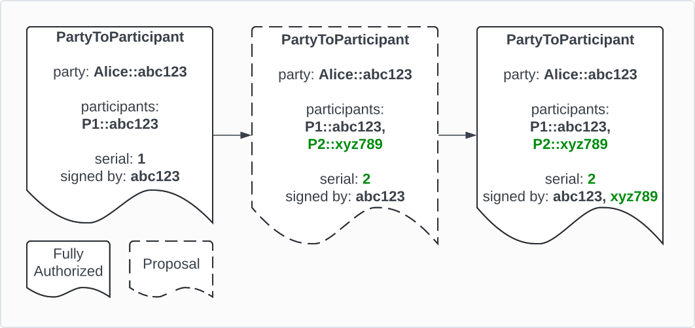
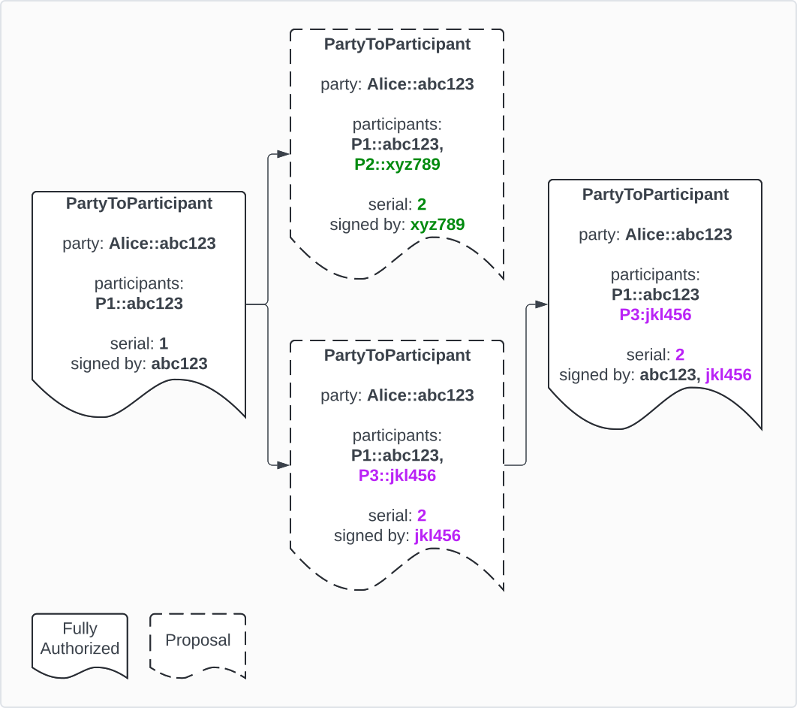
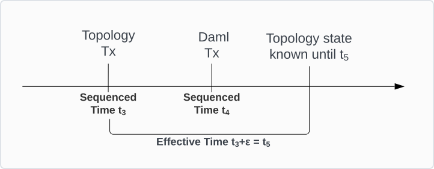
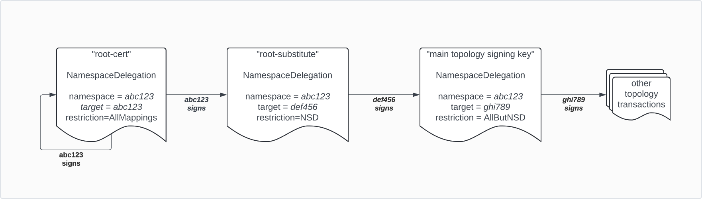
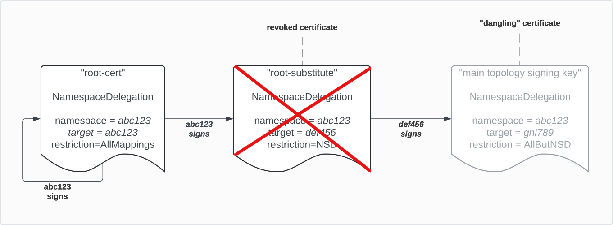

..
   Copyright (c) 2025 Digital Asset (Switzerland) GmbH and/or its affiliates. All rights reserved.
..
   SPDX-License-Identifier: Apache-2.0

.. default-role:: math

.. _identity-manager-1:

*******************
Topology management
*******************

.. note::

   * Replace with https://docs.google.com/document/d/1z2yNEUdVQ7bt8wDjPWrXaEh6XnkNvta7uumrQdnq33Q/edit?tab=t.0#heading=h.j1o9vy5fqmrz

   * Merge in some ideas from https://www.canton.network/hubfs/Canton%20Network%20Files/whitepapers/Polyglot_Canton_Whitepaper_11_02_25.pdf (topology ledger)

   * Decentralization is out of scope here and will be dealt with in a separate section

All Participant Nodes and Synchronizer components must know the topology state
of a Synchronizer, which includes all identities on the Synchronizer and their
associated keys. The two-phase commit protocol on a Synchronizer can therefore
assume that identities and keys are common knowledge and thus omit to include
such information in the protocol messages. Updates to the topology state are
distributed via the Synchronizer so that nodes maintain the synchronized
topology state via state machine replication.

The mechanism that establishes this shared understanding in a Synchronizer is
referred to as *topology management*. Each Canton node (Participant Nodes and
Synchronizer components) locally replicates a deterministic state machine to
validate changes to the topology state. This means that each Canton node
independently determines which topology changes are properly authorized
according to the authorization rules. The deterministic nature of the state
machine causes all Canton nodes connected to a Synchronizer to compute the same
conclusion about the topology state of that Synchronizer at any given time.

Requirements
============

The following non-exhaustive list of requirements drives the design and
implementation decisions for topology management in Canton.

* **No central authority**: topology transactions are not gated by a component
  that can only be run by a single entity.

* **Authorization Rules**: each type of topology transaction specifies the rules
  by which nodes can determine the required signatures for a particular topology
  transaction to become valid.

* **No Replay Attacks**: malicious actors must not be able to replay topology
  transactions at a later time.

* **Consensus**: All nodes that have observed the same sequenced time on a
  Synchronizer must come to the same conclusion regarding the state of topology
  for that sequenced time on this Synchronizer.

* **Not block Daml Transaction processing**: topology transaction processing
  must not block Daml Transaction processing.

Design principles
=================

To understand the approach to Canton's topology management, a few key principles
need to be introduced.

Similar to how there is no single globally trusted entity for synchronizing Daml
transactions, there is also no single globally trusted entity for establishing
identities, which leads us to the first principle:

.. todo:: cross-reference to the multi-synchronizer motivation <https://github.com/DACH-NY/canton/issues/25656>

  *Principle 1: For global synchronization to work in reality, there cannot
  be a single trust anchor.*

A cryptographic key pair can uniquely be identified through the fingerprint
of the public key. By owning the associated private key, an entity can always
prove unambiguously through a signature that the entity is the owner of the
public key. We are using this principle heavily in our system to verify and
authorize the activities of Canton key holders acting on a Canton Synchronizer.
As such, we can introduce the second principle:

  *Principle 2: A Canton key holder is an entity that can authorize actions and
  whose authorized actions can be verified.*

In short, every Canton key holder has a key or a set of keys that are
known to belong together. However, the preceding definition doesn't mean that we
necessarily know who owns the key. Ownership is an abstract aspect of the real
world and is not relevant for the synchronization itself. Real-world ownership
is only relevant for the interpretation of the meaning of some shared data,
but not of the data processing itself.

Therefore, we introduce the third principle:

  *Principle 3: We separate the certification of system identities and legal
  identities (or separation of cryptographical identity and metadata)*

Using keys, we can build trust chains by having a key sign a certificate
certifying some ownership or some fact to be associated with another key.
However, at the root of such chains is always the root key. The root key
itself is not certified and the legal ownership cannot be verified: we just
need to believe it. As an example, if we look at our local certificate store
on our device, then we just believe that a certain root is owned by a named
certificate authority. Our belief is rooted in the trust in our
operating system provider that they have included only legitimate keys.

As such, any link between legal identities to cryptographic keys through
certificates is based on a belief that the entity controlling the root key
is honest and ensures that everybody attached to the trust root has been
appropriately vetted. Therefore, we can only believe that legal identities are
properly associated, but verifying it in the absolute sense is very difficult,
especially impossible online.

Another relevant aspect is that identity requirements are asymmetrical
properties. While large corporations want to be known by their name (BANK),
individuals tend to be more closed and would prefer that their identity
is only revealed if necessary (GDPR, HIPAA, confidential information,
bank secrecy). Also, by looking at a bearer bond, for example, the owner has a
much higher interest in the identity of the obligor than the obligor has in the
owner. If the obligor turns out to be bad or a fraud, the owner might lose all
their money. In contrast, the obligor does not care to whom they are paying
back the bond, except for some regulatory reasons. Therefore, we conclude the
fourth principle

  *Principle 4: Identities on the ledger are an asymmetric problem, where
  privacy and publicity need to be carefully weighed on a case-by-case
  basis.*

Identities
==========

A Canton identity represents an actor on a Canton Synchronizer, such as a Canton
node or a party. Canton identities are backed by cryptographic certificates,
such that an identity can prove that it authorized an action and others can
verify that the action was indeed authorized by the identity.

.. _topology-namespaces:

Namespaces
----------

A namespace is defined by a root certificate, which declares that the signing
public key with fingerprint ``abc123`` is allowed to sign topology transactions
on behalf of namespace ``abc123``. The root certificate is signed by the
corresponding private key of the public key with fingerprint ``abc123``. This
demonstrates that the issuer of the root certificate for the namespace
``abc123`` is indeed in the possession of the corresponding private key. The
self-signed root certificate, together with the private key, act as the *root
of trust* or *trust anchor* for the namespace.

Canton can also bootstrap multi-signature namespaces where there is no single
controlling key(see :ref:`decentralization`).

Similar to other public key infrastructure systems, Canton supports intermediate
certificates that delegate authorization rights on behalf of a namespace to
additional keys(see :ref:`topology-authorization-chains`).

.. _topology-unique-identifiers:

Unique identifiers
------------------

A unique identifier (UID) represents an identity on a Canton
Synchronizer, such as a Canton node or a party. It is made up of a string,
called the identifier, and a namespace. Two UIDs can have the same identifier
as long as the namespaces are different. The Canton key holder owning the
namespace is in control of all UIDs within that namespace and often chooses
identifiers that refer to the role of the UID. For example, the Canton key
holder for the namespace ``abc123`` creates a party with the UID
``jane_doe:::abc123`` for a particular person they know, called *Jane Doe*.

Identity of a Canton node
-------------------------

By default, all Canton nodes create a new identity during the first startup,
unless auto initialization was not explicitly turned off. This identity also
serves as the namespace for the UID used in protocol messages
(topology transactions, submission requests) to refer to this node.

Identity of a party
-------------------

A party identifier is the same as a UID, that is, an identifier
(``alice``) within a namespace (``abc123``). By default, party identifiers are
created within the namespace of the hosting Participant Node (``abc123``). This
puts the ownership of the party in the hands of the owners of the Participant
Node's namespace. However, it is also possible to create a separate namespace
for a party, decoupling its ownership from the hosting Participant Node. This
is done by creating a root certificate for a different private key
(``xyz789``) and creating the party identifier within that namespace
(``alice::xyz789``). The Participant Node can still host the party even though
the Participant Node and the party do not share the same namespace.

Reminder: LAPI users vs. parties (see protocol.rst)
---------------------------------------------------

Structure of topology transactions
==================================

Topology transactions make up the topology state, which is maintained as a
key-value map. Individual topology transactions always affect exactly one key.
They modify the value, provided they are well-formed and well-authorized. A
topology transaction is considered well-formed if it passes all the checks that
can be checked independent of the current topology state, and is considered
well-authorized if it passes all the checks that depend on the topology state as
of the topology transaction's effective time (see
:ref:`topology-effectiveness`).

Topology mappings
-----------------

A topology transaction holds or modifies state about a certain aspect of the
topology state of a Synchronizer. For example, this could be all signing and
encryption keys used by a certain Canton node, or a list of which Participant
Nodes host a particular party. The content of a topology transaction is also
referred to as a mapping.

Every mapping type defines how to compute the unique key based on the mapping's
content. At most one topology transaction per unique key can be active at any
given time. For example, the unique key of a ``PartyToParticipantMapping``
mapping consists of the ``partyId``. This means that there can only ever be at
most one active ``PartyToParticipantMapping`` topology transaction for a given
``partyId`` per Synchronizer.

For definitions of all mappings and the respective unique keys, please refer to
topology.proto.

.. todo:: link to topology proto? <https://github.com/DACH-NY/canton/issues/25656>

Serial
------
The serial of a topology transaction is used to evolve the mapping of a
particular unique key. The first serial of a unique key always starts at ``1``.
Any subsequent topology transaction must increase the serial of the preceding
topology transaction for the same key by exactly one. There must be no gaps
(going from ``1`` to ``3`` is not permitted) or repetitions (same serial but
different content). However, additional signatures of expected authorizers can
be added to an already fully authorized and currently effective topology
transaction. More on that later.

.. todo:: link to the section that covers the "more on that later". <https://github.com/DACH-NY/canton/issues/25656>

The serial on the topology transaction prevents replay attacks. A malicious
actor cannot simply take a previously fully authorized transaction and submit
it again, because the Canton nodes on the Synchronizer detect an unexpected
serial and therefore reject the topology transaction.

Change operation
----------------

A topology transaction specifies whether it replaces (``REPLACE``) or removes
(``REMOVE``) a previous mapping. In the case of the very first mapping with
serial ``1``, the replace operation acts as a *create* or *add*. When removing
a mapping, it must have the same content as the topology transaction with the
previous serial. A transaction with the ``REMOVE`` operation must follow the
same rules regarding the serial number as transactions with the ``REPLACE``
operation, because it is just an entry in the transaction log. No data is
actually deleted from the topology state. Therefore it is generally also
possible to "reactivate" a previously removed mapping by submitting a topology
transaction with the ``REPLACE`` operation and the successor of the serial of
the topology transaction with the ``REMOVE`` operation.

.. _topology-signatures:

Signatures
----------

All topology mappings precisely define which identities must provide their
authorization before the topology transaction is considered well-authorized. In
Canton, an identity expresses its authorization by providing a cryptographic
signature of the topology transaction to all members of the Synchronizer.

For example, hosting a party(``alice::abc123``) on Participant Node
(``p1::xyz789``) requires the authorization, and therefore signatures, of both
the owner of the party and the owner of the Participant Node. The party has to
authorize that it wants the Participant Node to handle the party's sensitive
data. On the other hand, the Participant Node has to accept the operational
responsibilities of hosting a party, such as receiving and handling the party's
transactions. If both party and Participant Node are owned by the same
identity, one signature is sufficient.

The cryptographic signature of a topology transaction covers the mapping, the
serial, and the change operation. Therefore, tampering with any of these
attributes of a topology transaction invalidates the existing signatures.
Likewise, the signature of a previous topology transaction cannot be used for
any other topology transaction, because the data that is covered by the
signature is not the same, not even for the same unique key and the same
content. At least the serial must change in a later evolution of the
value for the unique key.

.. todo:: Section "Binding topology transactions to Synchronizers" <https://github.com/DACH-NY/canton/issues/25656>

Types of topology mappings
==========================

.. _topology-delegation:

Namespace definition and delegation
-----------------------------------

As outlined in the section :ref:`topology-namespaces`, a namespace is defined by
a self-signed root certificate. Concretely, the root certificate is a
self-signed ``NamespaceDelegation`` (NSD) where the namespace, the target key,
and the key used for signing the transaction are the same. This is expressed as
``NSD(namespace=ROOT_KEY, target=ROOT_KEY, signedBy=ROOT_KEY)``. This key can be
used to sign all other topology transactions on behalf of that namespace.

A Canton key holder can also delegate authorization power to other keys. See
:ref:`topology-authorization-chains` and :ref:`topology-key-revocation` for more
details on those subjects.

The ``NamespaceDelegation`` topology mapping allows you to restrict the
target signing key to only be used for certain topology transactions. There are
three kinds of restrictions:

* ``CanSignAllMappings``: the target key is allowed to sign all topology
  mappings that are currently known and any topology mapping that might be added
  in a future Canton release.
* ``CanSignAllButNamespaceDelegations``: the target key is allowed to sign all
  topology mappings that are currently known, except for other
  ``NamespaceDelegation`` mappings, and any topology mapping that might be added
  in a future Canton release. This restriction is typically used for a key that
  acts as a root key substitute for daily use, so that the actual root key can
  be moved to cold storage for security reasons.
* ``CanSignSpecificMappings(mappings)``: the target key can only be used to sign
  the topology mappings that are explicitly listed in the ``mappings``
  parameter. This facilitates the implementation of a strict security regimen to
  compartmentalize the impact area in case a key gets compromised.

.. _topology-cryptographic-keys:

Cryptographic keys
------------------

Canton key holders use cryptographic signing and encryption keys when
communicating with each other over the shared ledger, via Sequencers. The
signatures allow receivers to verify the originator of each message, whereas
encryption ensures that sensitive data in those messages remains confidential.

Canton key holders declare which keys they want to use with topology mappings;
``OwnerToKeyMapping`` for Canton nodes and ``PartyToKeyMapping`` for external
parties (see :ref:`overview_canton_external_parties`). Canton key holders use the keys listed in
these topology mappings for various use cases across the layers of Canton's
communication protocols (see :ref:`protocols`) except for topology management.
Specifically, the signing keys in ``OwnerToKeyMapping`` and
``PartyToKeyMapping`` cannot be used for signing topology transactions, unless
the same key is also the target of a ``NamespaceDelegation``. This practice is
highly discouraged for security reasons.

.. _topology-parties:

Parties in the topology state
-----------------------------

Parties are declared via the ``PartyToParticipant`` topology mapping, which
defines the Participant Nodes that host the party. Hosting a party gives the
Participant Node the rights, if not the obligation, to process Daml Transactions
for the party. This gives the Participant Node access to the party's contracts.
Therefore, the owner of a party, (i.e., key holder of the party's
namespace) must carefully select which Participant Nodes are trustworthy to
process the party's sensitive data.

From the Participant Node's perspective, hosting a party implies certain
responsibilities and obligations towards the party. Most notably, the
Participant Node is expected to participate in the :ref:`two-phase
commit<protocol-two-phase-commit>` protocol for the party's transactions and
store the data locally so that applications can access the data on the party's
behalf.

Both the party's owner and the Participant Node must consent to enter this
relationship by authorizing the respective ``PartyToParticipant`` topology
transaction.

.. _topology-participant-permission:

Participant Nodes can host a party with different permissions, which are
assigned by the party's owner:

* **Observation**: the Participant Node only gets notified of transactions in
  which the hosted party is a stakeholder.
* **Confirmation**: the Participant Node confirms or rejects Daml Transactions
  as part of the :ref:`two-phase commit<protocol-two-phase-commit>` protocol.
  This permission subsumes the *Observation* permission.
* **Submission**: the Participant Node is authorized to submit Daml Transactions
  for the party. This permission subsumes the *Confirmation* permission.

The distinction between Submission and Confirmation is only enforced in the
Participant Node. A malicious Participant Node with Confirmation permission for
a certain party can submit Daml transactions in the name of the party. This is
due to Canton's high level of privacy where validators do not know the identity
of the submitting Participant Node. Therefore, a party who delegates
Confirmation permissions to a Participant Node should trust the Participant Node
sufficiently.

A party's owner may decide to have the party hosted on multiple Participant
Nodes (see :ref:`decentralized-parties`).

.. _topology-package-vetting:

Package vetting
---------------

Validating Daml Transactions ultimately means running Daml code written by third
parties. This exposes the Participant Node to certain risks, as Daml code can
run for an arbitrarily long time and consume a large amount of memory.
Therefore, a Participant Node's owner must explicitly declare which packages
they agree to run on their Participant Node. They do this via the topology
mapping ``VettedPackages``. The Participant Node's owner may restrict the
vetting of a package to a specific window of time, which can be open-ended on
either side. Furthermore, the ``VettedPackages`` topology mapping determines
what version of a Daml template will be used for interpreting a Ledger API
command.

.. todo:: add section Synchronizer Parameters <https://github.com/DACH-NY/canton/issues/25656>

Membership with a Synchronizer
------------------------------

To onboard a Canton node to a Synchronizer, it must provide its identity
topology transactions, which include at the very least the node's root
certificate ``NamespaceDelegation`` and the node's cryptographic keys in an
``OwnerToKeyMapping`` topology transaction. This specific bundle of topology
transactions is called *identity transactions*. The actual membership of a
Canton node is expressed differently for each of the three node types:

* **Participant Node**: when connecting to a Synchronizer, the Participant Node
  submits its identity transactions together with an automatically generated
  ``SynchronizerTrustCertificate`` topology transaction, which is specific to
  the combination of the Participant Node's UID and the Synchronizer's
  ``SynchronizerId``. Therefore, it cannot be taken from one Synchronizer and
  replayed on another Synchronizer, because the ``SynchronizerId`` contained in
  the topology mapping would not match the target Synchronizer. Thus, a
  ``SynchronizerTrustCertificate`` is an explicit signal that the Participant
  Node's owner wants the Participant Node to be a member of the Synchronizer.
* **Sequencer**: a Sequencer is considered a member of a Synchronizer, if the
  Synchronizer's topology state contains the Sequencer's identity transactions
  and the Synchronizer owners have added the Sequencer to the Synchronizer's
  ``SequencerSynchronizerState`` topology mapping. This mapping lists all
  Sequencers of a Synchronizer and is controlled by the Synchronizer owners.
  There are various reasons why the Sequencer does not need to authorize its
  addition to the ``SequencerSynchronizerState`` mapping:

  1. The Synchronizer owners are interested in providing a good service to
     Participant Nodes. Advertising a Sequencer, that is not ready or not
     willing to serve other members, does not achieve that goal of a good
     service. In any case, Synchronizer owners likely have legal contracts in
     place to manage the relationship with third party Sequencers running on the
     Synchronizer.
  2. A Sequencer can only serve one Synchronizer, which means that Sequencers
     are bootstrapped and set up for the specific purpose of becoming a member
     of a certain Synchronizer.
  3. Considering that the goals of the Synchronizer owners and the Sequencer
     owners are aligned, not requiring the Sequencer owners to authorize the
     addition of the Sequencer to the topology state simplifies the onboarding
     process of the Sequencer significantly.

  For more information on how to onboard a Sequencer to a Synchronizer, please
  refer to :externalref:`dynamically_adding_sequencers`.
* **Mediator**: the membership of Mediators works similar to the membership of
  Sequencers: its identity transactions must be in the topology state, and the
  Synchronizer owners have added the Mediator to a ``MediatorSynchronizerState``
  topology mapping. There can be more than one such mapping, in case the
  Synchronizer owners decided to allow the distribution of the Mediator workload
  to multiple Mediator groups (see :externalref:`optimize-mediator`). A Mediator can
  only be in single Mediator group. For more information on how to onboard a
  Mediator, please refer to :externalref:`dynamically_adding_mediators`.

Evolving a topology mapping
===========================

Proposals
---------

Canton nodes regard topology transactions with insufficient authorization as
proposals and do not take them into account when computing the topology state
for a particular timestamp. But even with insufficient signatures, a proposal
must be well-formed as if it were a fully authorized transaction.

When a Canton node receives a proposal, it first merges the signatures of any
previously successfully validated proposals for the same topology transaction
into the proposal and only then continues to validate the resulting proposal
with all known signatures. This has no effect on the proposal already stored
locally. Once a sufficient number of identities submitted their signatures for a
proposal, the proposal becomes a fully authorized topology transaction if all
validations pass successfully.

Proposals have no timestamp of expiration. This means that a proposal is pending
until enough signatures have been submitted to make it fully authorized, or the
Canton node successfully validates a fully authorized topology transaction for
the same unique key.

.. _topology-proposals-example:

Example
~~~~~~~

The starting point is a ``PartyToParticipant`` mapping for party
``Alice::abc123`` and its hosting Participant Node ``P1::abc123`` at serial
``1``. The owner of the party now wants the Participant Node ``P2::xyz789`` to
host the party as well. Therefore, the party's owner submits a proposal of the
mapping that includes ``P2::xyz789`` as a hosting Participant Node with serial
``2``. According to the authorization rules defined by the
``PartyToParticipant`` mapping, the key holders of both namespaces ``abc123``
and ``xyz789`` must authorize this change. Since the party's owner can only
provide the signature for the namespace ``abc123``, the Canton nodes store the
topology transaction with serial ``2`` as a proposal. Once the new hosting
Participant Node's key holder submits their signature for this topology
transaction to the Synchronizer, the Canton nodes merge the signatures and store
the now fully authorized ``PartyToParticipant`` mapping after successful
validation.

.. https://lucid.app/lucidchart/03fbc838-4153-4442-8e6f-fc91ee9313a4/

.. todo:: link to the PartyToParticipant mapping topology proto documentation. <https://github.com/DACH-NY/canton/issues/25656>

Concurrent / competing proposals
--------------------------------

When Canton nodes submit proposals for a mapping with the same unique key, the
same serial, but varying content, they have produced competing proposals. These
topology transactions are proposals because they are not yet fully authorized,
and they are competing because the first proposal to become fully authorized
automatically invalidates all other proposals for the same unique key and the
same serial.

Example
~~~~~~~

To illustrate, consider the scenario where the Participant Node ``P1::abc123``
hosts the party ``Alice::abc123``. The key holder for ``abc123`` is in
negotiations with two other key holders for the Participant Nodes ``P2::xyz789``
and ``P3::jkl456``. Both of those other key holders decide to submit their
proposal to host ``Alice::abc123``. Both send a topology transaction with serial
``2`` to add themselves as hosting Participant Node. Since ``abc123``’s
signature is required to satisfy the authorization requirements, both
transactions are considered proposals until ``abc123`` decides to sign one of
them. In this example, ``abc123`` chooses to allow hosting Alice on
``P3::jkl456`` and signs the respective proposal, turning it into a fully
authorized transaction. ``P2::xyz789``’s proposal automatically gets
invalidated, since now there is a fully authorized transaction with serial
``2``. ``P2::xyz789``’s proposal has no chance of ever becoming valid, because
there may only be at most one fully authorized topology transaction for a unique
key with a given serial.

.. https://lucid.app/lucidchart/03fbc838-4153-4442-8e6f-fc91ee9313a4/

.. _topology-effectiveness:

Validity / effectiveness
------------------------

Upon validating a topology transaction received from the Sequencer, Canton nodes
deterministically compute the so-called *effective time* of the topology
transaction based on its sequencing time. For more details about the computation
of the effective time, please refer to the sections
:ref:`topology-sequential-validation` and :ref:`topology-future-dating`.
The effective time of the topology transaction for a unique key
with serial ``n`` marks the exclusive beginning of the topology transactions
validity period and simultaneously marks the inclusive end timestamp of the
predecessor topology transaction for the same unique key with serial ``n-1`` and
all proposals for the same unique key with serial ``n``. The fully authorized
topology transaction with serial ``n`` triggers the "expiry" of the proposals
with serial ``n``, because it prevents those proposals from becoming fully
authorized, because the next fully authorized topology transaction must have
serial ``n+1``. Conversely, a successfully validated proposal with serial
``n+1`` does not determine the end of the validity period of the fully
authorized topology transaction with serial ``n``.

As a consequence of the definition of the validity period, all fully authorized
topology transaction for a unique key build a "validity timeline" with no gaps,
which unambiguously defines which topology transaction is considered effective
for any given point in time.

.. todo:: Add pointers to API docs and howtos in "Operate" and "Subnet" subsites <https://github.com/DACH-NY/canton/issues/25656>

Disseminating topology transactions
===================================

This section describes how Canton Participant Nodes and Synchronizer components
learn about changes to the topology state on a Synchronizer. Since there is no
centralized component that manages and validates the topology state, each
Synchronizer component and Participant Node receives and validates all changes
to the topology state on their own.

Broadcast of topology changes
-----------------------------

Canton nodes connected to a Synchronizer submit topology transactions, addressed
to the broadcast recipient group ``AllMembersOfSynchronizer``, to the
Sequencer. The resolution of this group address to concrete members is done by
the sequencers using the sequencing time of the transaction as the reference
time. The nodes must reject topology transactions that were not addressed to
the broadcast recipient group, because accepting such topology changes could
lead to a ledger fork due to diverging topology state.

Operators of a Canton node can use either the gRPC Admin API or the admin
console commands to issue new topology transactions.

.. _topology-sequential-validation:

Sequential validation
---------------------

Canton nodes validate topology transactions one after the other in a strictly
sequential manner. The system currently does not track dependencies or conflicts
between topology transactions, which is a complex task that is highly error
prone and fragile. Without such tracking, processing topology transactions in
parallel would make the validating state machine non-deterministic and would
lead to diverging topology states between Canton nodes. Therefore, to ensure
integrity for the topology state across all members of a Synchronizer, all
topology transactions must be fully processed sequentially.

The various layers of Canton's protocol (see :ref:`protocols`) rely on topology
snapshots to access the topology state necessary to process the respective event
or message at that layer. The topology snapshots are driven by topology updates
via topology transactions and to compute a topology snapshot, the Canton node
must be sure that all topology transactions up to this timestamp have been
processed. Otherwise, the topology state would be incomplete and could miss
important changes that are relevant for the processing of the message at that
layer, for example, changes to party hosting or vetted packages, or changes to
the Sequencer's signing keys. Therefore the individual protocol layers have to
carefully select a timestamp for the topology snapshot to avoid deadlocks.

The dependency between message processing in general and the topology state is
primarily due to the need to verify the Sequencer's signature on every message.

A simple way to resolve this dependency is to separate topology transactions
from other events into dedicated blocks, so that they get a separate sequenced
time and are processed separately.

The downside of this simple approach is that any topology transaction puts a
temporary stop, however brief, to the processing of other messages. This
hurts both latency and throughput.

.. _topology-future-dating:

Future dating
-------------

One way to work around the problem of topology transactions pausing the
processing of messages in the various protocol layers is to make topology
transactions effective at some point in the future. The concept of *effective
time*  was already introduced in the section :ref:`topology-effectiveness`.
While a topology transaction is sequenced at time ``t``, it only becomes
effective after the *topology change delay* ``ε``. The time ``t+ε`` gives the
lower bound for the effective time. If the topology change delay hasn't been
changed recently, the effective time is equal to the lower bound ``t+ε``. The
topology change delay is a dynamic Synchronizer parameter in the topology state
and can be changed by the Synchronizer owners. Therefore the actual topology
change delay used for the calculation of the effective time must be read from
the topology state during the validation of topology transactions.

.. todo:: link to a howto for changing Synchronizer parameters <https://github.com/DACH-NY/canton/issues/25656>

This mechanism allows other messages and events between ``t`` and ``t+ε`` to be
processed normally without having to wait for the topology processing layer.

How big should ``ε``, the topology change delay, be? The trade off is between
not blocking the processing of other messages and not waiting too long for a
topology transaction to become effective. Topology change delay should be just
larger than it takes to process a topology transaction. With a topology change
delay of 0 ms, topology transactions become effective immediately, but as
described in previous section, the processing of other messages needs to wait
until the Canton node can be sure that there are no pending topology
transactions for the topology snapshot required for that message. On the other
hand, with a topology change delay of 30 s, Daml transactions are unlikely to be
blocked from processing, but it takes quite a while before, for example, a party
can actually be used in a transaction.

To illustrate the benefits of future dating, consider the following example. The
effective time of the topology transaction at t\ :sub:`3`\  is computed to be t\
:sub:`5`\ . Therefore, once the processing of the topology transaction
completes, the processing of the Daml Transaction at t\ :sub:`4`\  can
access the topology snapshot at t\ :sub:`4`\ , because the Canton node knows, that it
has seen all changes to the topology state that are relevant for a snapshot up
to t\ :sub:`5`\ .

.. https://lucid.app/lucidchart/03fbc838-4153-4442-8e6f-fc91ee9313a4/edit?page=_4giX7nLVzKD

.. todo:: link to dynamic Synchronizer parameters reference. <https://github.com/DACH-NY/canton/issues/25656>

.. _authorization:

Authorization
=============

The section :ref:`topology-signatures` mentions that topology mappings define
the rules that determine the required authorizers for the topology transaction
to be considered fully authorized, and states that key holders express this
authorization by disseminating a cryptographic signature over the topology
transaction to the Synchronizer.

This section goes into more detail about these aspects.

Authorization rules
-------------------

Each type of topology mapping changes a certain aspect of the Synchronizer's
topology state, which must be authorized by the key holders that are either
impacted by or responsible for that change. In other words, only key holders
can make changes to the topology state under their responsibility. For example,
only the key holders of a Participant Node may change the list of packages that
are vetted by that Participant Node. Similarly, only the key holders of the
Synchronizer may change dynamic parameters of the Synchronizer.

For definitions of all mappings and the respective authorization rules, please
refer to topology.proto.

.. todo:: link to topology proto? <https://github.com/DACH-NY/canton/issues/25656>

Some topology mappings define more than one required authorizer for certain
changes. A common scenario is the hosting of a party on a Participant Node that
is not owned by the same key holder as the party. This scenario was shown in the
example for evolving topology mappings (see :ref:`topology-proposals-example`).
On the one hand, hosting a party gives the Participant Node access to data in
Daml transactions that pertains to the party. Therefore, the party's key holder
must express its consent that it wishes the Participant Node to receive and
process the party's Daml transactions. On the other hand, the Participant Node's
key holders must consent to host the party, because hosting a party incurs
network and storage cost, as well as the obligation to comply with the
:ref:`two-phase commit protocol <protocol-two-phase-commit>` for Daml
transactions that involve the party.

.. _topology-authorization-chains:

Authorization chains
--------------------

As described in the section :ref:`topology-namespaces` and
:ref:`topology-delegation`, the root certificate of a namespace serves as the
trust anchor. For security reasons, it is recommended to keep the root namespace
key in secure cold storage to reduce the risk of unauthorized access to the key.
This is especially important, as the root namespace key cannot be rolled,
because generating a new key would effectively create a new namespace.
Therefore, Canton supports the implementation of this recommended security
practice, by allowing Canton key holders to delegate authorization rights to
other keys that are not the root namespace key.

With only the root certificate for the namespace, the first namespace delegation
must be signed by root key: ``NamespaceDelegation(namespace=ROOT_KEY,
target=KEY1, signedBy=ROOT_KEY)``. The key holder for the namespace represented
by ``ROOT_KEY`` can now use ``KEY1`` to sign other topology transactions,
including further namespace delegations to additional keys, and move the private
key ``ROOT_KEY`` off of the live system.

Whenever a Canton node validates a signature of a topology transaction, it
validates that the signature itself correctly signs the topology transaction,
but it also checks that there is a certificate or delegation chain without gaps
from the signing key to the root namespace key.

Consider the following scenario, where the key holder for namespace ``abc123``
creates a root certificate and a "root-substitute" certificate for key
``def456``. The key for the root-substitute in turn is restricted to only sign
other namespace delegations and signs the "main topology signing key"
``ghi789``. This signing key cannot sign other namespace delegations, but can be
used to sign any other topology transaction.

.. https://lucid.app/lucidchart/03fbc838-4153-4442-8e6f-fc91ee9313a4/edit?page=2oJVpWUfm8eF

To continue the example, consider that the key holder for namespace ``abc123``
broadcasts a ``PartyToParticipant`` mapping for party ``alice::abc123`` signed
by the key ``ghi789`` on a Synchronizer. When validating this topology
transaction, all Canton nodes on the Synchronizer build a directed acylic graph
of all namespace delegations for the namespace ``abc123`` and verify that there
is a valid chain of certificates in the topology snapshot at the topology
transaction's effective time from the root certificate ``abc123`` to the key
``ghi789``. And indeed there is such a chain ``abc123 -> def456 -> ghi789``.

.. _topology-key-revocation:

Key revocation
--------------

A Canton key holder can revoke an intermediate certificate by broadcasting a
namespace delegation for that key with the ``REMOVE`` operation. This revocation
does not invalidate previously validated topology transactions signed with the
key of the now revoked certificate, because at the time of the validation it was
still a valid certificate. After the revocation has become effective, Canton
nodes must reject signatures made by the key on behalf of the namespace.
Additionally, all certificates that were signed by the key of the revoked
certificate are now considered "dangling". Even though they haven't been revoked
themselves, there is now no chain of valid certificates between them and the
root certificate. Similar to the scenario with revoked certificates, the fact
that a certificate is in a dangling state does not invalidated previously
validated topology transactions signed by the key of the now dangling
certificate, because it wasn't dangling at the time of the successful
validation.

Continuing the example from the :ref:`preceding section
<topology-authorization-chains>`, the key holder for ``abc123`` revokes the
certificate for the key ``def456``, which leaves the certificate for the key
``ghi789`` dangling. Therefore, Canton nodes must reject any signatures for
future topology transactions on behalf of the namespace ``abc123`` made by
either of the keys ``def456`` or ``ghi789``.

.. https://lucid.app/lucidchart/03fbc838-4153-4442-8e6f-fc91ee9313a4/edit?page=3O-ioZ3C0FPK

