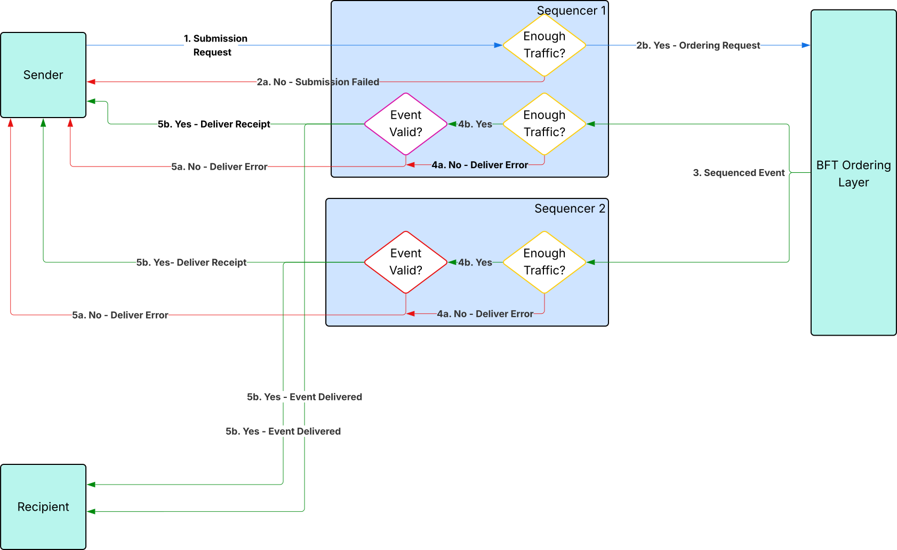

..
   Copyright (c) 2025 Digital Asset (Switzerland) GmbH and/or its affiliates. All rights reserved.
..
   SPDX-License-Identifier: Apache-2.0

.. _overview-explanation-traffic-management:

Traffic management
##################

The sequencer is a critical component of a Canton synchronizer and incurs significant operating costs.
As such Canton provides a mechanism to protect it from abuse, and control how much data individual members of the synchronizer can get sequenced over time.
To that end, the sequencers of a synchronizer perform traffic accounting and enforce traffic limits.
This page explains this mechanism.

Submission requests
*******************

The sequencer API offers a ``SendAsync`` RPC to get events sequenced on a synchronizer.
Submission requests are the payload of the SendAsync RPC and are the principal focus of traffic management, as the sequencers spend most of their resources on processing those RPCs.

Traffic Cost
============

The traffic cost aims to capture the processing cost of a submission request along two dimensions:

* Network traffic incurred by recipients reading the event
* Storage cost of the events in the sequencer

Traffic cost looks at two components of submission request:

* The sender
* The list of envelopes. Each envelope contains:

    * A payload (arbitrary bytes)
    * A list of recipients (members of the synchronizer). Recipients can be addressed either:

        * Individually
        * Via group addressing. Group addressing allows to address a specific set of recipients as a group. For instance, the group address ``AllMembersOfSynchronizer`` will send the payload to all members of the synchronizer.

The traffic cost of a submission request is calculated as follows (pseudo-code):

.. code-block::

    fn calculate_submission_request_traffic_cost:
        envelopes_cost = 0

        for envelope in envelopes:
            storage_cost = envelope.payload
            network_cost = envelope.payload * envelope.recipients.size * read_vs_write_scaling_factor
            submission_request = storage_cost + network_cost
            envelopes_cost = envelopes_cost + submission_request

        return base_event_cost + envelopes_cost

where ``base_event_cost`` is a constant cost for the submission request added to the envelopes cost, and ``read_vs_write_scaling_factor`` is a constant factor that scales the network cost based on the number of recipients.
Both are configuration parameters of the synchronizer and part of the topology. See the :ref:`configuration section <traffic_config>` for more details. Typically the ``read_vs_write_scaling_factor`` is in the order of 1/10000 and scales down the payload size to account for network bandwidth when recipients read the event.

Group addresses are resolved before the cost is computed. This means that a message addressed to ``AllMembersOfSynchronizer`` will have a network cost scaled to the number of members in the synchronizer at the time the request is submitted.

The traffic cost is charged to the sender for every submission request sequenced on the synchronizer.
Submission requests include confirmation requests, confirmation responses, ACS commitments, topology requests, and time proofs.

Because time proofs are technically empty messages, their traffic cost is always equal to ``base_event_cost``.

Synchronizer members typically send regular acknowledgements to the synchronizer to confirm that they have received the events sent to them. This allows sequencers to prune events safely.
Acknowledgements do not cost traffic, but are rate limited to avoid abuse.

Traffic accounting
******************

The sequencers of the synchronizer perform traffic accounting jointly. Each authorized member of the synchronizer gets the cost of their submission requests deducted from their traffic balance once the request has been sequenced.
The traffic parameters described above are configured as part of the dynamic domain parameters of the synchronizer, and are therefore subject ot change. The cost of a request may consequently change between the moment it is submitted to the sequencer API and the moment it is sequenced, if the traffic parameters changed in the meantime.
To that end, each member computes the expected cost of a submission request when sending it and includes it in the request's metadata.
To prevent submission failures when the traffic parameters are updated concurrently, sequencers allow a grace period during which the cost computed by the member may differ from the cost at sequencing time,
as long as the submission cost was correctly computed when the submission was made. Beyond this time window, the submission is rejected and must be retried with up-to-date traffic costs.
The duration of this window is equal to ``(confirmationResponseTimeout + mediatorReactionTimeout) * 2``.
Refer to the :externalref:`dynamic synchronizer parameters <dynamic-sync-params>` documentation for more details on these parameters.

When a node subscribes to receive events from several sequencers of a given synchronizer, it requests its current traffic state from all sequencers and compares them in a Byzantine Fault Tolerant (BFT) fashion.
This provides an initial traffic state for the node, which then continually updates its traffic state in memory as it observes its own events being sequenced from the subscription.

Traffic enforcement
===================

The following diagram gives a high level of the enforcement flow and scenarios.

.. https://lucid.app/lucidchart/075a2a25-0fc2-4263-a7dc-283aecd00b4d/edit

There are a few points to highlight on this diagram.

Enforcement takes place at two points in the submission flow:

* After step 1 when the sequencer receives the submission request from the sender.
  At this stage the sequencer decides whether the sender has enough traffic for the request using its local knowledge of the sender's traffic state.
  If it determines that the sender does not have enough traffic, it rejects the request at this stage.

* After step 3, every sequencer reads the sequenced event from the BFT ordering layer.
  At this stage each sequencer runs the same logic as in step 1, except they use the traffic state of the sender at the sequencing time of this event.
  This enables every sequencer to make the same deterministic decision on whether the sender has enough traffic.

    * If the sender does not have enough traffic, the event is not sent to its recipient, and the sender receives a deliver error indicating the reason.
      This is called "wasted sequencing" and will be reported as such in metrics.
    * If the sender has enough traffic, traffic is deducted from the sender's balance. What happens after this depends on whether the event is valid and can be delivered to its recipients.
      Additional validations beyond traffic control happen in the sequencer before an event can be delivered (such as validating signatures, the existence of recipients, and so on).
      If those validations pass, the event is delivered, and the sender receives a delivery receipt that includes a ``TrafficReceipt``. The receipt allows the sender to update its traffic state accordingly.
      If the event is otherwise invalid, the event is not delivered, and the sender receives a delivery error indicating the reason for the failure. This last case is called "wasted traffic" and is reported as such in metrics.

Acquiring traffic
*****************

Base traffic
============

All members of the synchronizer accumulate base traffic passively over time.
Note that time here refers to the synchronizer's time, not the wall clock time of the sender.
How fast traffic accumulates and the maximum amount of base traffic a member can accumulate is determined by the synchronizer's traffic :ref:`configuration <traffic_config>`.
Base traffic is generally limited and used to bootstrap nodes and allow them to connect to a synchronizer which requires a minimal amount of traffic.
Most real-world scenarios require acquiring additional traffic.

Extra traffic
=============

Extra traffic can be acquired for any member of the synchronizer by calling the ``SetTrafficPurchased`` RPC on the sequencer Admin API of at least ``SequencerSynchronizerState.threshold`` sequencers.
``SequencerSynchronizerState`` is a topology transaction that defines the active sequencers of a synchronizer. It comes with a threshold defining the minimum number of sequencers that must approve a change affecting the sequencers, which includes the traffic state.
Therefore, in order to add extra traffic for a member on a synchronizer, the same traffic purchase request must be submitted to at least threshold sequencers within a :ref:`configurable <traffic_config>` time window.

.. important::

    The request sets the new absolute value of total extra traffic purchased for the member. **NOT** a delta in traffic.
    For example, if participant P1 has currently ``0`` extra traffic and wants to purchase ``1000`` extra traffic credits, a ``SetTrafficPurchased`` request with an amount of ``1000`` must be successfully processed by at least ``SequencerSynchronizerState.threshold`` sequencers.
    If later P1 wants an additional ``500`` extra traffic credit, a new ``SetTrafficPurchased`` request with an amount of ``1500`` must be successfully processed.

.. tip::

    Acquiring extra traffic is often referred to as a "top up" in the the documentation.

Serial
------

Each ``SetTrafficPurchased`` request requires a serial number to be set. The serial number is an integer used to ensure idempotency of the request and correctly handle concurrent traffic updates for the same member.
When a request is sent, the sequencer verifies that the serial number is higher than the last serial number used for that member.
If the serial is too low, the request fails and must be retried with the correct serial. To obtain the current serial, see :ref:`observing traffic <observing_traffic>`.

Acquiring extra traffic requires access to the Sequencer Admin API and synchronization amongst the sequencers.
In the Canton Network, this synchronization is handled on ledger via a Daml workflow resulting in each super validator updating the extra traffic balance of the member acquiring traffic.

.. _observing_traffic:

Observing traffic
*****************

Traffic state
=============

The sequencer Admin API exposes the traffic state of all members of a synchronizer via the ``SequencerAdministrationService.TrafficControlState`` RPC.
The Admin API of a participant node exposes the traffic state of the Participant Node via the ``TrafficControlService.TrafficControlState`` RPC

The state observed on the Participant Node is slightly delayed compared to the one observed from the sequencer for that Participant Node because the participant updates its state from the events it receives from its sequencer subscription,
which happens by definition after the event has been sequenced by the sequencer.

Metrics
=======

A number of traffic-related metrics are reported by the sequencer and can be used to monitor the traffic state of a synchronizer.
See :externalref:`Canton Metrics <canton-metrics>`

.. _traffic_config:

Configuration
*************

Traffic is configured via dynamic synchronizer parameters per synchronizer.

.. literalinclude:: CANTON/community/base/src/main/protobuf/com/digitalasset/canton/protocol/v30/traffic_control_parameters.proto
   :language: protobuf
   :start-after: [doc-entry-start: TrafficControlParameters]
   :end-before: [doc-entry-end: TrafficControlParameters]

Instructions on how to configure traffic are available in the :externalref:`how-to <sequencer-traffic>` section.
