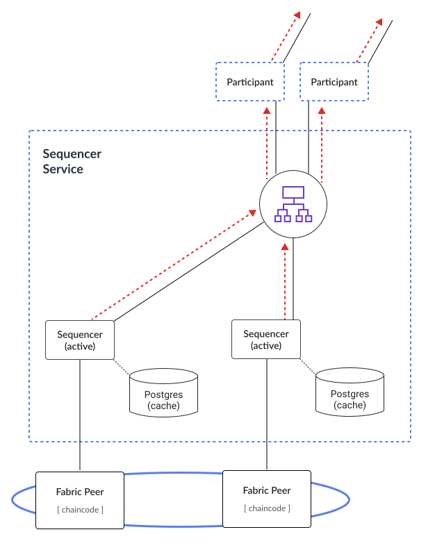

..
   Copyright (c) 2026 Digital Asset (Switzerland) GmbH and/or its affiliates. All rights reserved.
..
   SPDX-License-Identifier: Apache-2.0

.. wip::
    merge with participant.rst

Overview
########

**High Availability** (HA) is the elimination of single points of failure to ensure that applications continue to operate when a component they depend on, such as a server, fails.

In Daml solutions, HA focuses on the following components running in separate processes:

* Participant nodes

* Synchronizers:

    * Sequencer

    * Mediator

    * Synchronizer Topology Manager

.. _components-for-ha:
.. https://lucid.app/lucidchart/3082d315-f7d9-4ed7-926f-bb98841b7b38/edit?page=0_0#
.. EDIT REQUIRED

Participant Nodes
~~~~~~~~~~~~~~~~~

The availability of a participant node shouldn't affect the availability of another participant node, except for the following workflows:

  1. Where they are both involved.
  2. When they have distinct visibility configurations, i.e. they manage different parties involved in the workflow.

For example, if they both host the same party, transactions involving the party can continue as long as either of them is available.

.. NOTE::
    An application operating on behalf of a party cannot transparently failover from one participant node to another due to the difference in offsets emitted on each participant.

Synchronizers
~~~~~~~~~~~~~~~~~~~~~~~

A participant node's availability is not affected by the availability of the synchronizer, except for workflows that use the synchronizer. This allows participant nodes and synchronizers to take care of their HA separately.

Replication
~~~~~~~~~~~

To achieve HA, components replicate. All replicas of the same component have the same trust assumptions, i.e. the operators of one replica must trust the operators of the other replicas.

Databases
~~~~~~~~~

In general, when a component is backed by a database/ledger, the component's HA relies on the HA of the database/ledger. Therefore, the component's operator must handle the HA of the database separately.

All database-backed components are designed to be tolerant of temporary database outages. During the database failover period, components halt processing until the database becomes available again, resuming thereafter.

Transactions that involve these components may time out if the failover takes too long. Nevertheless, they can be safely resubmitted, as command deduplication is idempotent.

Health Check
~~~~~~~~~~~~

Canton components expose a :ref:`health endpoint <health-check>`, for checking the health of the components and their subcomponents.
