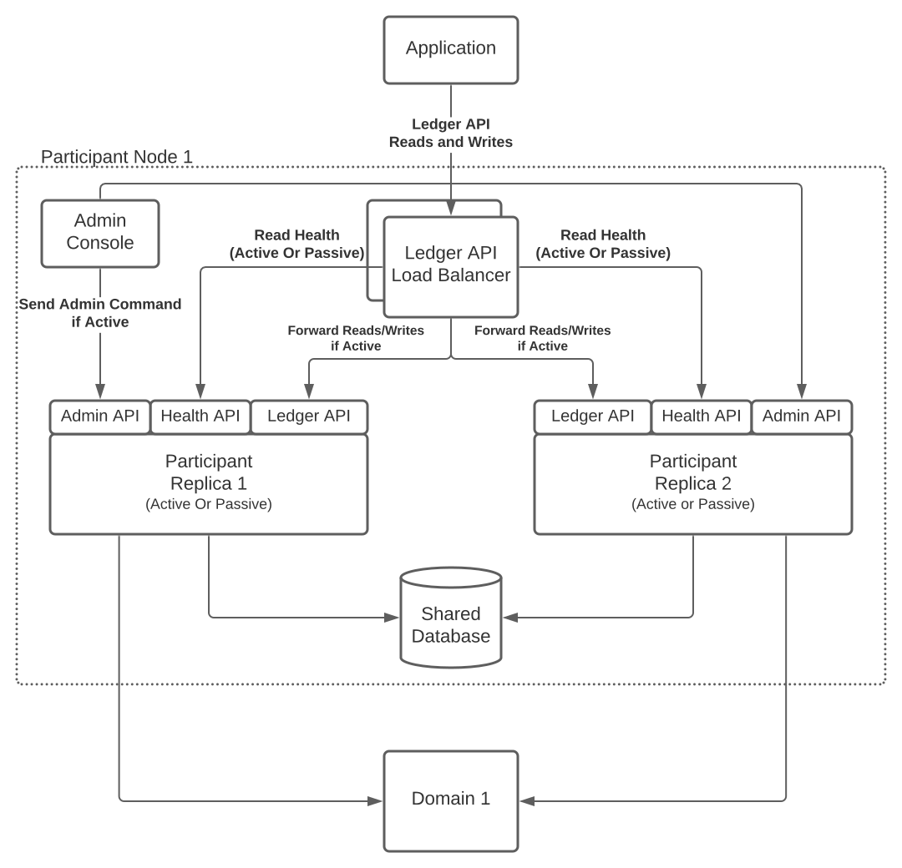

..
   Copyright (c) 2026 Digital Asset (Switzerland) GmbH and/or its affiliates. All rights reserved.
..
   SPDX-License-Identifier: Apache-2.0

.. _ha_participant_arch:

Active-Passive Participant Node Configuration
---------------------------------------------

Participant nodes are configured in an active-passive configuration with a shared database.

The active node services requests while a passive node waits in warm-standby mode, ready to take over if the active node fails.

High-Level System Design
~~~~~~~~~~~~~~~~~~~~~~~~

A logical participant node - shown below - contains an active and passive physical participant node with a shared database.

Each participant node exposes its own gRPC Ledger API although these can be hidden by a single gRPC Ledger API endpoint running on a highly available load balancer.

.. _participant-ha-system-topology:
.. https://lucid.app/lucidchart/cd96a3a6-e10b-4edc-bfb3-a70e484d7c06

The load balancer configuration contains details of all gRPC Ledger API server addresses and the ports for the participant node replicas. Nodes expose their active or passive status via a health endpoint. The load balancer can also detect when the backend port becomes unreachable, i.e. when the gRPC Ledger API server is shut down as a node goes from active to passive.

Periodically polling the health API endpoint, the load balancer identifies a node as offline if it is passive. Requests are then *only* sent to the active participant node.

.. IMPORTANT::
  The health endpoint polling frequency can affect the failover duration.

During failover, requests may still go to the former active node; which rejects them. The application retries until the requests are forwarded to the new active node.

Shared Database
"""""""""""""""

The nodes require a shared database for the following reasons:

1. To share the command ID deduplication state of the gRPC Ledger API command submission service. This prevents double submission of commands in case of failover.
2. To obtain consistent ledger offsets without which the application cannot seamlessly failover.
   The database stores ledger offsets in a non-deterministic manner based on the order of publishing events to the indexer.

Leader Election
~~~~~~~~~~~~~~~

A leader election establishes the active node. The participant node sets the chosen active node as the single writer to the shared database.

Exclusive, application-level database locks - tied to the database connection lifetime - enforce the leader election and set the chosen node as the single writer.

.. NOTE::
  Alternative approaches for leader election, such as Raft, are unsuitable because the leader status can be lost between the leader check and the use of the shared resource, i.e. writing to the database. Therefore, we cannot guarantee a single writer.

Exclusive Lock Acquisition
""""""""""""""""""""""""""

A participant node uses a write connection pool that is tied to an exclusive lock on a main connection, and a shared lock on all pool connections. If the main lock is lost, the pool's connections are ramped down. The new active node must wait until all the passive node's pool connections are closed, which is done by trying to acquire the shared lock in exclusive mode.

.. NOTE::
  Using the same connection for writes ensures that the lock is active while writes are performed.

Lock ID Allocation
""""""""""""""""""

Exclusive application-level locks are identified by a 30-bit integer lock ID which is allocated based on a scope name and counter.

The lock counter differentiates locks used in Canton from each other, depending on their usage. The scope name ensures the uniqueness of the lock ID for a given lock counter. The allocation process generates a unique lock ID by hashing and truncating the scope and counter to 30 bits.

.. NOTE::
  On Oracle, the lock scope is the schema name, i.e. user name. On PostgreSQL, it is the name of the database.

Participant nodes must allocate lock IDs and counters consistently. It is, therefore, crucial that nodes are configured with the same storage configuration, e.g. for Oracle using the correct username to allocate the lock IDs within the correct scope.

Prevent Passive Node Replica Activity
~~~~~~~~~~~~~~~~~~~~~~~~~~~~~~~~~~~~~

.. IMPORTANT::
  A passive node replica does not hold the exclusive lock and cannot write to the shared database.

To avoid passive node replicas attempting to write to the database - any such attempt fails and produces an error - we use a coarse-grained guard on synchronizer connectivity and API services.

To prevent the passive node from processing synchronizer events, and ensure it rejects incoming gRPC Ledger API requests, we keep the passive node disconnected from the synchronizers as coarse-grained enforcement.

Lock Loss and Failover
""""""""""""""""""""""

If the active node crashes or loses connection to the database, the lock is released and a passive node can claim the lock and become active. Any pending writes in the formerly active node fail due to losing the underlying connection and the corresponding lock.

The active node has a grace period in which it may rebuild the connection and reclaim the lock, due to the higher frequency of health checks on the lock in the active node vs. the passive node trying to acquire the lock at a lower frequency.

The passive node continuously attempts to acquire the lock within a configurable interval. Once the lock is acquired, the participant node's replication manager sets the state of the successful node to active.

When a passive node becomes active, it connects to previously connected synchronizers to resume event processing. The new active node accepts incoming requests, e.g. on the gRPC Ledger API which starts when the node becomes active. The former active node, which is now passive, shuts down its Ledger API to stop accepting incoming requests.
