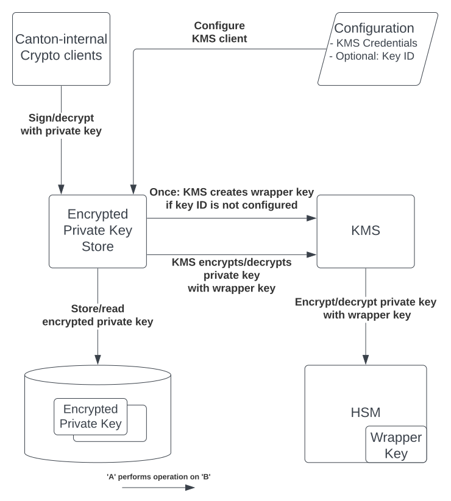
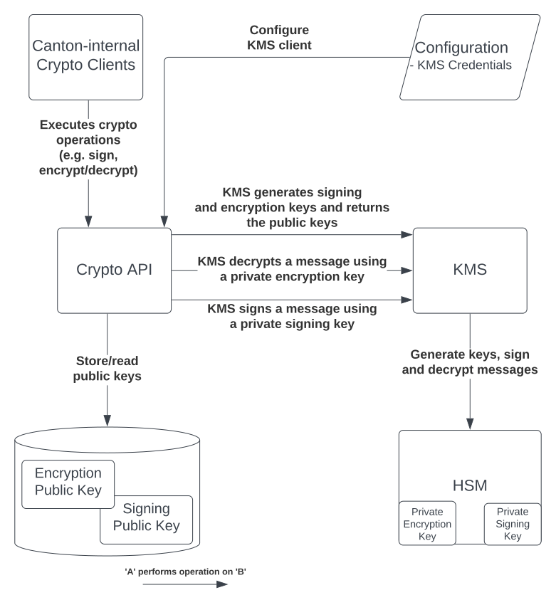
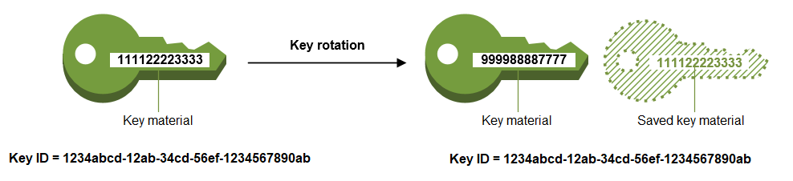

..
   Copyright (c) 2025 Digital Asset (Switzerland) GmbH and/or its affiliates. All rights reserved.
..
   SPDX-License-Identifier: Apache-2.0

.. wip::
    Review and update.
    Make sure to not duplicate contents from canton/security.rst.
    Cover session signing/encryption keys and party keys details.
    Link to "overview" -> security page which covers high-level what cryptography is used in canton and which keys are being used.
    Here we cover more details on how the keys are used by the participant node and the internal architecture around KMS usage.

.. _canton-security:

Security & Key Management
=========================

Parking lot
"""""""""""

Public Key Distribution using Topology Management
^^^^^^^^^^^^^^^^^^^^^^^^^^^^^^^^^^^^^^^^^^^^^^^^^

The public keys of the corresponding key pairs that are used for signing and
asymmetric encryption within Canton are distributed using Canton's Topology
Management. Specifically, signing and asymmetric encryption public keys are
distributed using `OwnerToKeyMapping` transactions, which associate a node with
a public key for either signing or encryption, and `NamespaceDelegation` for
namespace signing public keys.

See :brokenref:`Topology transactions <topology_transactions>` for details on the specific
topology transactions in use.

.. _kms_architecture:

Secure cryptographic private key storage
----------------------------------------

In this section we describe Canton's two different approaches to securing the storage of cryptographic private keys.
When enabled, we leverage a Key Management Service (KMS) to either: (a) `host an encryption
key that is used to transparently encrypt the private keys (i.e. envelope encryption) before storing
them in Canton's database`; or (b) `directly use a KMS to perform cryptographic operations without
access to the private keys`.
While using envelope encryption we make sure that an attacker who has access to the database
(e.g., a malicious database operator) cannot get access to the private keys from a Canton node,
which would compromise the transaction privacy and integrity guarantees of Canton. If we instead decide to
externalize private key storage, we go one step further and protect against an attacker with privileged
access to the node’s system that can inspect the memory.

Background
^^^^^^^^^^

`Canton uses cryptography in several ways <https://docs.daml.com/canton/usermanual/security.html>`_
to provide a secure, minimal trust platform.
In Canton we distinguish between three types of keys: short-term, long-term, and permanent keys.

- `Short-term key`: These are used to encrypt transaction payloads. The secrets for these keys are already transmitted and stored in an encrypted form, and used only once.
- `Long-term key`: These are keys that are used for topology transaction signing, transaction protocol signing, and encryption of short-term key secrets.
- `Permanent key`: A `namespace root signing key <https://docs.daml.com/canton/usermanual/identity_management.html#identity-setup-guide>`_ is a permanent key. It cannot be rotated without losing the namespace, as the namespace is identified by the fingerprint of the signing key. This is an architectural feature.

Long-term and permanent keys are by default stored in clear.
Canton can, :externalref:`if enabled <kms>`, offer confidentiality at rest for these private keys.
Short-term keys do not require additional protection because they are derived from a secret that is already
transmitted and stored in an encrypted form using a long-term public encryption key.

Long-term keys should be governed by an operational security policy with a requirement to rotate these keys periodically
or if one of them is compromised.

.. _kms_requirements:

Requirements
^^^^^^^^^^^^

- The long-term keys must not be available on disk or in storage in a way that would allow someone with access to the storage to view/access the key.
- The keys must not be part of Canton’s container images.
- A key administrator can rotate both the KMS key and the long-term keys in Canton.
- Historical contract data can be decrypted using old long-term, encrypted keys that have been superseded. No old long-term keys are used in future transactions.
- Backup and subsequent restoration of the database of a Participant Node supports KMS key rotation and rotation of Canton’s long-term keys.
- For high availability operation, Canton supports duplication of keys.

.. note::

    Confidentiality at runtime for the private keys is out of scope.
    If envelope encryption is used then we do not protect against an attacker that has
    privileged access to the node’s system and can inspect the memory.

.. _kms_envelope_architecture:

Protect private keys with envelope encryption and a key management service
^^^^^^^^^^^^^^^^^^^^^^^^^^^^^^^^^^^^^^^^^^^^^^^^^^^^^^^^^^^^^^^^^^^^^^^^^^

Canton can protect private keys by forcing them to be internally stored in an encrypted form so
they can’t be decrypted and used to create fraudulent transactions. This protection at rest safeguards
against malicious adversaries that get access to a node’s storage layer. Keys will only be decrypted
when being used and stored in a memory cache for fast access.
We currently make use of a KMS's ability to securely perform this encryption/decryption of keys
using a symmetric encryption key, which we call `KMS wrapper key`, without ever exposing it
to the outside world, as it is backed by Hardware Security Modules (HSM) that move the crypto operations
to a secure enclave.

.. https://lucid.app/documents/view/8eda4d8c-d323-4432-8fbe-87a71ec33d2f

Directly encrypting the Canton private keys with a KMS wrapper key, i.e. `envelope encryption`,
has multiple advantages compared to storing these keys in the KMS itself:

- Reduces the impact on performance due to additional latency and the probability of `throttling KMS API <https://docs.aws.amazon.com/kms/latest/developerguide/throttling.html>`_ requests if the thresholds are exceeded.
- Preserves Canton's current key schemes, which remain flexible and easily modifiable. Not all KMS implementations offer modern and fast signing schemes such as Ed25519.

The confidentiality of the Canton private long-term and permanent keys depends on the access to the KMS wrapper key.
The KMS must be locked down appropriately:

- Export of the symmetric key must be forbidden.
- Only authorized Canton nodes can use the wrapper key for decryption.
- Usage of the wrapper key must be logged for auditability.
- Separation of duties between the KMS operator and the database operator.

.. _kms_external_architecture:

Externalize private keys with a key management service
^^^^^^^^^^^^^^^^^^^^^^^^^^^^^^^^^^^^^^^^^^^^^^^^^^^^^^

Canton can also protect private keys by outsourcing their generation and storage to a KMS, making use of
of its API to perform necessary crypto operations such as decryption and signing. This protection
safeguards against malicious adversaries that, besides access to the storage layer, can also
access the node’s system and inspect its memory. Using a KMS's underlying monitoring framework
(e.g. AWS CloudTrail Logs or GCP Cloud Audit Logs) in combination with Canton logging also offers a
reliable way to maintain the security, reliability of Canton, and identify any possible misuse of its private keys.

.. https://lucid.app/lucidchart/0f9bfceb-2341-4d79-b8aa-96eb2898843d

This improvement in security comes with drawbacks, in particular:

- Added latency resulting from the need to use a KMS to decrypt and sign messages.
- Canton's supported schemes must match those provided by the KMS.

KMS integration
"""""""""""""""

Canton currently makes use of AWS or GCP KMSs to protect its private keys.
The `AWS KMS API <https://docs.aws.amazon.com/kms/latest/developerguide/overview.html>`_
or the `GCP KMS API <https://cloud.google.com/kms/docs/reference/rest>`_  are similar to
a hardware security module (HSM) where cryptographic operations can be done
within the KMS using the stored keys, without exposing them outside of the KMS.

Besides offering a secure platform to create, manage, and control cryptographic keys, they also support:

- Enforcement of key usage/authorization policies
- Access to the key usage authorization logs
- Multi-region keys that allow for the replication of keys in multiple regions for disaster recovery; and
- Automatic rotation of keys. Note that both AWS and GCP transparently select the appropriate KMS key to use, so they can be safely rotated without any code changes.

KMS wrapper key rotation
""""""""""""""""""""""""

`AWS <https://docs.aws.amazon.com/kms/latest/developerguide/rotate-keys.html>`_ and `GCP <https://cloud.google.com/kms/docs/key-rotation>`_ KMS offer two different ways to rotate keys, either automatically or manually.
By default, every symmetric key created by these KMSs is set for automatic rotation
(yearly for AWS, and user-defined for GPC) where only the key material is changed.
The properties of the KMS key do not change and there is no need to re-encrypt the data with the newly rotated key.
Management of different key versions is done seamlessly and no changes are necessary in Canton.
We recommend the :externalref:`rotation of the underlying Canton long-term keys <rotating-canton-keys>` after the KMS key has been rotated.
The rotation frequency is fixed and cannot be changed.

.. https://docs.aws.amazon.com/kms/latest/developerguide/images/key-rotation-auto.png

   image taken from https://docs.aws.amazon.com/kms/latest/developerguide/rotate-keys.html

The manual rotation of a wrapper key requires not only the creation of a new KMS key but also the re-encryption of our data with it.
To do this Canton node administrators can request a manual rotation of the KMS wrapper key through the Canton console.

KMS key rotation
""""""""""""""""

When Canton's signing and encryption keys are off-sourced to a KMS (rather than encrypted at rest with a KMS wrapper key)
their rotation has to be operated manually. Neither AWS or GCP provide automatic asymmetric key rotation.
Manual key rotation is achieved by requesting either: (1) a :externalref:`standard rotation of Canton's keys <rotating-canton-keys>`,
which in this case also involves the rotation of the underlying KMS key, or (2) a rotation to a
previously generated KMS key manual-kms-key-rotation.

Satisfied requirements
^^^^^^^^^^^^^^^^^^^^^^

Our solutions: (a) `private key storage protection using envelope encryption` and (b) `private key externalization`
comply with all the previously mentioned :ref:`requirements <kms_requirements>` in the following ways:

- The long-term keys must not be available on disk or in storage in a way that would allow someone with access to the storage to view/access the key.
    - The long-term and permanent keys are either: (a) only stored in an encrypted form in the database (the corresponding encryption key is stored securely by the KMS in an HSM), or (b) not stored at all by Canton.
- The keys must not be part of Canton’s container images.
    - The Canton private keys are stored in the (a) database of the node or directly in the (b) external KMS and not in the container image. Credentials to access the KMS can be passed in via the environment when a container is created, the credentials must not be stored in the image.
- A key administrator can both rotate the KMS key or long-term keys in Canton.
    - Canton already supports manual rotation of long-term keys. In scenario (b) this also involves the re-generation of the keys in the KMS.
    - Support of KMS wrapper key rotation (b) based on either: an KMS automated annual key rotation, or a manual rotation and re-encryption of the Canton private keys.
- Historical contract data can be decrypted using old long-term, encrypted keys that have been superseded. No old long-term keys are used in future transactions.
    - Canton already supports rotation of long-term keys with a synchronized state on which keys are active across nodes as part of topology management.
- Backup and subsequent restoration of the database of a participant node supports KMS key rotation and rotation of Canton’s long-term keys.
    - Database restoration/backup is only needed for (a) protection of keys at rest. As long as the database and the wrapper key are available, backup and restoration are unaffected by key rotation. Replicating a KMS key in multiple regions can also mitigate the impact of a failure in the primary region.
    - A KMS operator must ensure its configured key store has in place a robust disaster recovery plan to prevent the permanent loss of keys.
- For high availability operation, Canton supports duplication of keys.
    - Canton supports AWS and GCP multi-region keys when enabled in the configuration, as well as when the operator manually creates the key and just configures the existing key id in Canton. `Note: replicating keys to other regions is a manual process by the operator and not done automatically by Canton.`
