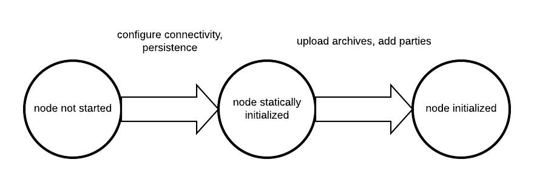

..
   Copyright (c) 2025 Digital Asset (Switzerland) GmbH and/or its affiliates. All rights reserved.
..
   SPDX-License-Identifier: Apache-2.0

.. wip::
    Explain the difference between static and dynamic configuration.
    Move out specific configuration parts from here to their howto sections, such as multi-synchronizer below.

.. _static_configuration:

Set Configuration Options
=========================

Canton differentiates between static and dynamic configuration. Static configuration is immutable and therefore has
to be known from the beginning of the process. For a static configuration, examples would be the connectivity
parameters to the local persistence store or the port the admin-apis should bind to. On the other hand, connecting to a synchronizer
or adding parties are not matters of static configuration and therefore are not set via the config file but through
:ref:`console commands <canton_console>` (or the :ref:`administration APIs <administration_apis>`).

The configuration files themselves are written in `HOCON <https://github.com/lightbend/config/blob/master/HOCON.md>`__
format with some extensions:

- Durations are specified scala durations using a ``<length><unit>`` format. Valid units are defined
  by `scala <https://github.com/scala/scala/blob/v2.13.3/src/library/scala/concurrent/duration/Duration.scala#L82>`__ directly,
  but behave as expected using ``ms``, ``s``, ``m``, ``h``, ``d`` to refer to milliseconds, seconds, minutes, hours and days.
  Durations have to be non-negative in our context.

Canton does not run one node, but any number of nodes, be it synchronizers or participant nodes in the same process. Therefore,
the root configuration allows to define several instances of synchronizers and participant nodes together with a set of
general process parameters.

A sample configuration file for two participant nodes and a single synchronizer can be seen below.

.. literalinclude:: CANTON/community/app/src/test/resources/examples/01-simple-topology/simple-topology.conf

.. _configuration_reference:

Configuration reference
-----------------------

The Canton configuration file for static properties is based on `PureConfig <https://pureconfig.github.io/>`__. PureConfig
maps Scala case classes and their class structure into analogue configuration options (see e.g. the `PureConfig quick start <https://pureconfig.github.io/docs/#quick-start>`__ for an example). Therefore, the ultimate source of truth for all
available configuration options and the configuration file syntax is given by the appropriate scaladocs of the
`CantonConfig <https://docs.daml.com/__VERSION__/canton/scaladoc/com/digitalasset/canton/config/index.html>`__ classes.

When understanding the mapping from scaladocs to configuration, please keep in mind that:

- CamelCase Scala names are mapped to lowercase-with-dashes names in configuration files, e.g. ``synchronizerParameters`` in the scaladocs becomes ``synchronizer-parameters`` in a configuration file (dash, not underscore).
- ``Option[<scala-class>]`` means that the configuration can be specified but doesn't need to be, e.g. you can specify a JWT token via ``token=token`` `in a remote participant configuration <https://docs.daml.com/__VERSION__/canton/scaladoc/com/digitalasset/canton/participant/config/RemoteParticipantConfig.html#token:Option[String]>`__, but not specifying ``token`` is also valid.

Configuration Compatibility
---------------------------
The enterprise edition configuration files extend the community configuration. As such, any community configuration
can run with an enterprise binary, whereas not every enterprise configuration file will also work with community
versions.

.. _include_configuration:

Advanced Configurations
-----------------------
Configuration files can be nested and combined together. First, using the ``include required`` directive (with relative paths), a
configuration file can include other configuration files.

.. todo::
   #. Rework this example <https://github.com/DACH-NY/canton/issues/23924>

::

    canton {
        synchronizers {
            include required(file("synchronizer1.conf"))
        }
    }

The ``required`` keyword will trigger an error, if the included file does not exist;
without the ``required`` keyword, any missing files will be silently ignored.
The ``file`` keyword instructs the configuration parser to interpret its argument as a file name;
without this keyword, the parser may interpret the given name as a URL or classpath resource.
By using the ``file`` keyword, you will also get the most intuitive semantics and most stable semantics of ``include``.
The precise rules for resolving relative paths can be found `here <https://github.com/lightbend/config/blob/master/HOCON.md#include-semantics-locating-resources>`__.

Second, by providing several configuration files, we can override configuration settings using explicit configuration
option paths:

::

    canton.participants.myparticipant.admin-api.port = 11234

If the same key is included in multiple configurations, then the last definition has highest precedence.

Furthermore, HOCON supports substituting environment variables for config values using the syntax
``key = ${ENV_VAR_NAME}`` or optional substitution ``key = ${?ENV_VAR_NAME}``, where the key will only be set
if the environment variable exists.

.. _configuration-mixin:

Configuration Mixin
-----------------------

Even more than multiple configuration files, we can leverage `PureConfig <https://github.com/pureconfig/pureconfig>`__
to create shared configuration items that refer to environment variables.
A handy example is the following, which allows for sharing database
configuration settings in a setup involving several synchronizers or participant nodes:

.. literalinclude:: CANTON/community/app/src/pack/config/storage/postgres.conf

Such a definition can subsequently be referenced in the actual node definition:

.. todo::
   #. Add examples here <https://github.com/DACH-NY/canton/issues/23873>

::

    canton {
        synchronizers {
            mysynchronizer {
                storage = ${_shared.storage}
                storage.config.properties.databaseName = ${CANTON_DB_NAME_SYNCHRONIZER}
            }
        }
    }

.. _multiple-synchronizers-config:

Multiple Synchronizers
--------------------------------

A Canton configuration allows you to define multiple synchronizers. Also, a Canton participant can connect to
multiple synchronizers. This is however only supported as a preview feature and not yet suitable for
production use.

In particular, contract key uniqueness cannot be enforced over multiple synchronizers. In this situation,
we need to turn contract key uniqueness off by setting

.. todo::
    `#22917: Fix broken literalinclude <https://github.com/DACH-NY/canton/issues/22917>`_
    literalinclude:: CANTON/community/app/src/test/resources/documentation-snippets/non-uck-mode.conf

Please note that the setting is final and cannot be changed subsequently. We will provide a migration
path once multi-synchronizer functionality is fully implemented.

Fail Fast Mode
--------------

By default, Canton will fail to start if it cannot access some external dependency such as the database. This is
preferable during initial deployment and development, as it provides instantaneous feedback, but can cause problems
in production. As an example, if Canton is started with a database in parallel, the Canton process would fail if the
database is not ready before the Canton process attempts to access it. To avoid this problem, you can configure a node
to wait indefinitely for an external dependency such as a database to start. The config option below will disable
the "fail fast" behavior for ``participant1``.

.. literalinclude:: CANTON/community/app/src/test/resources/documentation-snippets/no-fail-fast.conf

This option should be used with care as, by design, it can cause infinite, noisy waits.

Init Configuration
------------------

Some configuration values are only used during the first initialization of a node and cannot be changed afterwards.
These values are located under the `init` section of the relevant configuration of the node. Below is an example with
some init values for a participant config

.. literalinclude:: CANTON/community/integration-testing/src/main/resources/include/init.conf

The option ``ledger-api.max-deduplication-duration`` sets the maximum deduplication duration that the participant uses for :externalref:`command deduplication <command-deduplication>`.
