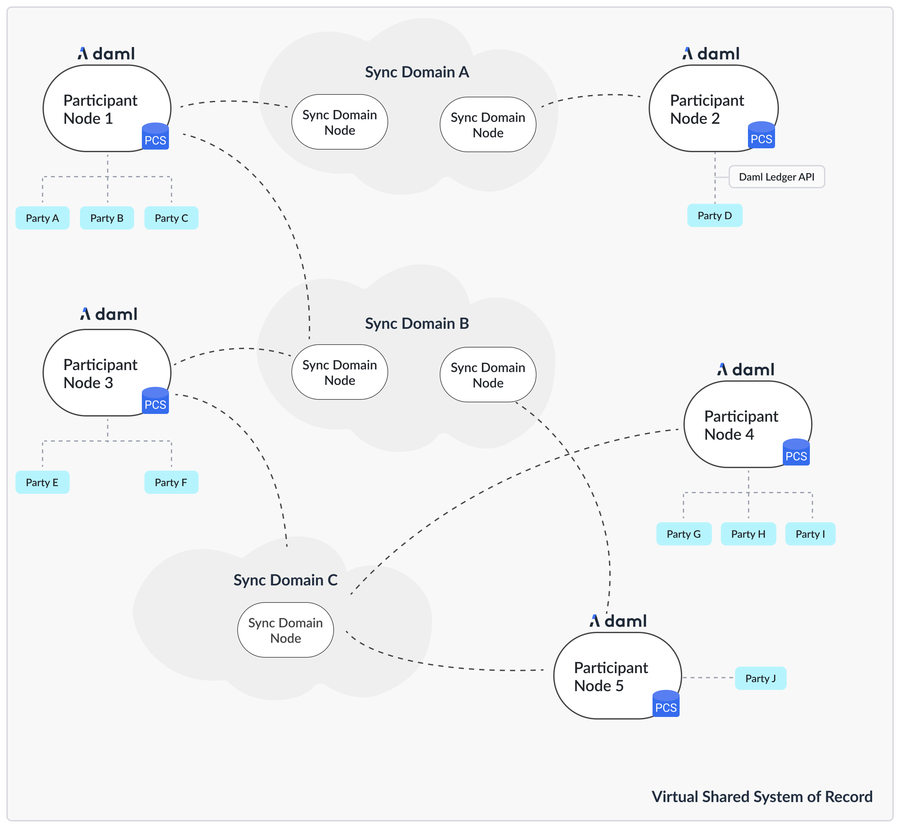

..
   Copyright (c) 2025 Digital Asset (Switzerland) GmbH and/or its affiliates. All rights reserved.
..
   SPDX-License-Identifier: Apache-2.0

.. wip::
    Dedup with install tutorial.
    Link to release download howto.
    Define hardware and software requirements.
    Document howto run canton from the release bundle.
    Remove howtos sections at the end for further configuration, link to relevant howtos, e.g. for postgres setup
    Move synchronizer install to synchronizer subsite.

.. _install-release:

Install Canton
==============

This guide will guide you through the process of setting up your Canton nodes to build a distributed Daml
ledger. You will learn the following:

#. How to set up and configure a participant node
#. How to set up and configure an embedded or distributed synchronizer
#. How to connect a participant node to a synchronizer

A single Canton process can run multiple nodes, which is very useful for testing and demonstration. In a
production environment, you typically run one node per process.

This guide uses the reference configurations you can find in the release bundle under ``config``
and explains how to leverage these examples for your purposes. Therefore, any file named in this guide
refers to subdirectories of the reference configuration example.

.. _hardware-resources:

Hardware Resources
------------------

Adequate hardware resources need to be available for each Canton node in a
test, staging, or production environment.  It is recommended to begin with a
potentially over-provisioned system. Once a long running, performance
benchmark has proven that the application's NFRs can be met (e.g., application
request latency, PQS query response time, etc.) then decreasing the available
resources can be tried, with a follow up rerun of the benchmark to confirm the
NFRs can still be met.  Alternatively, if the NFRs are not met then the
available resources should be increased.

As a starting point, the minimum recommended resources are:

- The physical host, virtual machine, or container has 6 GB of RAM and at least 4 CPU cores.
- The JVM has at least 4 GB RAM.

Also, you may want to add ``-XX:+UseG1GC`` to force the JVM to to use the
``G1`` garbage collector. Experience has shown that the JVM may use a
different garbage collector in a low resource situation which can result in
long latencies.

Downloading Canton
------------------

The Canton Open Source version is available from `Github <https://github.com/digital-asset/daml/releases>`__.

Daml Enterprise includes an enterprise version of the Canton ledger. If you have entitlement to Daml Enterprise
you can download the enterprise version of Canton by following the `Installing Daml Enterprise instructions
<https://docs.daml.com/getting-started/installation.html#installing-the-enterprise-edition>`__ and downloading the
appropriate Canton artifact.

You can also use the Daml Enterprise Canton Docker images by following our :ref:`Docker instructions <install-with-docker>`.

Your Topology
-------------
The first question we need to address is what the topology is that you are going after. The Canton topology
is made up of parties, participants and synchronizers, as depicted in the following figure.

.. https://app.lucidchart.com/documents/edit/da3c4533-a787-4669-b1e9-2446996072dc/0_0

The Daml code runs on the participant node and expresses smart contracts between parties.
Parties are hosted on participant nodes. Participant nodes synchronize their state with other
participant nodes by exchanging messages with each other through synchronizers. Synchronizers are nodes that integrate
with the underlying storage technology such as databases or other distributed ledgers. As the Canton protocol
is written in a way that assumes that participant nodes don't trust each other, you would normally expect that
every organization runs only one participant node, except for scaling purposes.

If you want to build up a test network for yourself, you need at least a participant node and a synchronizer.

The following instructions assume that you are running all commands in the root directory of the release bundle:

.. code-block:: bash

    cd ./canton-<type>-X.Y.Z

The Config Directory Contents
-----------------------------

.. important::

   This section applies to 2.8.1 and later releases.

The config directory contains a set of reference configuration files, one per node type:

.. code-block:: none

  .
  └── config
        ├── shared.conf, sandbox.conf, participant.conf, sequencer.conf, mediator.conf
        ├── jwt
        ├── misc
        ├── monitoring
        ├── remote
        ├── storage
        ├── tls
        └── utils

- ``participant.conf``: a participant node configuration
- ``sequencer.conf``, ``mediator.conf``, ``manager.conf``: a sequencer, mediator, and manager node configuration for a Daml
  Enterprise synchronizer deployment.
- ``sandbox.conf``: a simple setup for a single participant node connected to a single synchronizer node, using in-memory stores for testing.

In addition, you'll find the following files and directories:

- ``shared.conf``: a shared configuration file that is included by all other configurations.
- ``jwt``: contains JWT configuration files for the Ledger API.
- ``misc``: contains miscellaneous configuration files useful for debugging and development.
- ``monitoring``: contains configuration files to enable metrics and tracing.
- ``remote``: contains configuration files to connect Canton console to remote nodes.
- ``storage``: a directory containing storage configuration files for the various storage options.
- ``tls``: contains TLS configuration files for the various APIs and a script to generate test certificates.
- ``utils``: contains utility scripts, mainly to set up the database.

Selecting your Storage Layer
----------------------------

In order to run any kind of node, you need to decide how and if you want to persist the
data. You can choose not to persist data and instead use in-memory stores that are deleted on node restart,
or you can persist data using the ``Postgres`` database.

.. note::

    Multiple versions of Postgres are tested for compatibility with Canton and
    PQS in traditional deployment configurations. Postgres comes in many
    varieties that allow NFR trade-offs to be made (e.g., latency Vs. read
    operation scaling Vs. HA Vs. cost). Not all of these variants are
    tested for compatibility but all are expected to work with Canton and PQS.
    However, sufficient application testing is required to ensure that the
    SLAs of the Ledger API and PQS clients are met.  In particular, serverless
    Postgres has transient behaviors which require a robust application
    testing process to verify that application SLAs are met (e.g., transaction
    latency is not greatly impacted by auto-scaling).

For this purpose, there are some storage :ref:`mixin configurations <configuration-mixin>` (``config/storage/``) defined.

These storage mixins can be used with any of the node configurations. All the reference examples include the ``config/shared.conf``,
which in turn by default includes ``postgres.conf``. Alternatively, the in-memory configurations just work out of the
box without further configuration, but won't persist any data. You can change the include within
``config/shared.conf``.

The mixins work by defining a shared variable, which can be referenced by any node configuration

::

    storage = ${_shared.storage}
    storage.parameters.databaseName = "canton_participant"

If you ever see the following error: ``Could not resolve substitution to a value: ${_shared.storage}``, then
you forgot to add the persistence mixin configuration file.

.. note::

    Please also consult the more :ref:`detailed section on storage configurations <storage-config>`.

Canton will manage the database schema for you. You don't need to create any tables or indexes.

.. _persistence_using_postgres:

Persistence using Postgres
~~~~~~~~~~~~~~~~~~~~~~~~~~

While in-memory is great for testing and demos, for any production use, you'll need to use a database as a persistence layer.
Both the community version and the enterprise version support `Postgres <https://www.postgresql.org/>`__ as a persistence
layer.

Make sure you have a running Postgres server. Create one database per node.

Canton is tested on a selection of the `currently supported Postgres versions <https://www.postgresql.org/support/versioning/>`__.
See the `Canton release notes <https://github.com/digital-asset/canton/releases>`__ for the specific Postgres version
used to test a particular Canton release.

.. _postgres_helper:

Creating the Database and the User
^^^^^^^^^^^^^^^^^^^^^^^^^^^^^^^^^^

In `util/postgres` you can find a script ``db.sh`` which helps configure the database, and optionally
start a Docker-based Postgres instance. Assuming you have `Docker <https://www.docker.com/>`__ installed, you
can run:

.. code-block:: bash

    cd ./config/util/postgres
    ./db.sh start [durable]
    ./db.sh setup

The db.sh will read the connection settings from ``config/util/postgres/db.env`` if they aren't already set by environment variables.
The script will start a non-durable Postgres instance (use ``start durable`` if you want to keep the data between restarts),
and create the databases defined in ``config/util/postgres/databases``.

Other useful commands are:

- ``create-user``: To create the user as defined in ``db.env``.
- ``resume``: To resume a previously stopped Docker-based Postgres instance.
- ``drop``: Drop the created databases.

Database character encoding
^^^^^^^^^^^^^^^^^^^^^^^^^^^

For Canton applications to work correctly you must use UTF8 database server encoding in Postgres.
This avoids any issues with character conversion, like not being able to store some UTF8 characters in the database.
If the server character encoding is not set to UTF8, Canton reports an ERROR log message at startup.
You can check Postgres database server encoding by connecting to the database via SQL console (for example psql) and
issuing `SHOW SERVER_ENCODING; <https://www.postgresql.org/docs/current/sql-show.html>`__
Server encoding is set during database initialization to defaults deduced from OS environment, but this can be
`overridden <https://www.postgresql.org/docs/current/sql-createdatabase.html#CREATE-DATABASE-ENCODING>`__.
Please see `Postgres documentation on this subject <https://www.postgresql.org/docs/current/multibyte.html#MULTIBYTE>`__
for further information.

Configure the Connectivity
^^^^^^^^^^^^^^^^^^^^^^^^^^

You can provide the connectivity settings either by editing the file ``config/storage/postgres.conf`` or by setting
respective environment variables (see the file for which ones need to be set):

.. literalinclude:: CANTON/community/app/src/pack/config/utils/postgres/db.env
    :start-after: user-manual-entry-begin: PostgresDbEnvConfiguration
    :end-before: user-manual-entry-end: PostgresDbEnvConfiguration

Tuning the Database
^^^^^^^^^^^^^^^^^^^

Please note that Canton requires a properly sized and correctly configured database. Please consult
the :ref:`Postgres performance guide <postgres-performance-tuning>` for further information.

Generate the TLS Certificates
-----------------------------

The reference example configurations use TLS to secure the APIs. You can find the configuration files in
``config/tls``. The configuration files are split by different APIs. The configuration files are:

- ``tls-ledger-api.conf``: TLS configuration for the Ledger API, exposed by the participant node.
- ``mtls-admin-api.conf``: TLS configuration for the Administration API, exposed by all node types.
- ``tls-public-api.conf``: TLS configuration for the Public API, exposed by the sequencer and synchronizer node.

The client authentication on the Public API is built in and cannot be disabled. It uses specific signing keys
associated with the node's identity. The Ledger API supports :ref:`JWT based authentication <ledger-api-jwt-configuration>`.
On the Admin API, you can enable mTLS. Please consult the :ref:`TLS documentation section <tls-configuration>` for
further information.

If you want to start with a simple setup, you can use the provided script ``config/tls/gen-test-certs.sh`` to generate
a set of self-signed certificates (which must include the correct SAN entries for the address the node will bind to).

Alternatively, you can also skip this step by commenting out the TLS includes in the respective configuration files.

Setting up a Participant
------------------------

Start your participant by using the reference example ``config/participant.conf``:

.. code-block:: bash

    ./bin/canton [daemon] -c config/participant.conf

The argument ``daemon`` is optional. If omitted, the node will start with an interactive console. There are
various command line options available, for example to further tune the :ref:`logging configuration <logging>`.

.. note::

    By default, the node will initialize itself automatically using the identity commands :ref:`identity-commands`.
    As a result, the node will create the necessary keys and topology transactions and will initialize itself using
    the name used in the configuration file. Please consult the :ref:`identity management section <identity_management_user_manual>`
    for further information.

This was everything necessary to start up your participant node. However, there are a few steps that you want to take care
of in order to secure the participant and make it usable.

Secure the APIs
~~~~~~~~~~~~~~~

#. By default, all APIs in Canton are only accessible from localhost. If you want to connect to your node from other
   machines, you need to bind to ``0.0.0.0`` instead of localhost. You can do this by setting
   ``address = 0.0.0.0`` or to the desired network name within the respective API configuration sections.

#. All nodes are managed through the administration API. Whenever you use the console, almost all requests will
   go through the administration API. It is recommended that you set up mutual TLS authentication as described in
   the :ref:`TLS documentation section <tls-configuration>`.

#. Applications and users interact with the Participant Node using the gRPC Ledger API. We recommend that you secure your
   API by using TLS. You should also :ref:`authorize your clients using JWT tokens <ledger-api-jwt-configuration>`.
   The reference configuration contains a set of configuration files in ``config/jwt``, which you can use as a starting point.

Configure Applications, Users and Connection
~~~~~~~~~~~~~~~~~~~~~~~~~~~~~~~~~~~~~~~~~~~~
Canton distinguishes static from dynamic configuration.

* :ref:`Static configuration <static_configuration>` are items which are not supposed to change and are therefore captured in the configuration file.
  An example is to which port to bind to.

* Dynamic configuration are items such as Daml archives (DARs), synchronizer connections, or parties. All such changes are effected
  through :ref:`console commands <canton_console>` (or the :ref:`administration APIs <administration_apis>`).

If you don't know how to connect to synchronizers, onboard parties, or provision Daml code, please read the
:externalref:`getting started guide <canton-getting-started>`.

Setting up a Synchronizer
-------------------------

Your participant node is now ready to connect to other participants to form a distributed ledger. The connection
is facilitated by a synchronizer, which is formed by three separate processes:

- a sequencer, which is responsible for ordering encrypted messages
- a mediator, which is responsible for aggregating validation responses by the individual participants
- a synchronizer manager, which is responsible for verifying the validity of topology changes (distributed configuration changes)
  before they are distributed on the synchronizer

These nodes don't store any ledger data, but just facilitate the communication between the participants.

To set up a synchronizer, you need to decide what kind of driver you want to use for the sequencer.
Drivers are provided for different infrastructure types. These drivers have different levels of fidelity in terms of
trust and performance. Your current options are the following:

#. Postgres-based synchronizer
#. Native Canton BFT driver (used for the `Canton Network <https://canton.network/>`__).

This section explains how to set up a Postgres-based synchronization synchronizer.

Using Microservices
~~~~~~~~~~~~~~~~~~~

If you are using Daml Enterprise, you can start the synchronizer processes as separate microservices:

.. code-block:: bash

    ./bin/canton daemon -c config/[mediator|sequencer|manager].conf

Before the nodes work together, they need to be initialized and connected. Consult the
detailed guide :externalref:`on how to bootstrap a Synchronizer <synchronizer-bootstrap>`.

Generally, you can connect the nodes using either the embedded console (if they run in the same process)
or through the remote console:

.. code-block:: bash

    ./bin/canton -c config/remote/mediator.conf,config/remote/manager.conf,config/remote/sequencer.conf

Subsequently, just run the boostrap command:

.. code-block:: scala

    bootstrap.synchronizer(
      synchronizerName = "da",
      sequencers = sequencers.all,
      mediators = mediators.all,
      synchronizerOwners = Seq(sequencer1),
      synchronizerThreshold = 1,
      staticSynchronizerParameters = StaticSynchronizerParameters.defaultsWithoutKMS(ProtocolVersion.latest),
    )

Connect the Participant
^^^^^^^^^^^^^^^^^^^^^^^

The final step is to connect the participant to the synchronizer. Refer to :ref:`the connectivity guide <synchronizer-connections>`
for detailed instructions. In the simplest case, you just need to run the following command in the participant's console:

.. code-block:: scala

    participant.synchronizers.connect("da", "https://localhost:10018", certificatesPath = "config/tls/root-ca.crt")

The certificate is explicitly provided, as the self-signed test certificates are not trusted by default.

Secure the APIs
~~~~~~~~~~~~~~~

#. As with the participant node, all APIs bind by default to localhost. If you want to connect to your node from other
   machines, you need to bind to the right interface or to ``0.0.0.0``.
#. The administration API should be secured using client certificates as described in :ref:`TLS documentation section <tls-configuration>`.
#. The Public API needs to be properly secured using TLS. Please follow the :externalref:`corresponding instructions <public-api-configuration>`.

Next steps
~~~~~~~~~~
The above configuration provides you with an initial setup. Without going into details, the next steps would be:

#. Control who can join the Synchronizer by :externalref:`configuring the Synchronizer to be permissioned <permissioned-synchronizer>` (default is "everyone can join").
#. Create high availability setups for ref:`your synchronizer <components-for-ha>` or ref:`your participants <ha_participant_arch>`.

Multi-node setup
----------------

If desired, you can run many nodes in the same process. This is convenient for testing and demonstration purposes. You
can either do this by listing several node configurations in the same configuration file or by invoking the Canton process
with several separate configuration files (which get merged together).

.. code-block:: bash

    ./bin/canton -c config/participant.conf -c config/sequencer.conf,config/mediator.conf -c config/manager.conf
