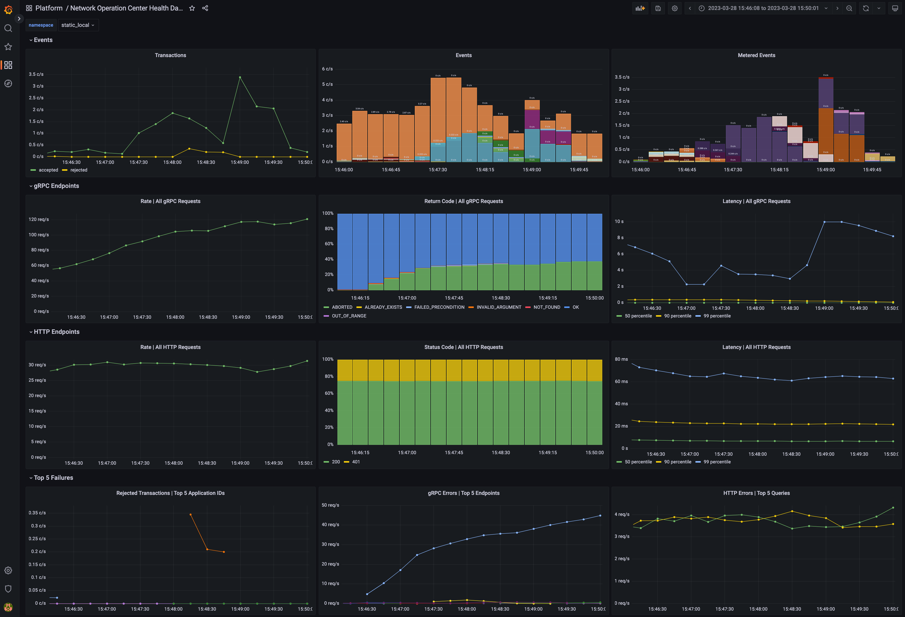

..
   Copyright (c) 2025 Digital Asset (Switzerland) GmbH and/or its affiliates. All rights reserved.
..
   SPDX-License-Identifier: Apache-2.0

.. wip::
    Move content into individual sections howto configure logging, metrics, health etc.
    Move individual metrics to reference.

.. _monitoring:

Monitoring Best Practices
=========================

Introduction
------------

Observability (also known as “monitoring”) lets you determine if the Daml Enterprise solution is healthy or not. If the state is not healthy, observability helps diagnose the root cause. There are three parts to observability: metrics, logs, and traces. These are described in this section.

To avoid becoming overwhelmed by the number of metrics and log messages, follow these steps:

- Read the shortcut to learning what is important, which is described below in the section :ref:`Hands-On with the Daml Enterprise - Observability Example <hands-on>` as a starting point and inspiration when building your metric monitoring.
- For an overview of how most metrics are exposed, read the section :ref:`Golden Signals and Key Metrics Quick Start <golden>` below. It describes the philosophy behind metric naming and labeling.

The remaining sections provide references to more detailed information.

.. _hands-on:

Hands-On with the Daml Enterprise - Observability Example
~~~~~~~~~~~~~~~~~~~~~~~~~~~~~~~~~~~~~~~~~~~~~~~~~~~~~~~~~

The `Daml Enterprise - Observability Example <https://github.com/digital-asset/daml-platform-observability-example>`__ GitHub repository provides a complete reference example for exploring the metrics that Daml Enterprise exposes. You can use it to explore the collection, aggregation, filtering, and visualization of metrics. It is self-contained, with the following components:

- An example Docker compose file to create a run-time for all the components
- Some shell scripts to generate requests to the Daml Enterprise solution
- A Prometheus config file to scrape the metrics data
- A Grafana template file(s) to visualize the metrics in a meaningful way, such as shown below in the example dashboard

   Dashboard with metrics

.. _golden:

Golden Signals and Key Metrics Quick Start
------------------------------------------

The best practice for `monitoring a microservices application <https://sre.google/sre-book/monitoring-distributed-systems/>`__ is an approach known as the `Golden Signals <https://www.blameless.com/blog/4-sre-golden-signals-what-they-are-and-why-they-matter/>`__, or `the RED method <https://www.weave.works/blog/the-red-method-key-metrics-for-microservices-architecture/>`__. In this approach, metric monitoring determines whether the application is healthy and, if not healthy, which service is the root cause of the issue. The Golden Signals for HTTP and gRPC endpoints are supported for all endpoints. Key metrics specific to Daml Enterprises are also available. These are described below.

The following Golden Signal metrics for each HTTP and gRPC API are available:

- Input request rate, as a counter
- Error rate, as a counter (discussed below)
- Latency (the time to process a request), as a histogram
- Size of the payload, as a counter, following the `Apache HTTP precedent <https://github.com/Lusitaniae/apache_exporter>`__

You can filter or aggregate each metric using its accompanying labels. The instrumentation labels added to each HTTP API metric are as follows:

- ``http_verb``: the HTTP verb (for example: GET, POST)
- ``http_status``: the status code (for example: 200, 401, 403, 504)
- ``host``: the host identifier
- ``daml_version``: the Daml release number
- ``service``: a string to identify what Daml service or Canton component is running in this process (for example: ``participant``, ``sequencer``, ``json_api``)
- ``path``: the request made to the endpoint (for example: ``/v2/commands/submit-and-wait``, ``/v2/state/active-contracts``)

The gRPC protocol is layered on top of HTTP/2, so certain labels (such as the ``daml_version`` and ``service``) from the above section are included. The labels added by default to each :ref:`gRPC API metric <grpc-metrics>` are as follows:

- ``canton_version``: the `Canton protocol version <https://docs.daml.com/canton/usermanual/versioning.html#canton-protocol-version>`__
- ``grpc_code``: the human-readable status code for gRPC (for example: ``OK``, ``CANCELLED``, ``DEADLINE_EXCEEDED``)
- The type of the client/server gRPC `request <http://www.grpc.io/docs/guides/concepts.html#rpc-life-cycle>`__, under the labels ``grpc_client_type`` and ``grpc_server_type``
- The protobuf package and service names, under the labels ``grpc_service_name`` and ``grpc_method_name``

The following other key metrics are monitored:

- A binary gauge indicates whether the node is :ref:`healthy or not healthy <health-metrics>`. This can also be used to infer which node is passive in a highly available configuration because it will show as not being healthy, while the active node is always healthy.
- A binary gauge signals whether a node is active or passive, for identifying which node is the active node.
- A binary gauge :ref:`detects when pruning is occurring <pruning-metrics>`.
- Each participant node measures the count of the inflight (dirty) requests so the user can see if ``maxDirtyRequests`` limit is close to being hit.  The metrics are:  ``canton_dirty_requests`` and ``canton_max_dirty_requests``.
- Each participant node records the distribution of events (updates) received by the participant and allows drill-down by event type (package upload, party creation, or transaction), status (success or failure), participant ID, and application ID (if available). The counter is called ``daml_indexer_events_total``.
- The ledger event requests are totaled in a counter called ``daml_indexer_metered_events_total``.
- :ref:`JVM garbage collection metrics <jvm-metrics>` are collected.

This list is not exhaustive. It highlights the most important metrics.

Set Up Metrics Scraping
-----------------------

Enable the Prometheus Reporter
~~~~~~~~~~~~~~~~~~~~~~~~~~~~~~

`Prometheus <https://prometheus.io>`__ is recommended for metrics reporting. Other reporters (jmx, graphite, and csv) are supported, but they are deprecated. Any such reporter should be migrated to Prometheus.

Prometheus can be enabled using:

::

    canton.monitoring.metrics.reporters = [{
      type = prometheus
      address = "localhost" // default
      port = 9000 // default
    }]

Prometheus-Only Metrics
~~~~~~~~~~~~~~~~~~~~~~~
Some metrics are available only when using the Prometheus reporter. These metrics include common gRPC and HTTP metrics (which help you to measure `the four golden signals <https://sre.google/sre-book/monitoring-distributed-systems/#xref_monitoring_golden-signals>`__), and JVM GC and memory usage metrics (if enabled). The metrics are documented in detail below.

Any metric marked with ``*`` is available only when using the Prometheus reporter.

Deprecated Reporters
~~~~~~~~~~~~~~~~~~~~

JMX-based reporting (for testing purposes only) can be enabled using:

::

    canton.monitoring.metrics.reporters = [{ type = jmx }]

Additionally, metrics can be written to a file:

::

    canton.monitoring.metrics.reporters = [{
      type = jmx
    }, {
      type = csv
      directory = "metrics"
      interval = 5s // default
      filters = [{
        contains = "canton"
      }]
    }]

or reported via Graphite (to Grafana) using:

::

    canton.monitoring.metrics.reporters = [{
      type = graphite
      address = "localhost" // default
      port = 2003
      prefix.type = hostname // default
      interval = 30s // default
      filters = [{
        contains = "canton"
      }]
    }]

When using the ``graphite`` or the ``csv`` reporter, Canton periodically evaluates all metrics matching the given filters. Filter for only those metrics that are relevant to you.

In addition to Canton metrics, the process can also report Daml metrics (of the Ledger API server). Optionally, JVM metrics can be included using:

::

    canton.monitoring.metrics.report-jvm-metrics = yes // default no

.. _canton-metrics:

Metrics
-------

The following sections contain the common metrics exposed for Daml services supporting a Prometheus metrics reporter.

For the metric types referenced below, see the `relevant Prometheus documentation <https://prometheus.io/docs/tutorials/understanding_metric_types/>`_.

Participant Metrics
~~~~~~~~~~~~~~~~~~~

..
    Dynamically generated content:
.. generatedinclude:: monitoring.rst.participant_metrics.inc

Sequencer Metrics
~~~~~~~~~~~~~~~~~

..
    Dynamically generated content:
.. generatedinclude:: monitoring.rst.sequencer_metrics.inc

Mediator Metrics
~~~~~~~~~~~~~~~~

..
    Dynamically generated content:
.. generatedinclude:: monitoring.rst.mediator_metrics.inc

.. _health-metrics:

Health Metrics
~~~~~~~~~~~~~~

The following metrics are exposed for all components.

daml_health_status
^^^^^^^^^^^^^^^^^^

- **Description**: The status of the component
- **Values**:

  - **0**: Not healthy
  - **1**: Healthy

- **Labels**:

  - **component**: the name of the component being monitored

- **Type**: Gauge

.. _grpc-metrics:

gRPC Metrics
~~~~~~~~~~~~

The following metrics are exposed for all gRPC endpoints. These metrics have the following common labels attached:

- **grpc_service_name**:
    fully qualified name of the gRPC service (e.g. ``com.daml.ledger.api.v1.ActiveContractsService``)

- **grpc_method_name**:
    name of the gRPC method (e.g. ``GetActiveContracts``)

- **grpc_client_type**:
    type of client connection (``unary`` or ``streaming``)

- **grpc_server_type**:
    type of server connection (``unary`` or ``streaming``)

- **service**:
    Canton service's name (e.g. ``participant``, ``sequencer``, etc.)

daml_grpc_server_duration_seconds
^^^^^^^^^^^^^^^^^^^^^^^^^^^^^^^^^
- **Description**: Distribution of the durations of serving gRPC requests
- **Type**: Histogram

daml_grpc_server_messages_sent_total
^^^^^^^^^^^^^^^^^^^^^^^^^^^^^^^^^^^^
- **Description**: Total number of gRPC messages sent (on either type of connection)
- **Type**: Counter

daml_grpc_server_messages_received_total
^^^^^^^^^^^^^^^^^^^^^^^^^^^^^^^^^^^^^^^^
- **Description**: Total number of gRPC messages received (on either type of connection)
- **Type**: Counter

daml_grpc_server_started_total
^^^^^^^^^^^^^^^^^^^^^^^^^^^^^^
- **Description**: Total number of started gRPC requests (on either type of connection)
- **Type**: Counter

daml_grpc_server_handled_total
^^^^^^^^^^^^^^^^^^^^^^^^^^^^^^
- **Description**: Total number of handled gRPC requests
- **Labels**:

  - **grpc_code**: returned `gRPC status code <https://grpc.github.io/grpc/core/md_doc_statuscodes.html>`_ for the call (``OK``, ``CANCELLED``, ``INVALID_ARGUMENT``, etc.)

- **Type**: Counter

daml_grpc_server_messages_sent_bytes
^^^^^^^^^^^^^^^^^^^^^^^^^^^^^^^^^^^^
- **Description**: Distribution of payload sizes in gRPC messages sent (both unary and streaming)
- **Type**: Histogram

daml_grpc_server_messages_received_bytes
^^^^^^^^^^^^^^^^^^^^^^^^^^^^^^^^^^^^^^^^
- **Description**: Distribution of payload sizes in gRPC messages received (both unary and streaming)
- **Type**: Histogram

HTTP Metrics
~~~~~~~~~~~~
The following metrics are exposed for all HTTP endpoints. These metrics have the following common labels attached:

- **http_verb**:
    HTTP verb used for a given call (e.g. ``GET`` or ``PUT``)

- **host**:
    fully qualified hostname of the HTTP endpoint (e.g. ``example.com``)

- **path**:
    path of the HTTP endpoint (e.g. ``/v2/parties``)

- **service**:
    Daml service's name (``json_api`` for the JSON Ledger API Service)

daml_http_requests_duration_seconds
^^^^^^^^^^^^^^^^^^^^^^^^^^^^^^^^^^^
- **Description**: Distribution of the durations of serving HTTP requests
- **Type**: Histogram

daml_http_requests_total
^^^^^^^^^^^^^^^^^^^^^^^^
- **Description**: Total number of HTTP requests completed
- **Labels**:

  - **http_status**: returned `HTTP status code <https://en.wikipedia.org/wiki/List_of_HTTP_status_codes>`_ for the call

- **Type**: Counter

daml_http_websocket_messages_received_total
^^^^^^^^^^^^^^^^^^^^^^^^^^^^^^^^^^^^^^^^^^^
- **Description**: Total number of WebSocket messages received
- **Type**: Counter

daml_http_websocket_messages_sent_total
^^^^^^^^^^^^^^^^^^^^^^^^^^^^^^^^^^^^^^^
- **Description**: Total number of WebSocket messages sent
- **Type**: Counter

daml_http_requests_payload_bytes
^^^^^^^^^^^^^^^^^^^^^^^^^^^^^^^^
- **Description**: Distribution of payload sizes in HTTP requests received
- **Type**: Histogram

daml_http_responses_payload_bytes
^^^^^^^^^^^^^^^^^^^^^^^^^^^^^^^^^
- **Description**: Distribution of payload sizes in HTTP responses sent
- **Type**: Histogram

daml_http_websocket_messages_received_bytes
^^^^^^^^^^^^^^^^^^^^^^^^^^^^^^^^^^^^^^^^^^^
- **Description**: Distribution of payload sizes in WebSocket messages received
- **Type**: Histogram

daml_http_websocket_messages_sent_bytes
^^^^^^^^^^^^^^^^^^^^^^^^^^^^^^^^^^^^^^^
- **Description**: Distribution of payload sizes in WebSocket messages sent
- **Type**: Histogram

.. _pruning-metrics:

Pruning Metrics
~~~~~~~~~~~~~~~

The following metrics are exposed for all pruning processes. These metrics have the following labels:

- **phase**:
    The name of the pruning phase being monitored

daml_services_pruning_prune_started_total
^^^^^^^^^^^^^^^^^^^^^^^^^^^^^^^^^^^^^^^^^
- **Description**: Total number of started pruning processes
- **Type**: Counter

daml_services_pruning_prune_completed_total
^^^^^^^^^^^^^^^^^^^^^^^^^^^^^^^^^^^^^^^^^^^
- **Description**: Total number of completed pruning processes
- **Type**: Counter

.. _jvm-metrics:

JVM Metrics
~~~~~~~~~~~
The following metrics are exposed for the JVM, if enabled.

runtime_jvm_gc_time
^^^^^^^^^^^^^^^^^^^
- **Description**: Time spent in a given JVM garbage collector in milliseconds
- **Labels**:

  - **gc**: Garbage collector regions (eg: ``G1 Old Generation``, ``G1 New Generation``)

- **Type**: Counter

runtime_jvm_gc_count
^^^^^^^^^^^^^^^^^^^^
- **Description**: The number of collections that have occurred for a given JVM garbage collector
- **Labels**:

  - **gc**: Garbage collector regions (eg: ``G1 Old Generation``, ``G1 New Generation``)

- **Type**: Counter

runtime_jvm_memory_area
^^^^^^^^^^^^^^^^^^^^^^^
- **Description**: JVM memory area statistics
- **Labels**:

  - **area**: Can be ``heap`` or ``non_heap``
  - **type**: Can be ``committed``, ``used`` or ``max``

runtime_jvm_memory_pool
^^^^^^^^^^^^^^^^^^^^^^^
- **Description**: JVM memory pool statistics
- **Labels**:

  - **pool**: Defined pool name.
  - **type**: Can be ``committed``, ``used`` or ``max``

.. _logging:

Logging
-------
Canton uses `Logback <https://logback.qos.ch>`__ as the logging library. All Canton logs derive from the logger ``com.digitalasset.canton``. By default, Canton will write a log to the file ``log/canton.log`` using the ``INFO``
log-level and will also log ``WARN`` and ``ERROR`` to stdout.

How Canton produces log files can be configured extensively on the command line using the following options:

- ``-v`` (or ``--verbose``) is a short option to set the Canton log level to ``DEBUG``. This is likely the most common log option you will use.
- ``--debug`` sets all log levels except stdout to ``DEBUG``. Stdout is set to ``INFO``. Note that ``DEBUG`` logs of external libraries can be very noisy.
- ``--log-level-root=<level>`` configures the log-level of the root logger. This changes the log level of Canton and of external libraries, but not of stdout.
- ``--log-level-canton=<level>`` configures the log-level of only the Canton logger.
- ``--log-level-stdout=<level>`` configures the log-level of stdout. This will usually be the text displayed in the Canton console.
- ``--log-file-name=log/canton.log`` configures the location of the log file.
- ``--log-file-appender=flat|rolling|off`` configures if and how logging to a file should be done. The rolling appender will roll the files according to the defined date-time pattern.
- ``--log-file-rolling-history=12`` configures the number of historical files to keep when using the rolling appender.
- ``--log-file-rolling-pattern=YYYY-mm-dd`` configures the rolling file suffix (and therefore the frequency) of how files should be rolled.
- ``--log-truncate`` configures whether the log file should be truncated on startup.
- ``--log-profile=container`` provides a default set of logging settings for a particular setup. Only the ``container`` profile is supported, which logs to both STDOUT and to 10-hour limited rolling log files history (to avoid storage leaks).
- ``--log-immediate-flush=false`` turns off immediate flushing of the log output to the log file.

Note that if you use ``--log-profile``, the order of the command line arguments matters. The profile settings can be overridden on the command line by placing adjustments after the profile has been selected.

Canton supports the normal log4j logging levels: ``TRACE``, ``DEBUG``, ``INFO``, ``WARN``, and ``ERROR``.

For further customization, a custom `logback configuration <https://logback.qos.ch/manual/configuration.html>`__ can be provided using ``JAVA_OPTS``.

.. code-block:: bash

    JAVA_OPTS="-Dlogback.configurationFile=./path-to-file.xml" ./bin/canton --config ...

If you use a custom log-file, the command line arguments for logging will not have any effect, except that ``--log-level-canton`` and ``--log-level-root`` can still be used to adjust the log level of the root loggers.

.. _lnav:

Viewing Logs
~~~~~~~~~~~~

A log file viewer such as `lnav <https://lnav.org/>`__ is recommended to view Canton logs and resolve issues. Among other features, lnav has automatic syntax highlighting, convenient filtering for specific log messages, and the ability to view log files of different Canton components in a single view. This makes viewing logs and resolving issues more efficient than using standard UNIX tools such as less or grep.

The following features are especially useful when using ``lnav``:

- Viewing log files of different Canton components in `a single view <https://lnav.org/features#single-log-view>`__, merged according to timestamps (``lnav <log1> <log2> ...``).
- `Filtering <https://docs.lnav.org/en/latest/usage.html#filtering>`__ specific log messages in (``:filter-in <regex>``) or out (``:filter-out <regex>``). When filtering messages (for example, with a given trace-id), a transaction can be traced across different components, especially when using the single-view-feature described earlier.
- `Searching <https://docs.lnav.org/en/latest/usage.html#searching>`__ for specific log messages (``/<regex>``) and jumping between them (``n`` and ``N``).
- Automatic syntax highlighting of parts of log messages (such as timestamps) and log messages themselves (for example, ``WARN`` log messages are yellow).
- `Jumping <https://docs.lnav.org/en/latest/usage.html#searching>`__ between error (``e`` and ``E``) and warn messages (``w`` and ``W``).
- Selectively activating and deactivating different filters and files (``TAB`` and `` `` to activate/deactivate a filter).
- Marking lines (``m``) and jumping back and forth between marked lines (``u`` and ``U``).
- Jumping back and forth between lines that have the same :ref:`trace-id <tracing>` (``o`` and ``O``).

The `custom lnav log format file <https://docs.lnav.org/en/latest/formats.html>`__ for Canton logs ``canton.lnav.json`` is bundled in any Canton release. You can install it with ``lnav -i canton.lnav.json``. JSON-based log files (which need to use the file suffix ``.clog``) can be viewed using the ``canton-json.lnav.json`` format file.

.. _detailed_logging:

Detailed Logging
~~~~~~~~~~~~~~~~

By default, logging omits details to avoid writing sensitive data into log files. For debugging or educational purposes, you can turn on additional logging using the following configuration switches:

.. literalinclude:: CANTON/community/app/src/test/resources/documentation-snippets/logging-event-details.conf

This turns on payload logging in the ``ApiRequestLogger``, which records every GRPC API invocation, and turns on detailed logging of the ``SequencerClient`` and the transaction trees. Please note that all additional events are logged at ``DEBUG`` level.

.. note::

    Note that the detailed event logging will happen within an gRPC API Interceptor. This creates a
    sequential bottleneck as every message that is sent or received gets translated into a pretty-printed
    string. You will not be able to achieve the same performance if this setting is turned on.

.. _tracing:

Tracing
-------

For further debugging, Canton provides a trace-id which allows you to trace the processing
of requests through the system. The trace-id is exposed to logback through the
*mapping diagnostic context* and can be included in the logback output pattern using ``%mdc{trace-id}``.

The trace-id propagation is enabled by setting the ``canton.monitoring.tracing.propagation = enabled`` configuration option, which is enabled by default.

You can configure the service where traces and spans are reported for observing distributed traces. Refer to :ref:`Traces <traces>` for a preview.

Jaeger and Zipkin are supported. For example, Jaeger reporting can be configured as follows:

::

    monitoring.tracing.tracer.exporter {
      type = jaeger
      address = ... // default: "localhost"
      port = ... // default: 14250
    }

This configuration connects to a running Jaeger server to report tracing information.

You can run Jaeger in a Docker container as follows:

::

    docker run --rm -it --name jaeger\
      -p 16686:16686 \
      -p 14250:14250 \
      jaegertracing/all-in-one:1.22.0

If you prefer not to use Docker, you can download the binary for your specific OS at `Download Jaeger <https://www.jaegertracing.io/download/#binaries>`_. Unzip the file and then run the binary `jaeger-all-in-one` (no arguments are needed).
By default, Jaeger will expose port `16686` (for its UI, which can be seen in a browser window) and port `14250` (to which Canton will report trace information). Be sure to properly expose these ports.

Make sure that all Canton nodes in the network report to the same Jaeger server to have an accurate view of the full traces. Also, ensure that the Jaeger server is reachable by all Canton nodes.

Apart from jaeger, Canton nodes can also be configured to report in Zipkin or OTLP formats.

Sampling
~~~~~~~~

You can change how often spans are sampled and reported to the configured exporter. By default, it will always report (``monitoring.tracing.tracer.sampler.type = always-on``). You can configure it to never report (``monitoring.tracing.tracer.sampler.type = always-off``), although this is less useful. Also, you can configure only a specific fraction of spans to be reported as follows:

::

    monitoring.tracing.tracer.sampler = {
      type = trace-id-ratio
      ratio = 0.5
    }

You can also change the parent-based sampling property. By default, it is turned on (``monitoring.tracing.tracer.sampler.parent-based = true``). When turned on, a span is sampled iff its parent is sampled (the root span will follow the configured sampling strategy). There will never be incomplete traces; either the full trace is sampled or it is not. If you change this property, all spans will follow the configured sampling strategy and ignore whether the parent is sampled.

Known Limitations
~~~~~~~~~~~~~~~~~

Not every trace created which can be observed in logs is reported to the configured trace collector service. Traces originated at console commands or that are part of the transaction protocol are largely reported, while other types of traces are added to the set of reported traces as the need arises.

.. todo::
    The limitation mentioned below is to be addressed as part of the below tickets:
    `#22920 <https://github.com/DACH-NY/canton/issues/22920>`_
    `#14256 <https://github.com/digital-asset/daml/issues/14256>`_

Also, the transaction protocol trace has a known limitation: once a command is submitted and its trace is fully reported, a new trace is created for any resulting Daml events that are processed. This occurs because the Ledger API does not propagate any trace context information from the command submission to the transaction subscription. As an example, when a participant creates a ``Ping`` contract, you can see the full transaction processing trace of the ``Ping`` command being submitted. However, a participant that processes the ``Ping`` by exercising ``Respond`` and creating a ``Pong`` contract creates a separate trace instead of using the same one.

This differs from a situation where a single Daml transaction results in multiple actions at the same time, such as archiving and creating multiple contracts. In that case, a single trace encompasses the entire process, since it occurs as part of a single transaction rather than the result of an external process reacting to Daml events.

.. _traces:

Traces
~~~~~~

Traces contain operations that are each represented by a span. A trace is a directed acyclic graph (DAG) of spans, where the edges between spans are defined as parent/child relationships (the definitions come from the `Opentelemetry glossary <https://opentelemetry.io/docs/concepts/glossary/>`_).

Canton reports several types of traces. One example: every Canton console command that interacts with the Admin API starts a trace whose initial span last for the entire duration of the command, including the GRPC call to the specific Admin API endpoint.

.. figure:: ./images/ping-trace.jpg
   :width: 100%
   :alt: A graph showing the trace of a Canton ping containing 18 spans.

   Graph of a Canton ping trace containing 18 spans

Traces of Daml command submissions are important. The trace illustrated in the figure results when you perform a Canton ping using the console. The ping is a smoke test that sends a Daml transaction (create Ping, exercise choice Pong, exercise choice Archive) to test a connection. It uses a particular smart contract that is preinstalled on every Canton participant. The command uses the Admin API to access a preinstalled application, which then issues Ledger API commands operating on this smart contract. In this example, the trace contains 18 spans. The ping is started by ``participant1``, and ``participant2`` is the target. The trace focuses on the message exchange through the sequencer without digging deep into the message handlers or further processing of transactions.

In some cases, spans may start later than the end of their parents, due to asynchronous processing. This typically occurs when a new operation is placed on a queue to be handled later, which immediately frees the parent span and ends it.

The initial span (span 1) covers the duration of the ping operation. In span 2, the GrpcPingService in the participant node handles a GRPC request made by the console. It also lasts for the duration of the ping operation.

The Canton ping consists of three Daml commands:

1. The admin party for ``participant1`` creates a ``Ping`` contract.
2. The admin party for ``participant2`` exercises the ``Respond`` consuming choice on the contract, which results in the creation of a ``Pong`` contract.
3. The admin party for ``participant1`` exercises the ``Ack`` consuming choice on it.

.. todo::
    `#22920 <https://github.com/DACH-NY/canton/issues/22920>`_

The submission of the first of the three Daml commands (the creation of the Ping contract) starts at span 3 in the example trace. Due to a limitation explained in the next section, the other two Daml command submissions are not linked to this trace. It is possible to find them separately. In any case, span 2 will only complete once the three Daml commands are completed.

At span 3, the participant node is on the client side of the Ledger API. In other use cases, it could be an application integrated with the participant. This span lasts for the duration of the GRPC call, which is received on the server side in span 4 and handled by the ``CantonSyncService`` in span 5. The request is then received and acknowledged, but not fully processed. It is processed asynchronously later, which means that spans 3 through 5 will complete before the request is handled.

Missing steps from the trace (which account for part of the gap between spans 5 and 6) are:

- The synchronizer routing where the participant decides which synchronizer to use for the command submission.
- The preparation of the initial set of messages to be sent.

The start of the Canton transaction protocol begins at span 6. In this span, ``participant1`` sends a request to ``sequencer1`` to sequence the initial set of confirmation request messages as part of phase 1 of the transaction protocol. The transaction protocol has :externalref:`seven phases <canton-overview-tx-processing>`.

At span 7, ``sequencer1`` receives the request and registers it. Receipt of the messages is not part of this span. That happens asynchronously at a later point.

At span 18, as part of phase 2, ``mediator1`` receives an informee message. It only needs to validate and register it. Since it doesn't need to respond, span 18 has no children.

As part of phase 3, ``participant2`` receives a message (see span 8), and ``participant1`` also receives a message (see span 9). Both participants asynchronously validate the messages. ``participant2`` does not need to respond. Since it is only an observer, span 8 has no children. ``participant1`` responds, however, which is visible at span 10. There, it again makes a call to ``sequencer1``, which receives it at span 11.

At span 12, ``participant1`` receives a successful send response message that signals that its message to the mediator was successfully sequenced. This occurs as part of phase 4, where confirmation responses are sent to the mediator. The mediator receives it at span 13, and it validates the message (phase 5).

In spans 14 and 15, ``mediator1`` (now at phase 6) asks ``sequencer1`` to send the transaction result messages to the participants.

To end this round of the transaction protocol, ``participant1`` and ``participant2`` receive their messages at spans 16 and 17, respectively. The messages are asynchronously validated, and their projections of the virtual shared ledger are updated (phase 7).

As mentioned, there are two other transaction submissions that are unlinked from this ping trace but are part of the operation.
The second one starts at a span titled ``admin-ping.processTransaction``, which is created by ``participant2``. The third one has the same name but is initiated by ``participant1``.

.. _status-commands:

Node Health Status
------------------

Each Canton node exposes rich health status information. Running:

.. code-block:: bash

    <node>.health.status

returns a status object, which can be one of:

- ``Failure``: if the status of the node cannot be determined, including an error message of why it failed
- ``NotInitialized``: if the node is not yet initialized
- ``Success[NodeStatus]``: if the status could be determined, including the detailed status

The ``NodeStatus`` differs depending on the node type. A participant node responds with a message containing:

- ``Participant id``: the participant id of the node
- ``Uptime``: the uptime of this node
- ``Ports``: the ports on which the participant node exposes the Ledger and the Admin API.
- ``Connected synchronizers``: the list of synchronizers to which the participant is properly connected
- ``Unhealthy synchronizers``: the list of synchronizers to which the participant is trying to connect, but the connection is not ready for command submission
- ``Active``: true if this instance is the active replica (It can be false in the case of the passive instance of a high-availability deployment.)

A synchronizer node or a sequencer node responds with a message containing:

- ``Synchronizer id``: the unique identifier of the synchronizer
- ``Uptime``: the uptime of this node
- ``Ports``: the ports on which the synchronizer exposes the Public and the Admin API
- ``Connected Participants``: the list of connected participants
- ``Sequencer``: a boolean flag indicating whether the embedded sequencer writer is operational

A sequencer node also returns the following additional field starting from Canton 2.8.6:

- ``Accepts admin changes``: a boolean flag indicating whether the sequencer accepts admin changes

A synchronizer topology manager or a mediator node returns:

- ``Node uid``: the unique identifier of the node
- ``Uptime``: the uptime of this node
- ``Ports``: the ports on which the node hosts its APIs
- ``Active``: true if this instance is the active replica (It can be false in the case of the passive instance of a high-availability deployment.)

Additionally, all nodes also return a ``components`` field detailing the health state of each of its internal runtime dependencies. The actual components differ per node and can give further insights into the node's current status. Example components include storage access, synchronizer connectivity, and sequencer backend connectivity.

.. _health-check:

Health Checks
-------------

gRPC Health Check Service
~~~~~~~~~~~~~~~~~~~~~~~~~

Each Canton node can optionally be configured to start a gRPC server exposing the `gRPC Health Service <https://github.com/grpc/grpc/blob/master/doc/health-checking.md#service-definition>`__. Passive nodes (see :ref:`High Availability <ha_user_manual>` for more information on active/passive states) return ``NOT_SERVING``. Consider this when configuring `liveness and readiness probes in a Kubernetes environment <https://kubernetes.io/docs/tasks/configure-pod-container/configure-liveness-readiness-startup-probes/>`__.

The precise way the state is computed is subject to change.

Here is an example monitoring configuration to place inside a node configuration object:

.. literalinclude:: CANTON/community/integration-testing/src/main/resources/include/health-monitoring.conf

.. note::

    The gRPC health server is configured per Canton node, not per process, as is the case for the HTTP health check server (see below). This means that the configuration must be inserted within a node's configuration object.

.. note::

    To support usage as a Kubernetes liveness probe, the health server exposes a service named ``liveness`` that should be targeted when `configuring a gRPC probe <https://kubernetes.io/docs/tasks/configure-pod-container/configure-liveness-readiness-startup-probes/#define-a-grpc-liveness-probe>`__.
    The latter service always returns ``SERVING``.

HTTP Health Check
~~~~~~~~~~~~~~~~~

Optionally, the ``canton`` process can expose an HTTP endpoint indicating whether the process believes it is healthy. This may be used as an uptime check or as a `Kubernetes liveness probe <https://kubernetes.io/docs/tasks/configure-pod-container/configure-liveness-readiness-startup-probes/>`__. If enabled, the ``/health`` endpoint will respond to a ``GET`` HTTP request with a 200 HTTP status code (if healthy) or 500 (if unhealthy, along with a plain text description of why it is unhealthy).

To enable this health endpoint, add a ``monitoring`` section to the Canton configuration. Since this health check is for the whole process, add it directly to the ``canton`` configuration rather than for a specific node.

::

  canton {
    monitoring.health {
     server {
        port = 7000
     }

     check {
       type = ping
       participant = participant1
       interval = 30s
     }
  }

This health check causes ``participant1`` to "ledger ping" itself every 30 seconds. The process is considered healthy if the ping is successful.

.. _creating_dumps:

Health Dumps
------------

You should provide as much information as possible to receive efficient support. For this purpose, Canton implements an information-gathering facility that gathers key essential system information for support staff. If you encounter an error where you need assistance, please ensure the following:

- Start Canton in interactive mode, with the ``-v`` option to enable debug logging: ``./bin/canton -v -c <myconfig>``. This provides a console prompt.
- Reproduce the error by following the steps that previously caused the error. Write down these steps so they can be provided to support staff.
- After you observe the error, type ``health.dump()`` into the Canton console to generate a ZIP file.

This creates a dump file (``.zip``) that stores the following information:

- The configuration you are using, with all sensitive data stripped from it (no passwords).
- An extract of the log file. Sensitive data is not logged into log files.
- A current snapshot on Canton metrics.
- A stacktrace for each running thread.

Provide the gathered information to your support contact together with the exact list of steps that led to the issue. Providing complete information is very important to help troubleshoot issues.

Remote Health Dumps
~~~~~~~~~~~~~~~~~~~

When running a console configured to access remote nodes, the ``health.dump()`` command gathers health data from the remote nodes and packages them into resulting zip files. There is no special action required. You can obtain the health data of a specific node by targeting it when running the command. For example:

``remoteParticipant1.health.dump()``

When packaging large amounts of data, increase the default timeout of the dump command:

``health.dump(timeout = 2.minutes)``
