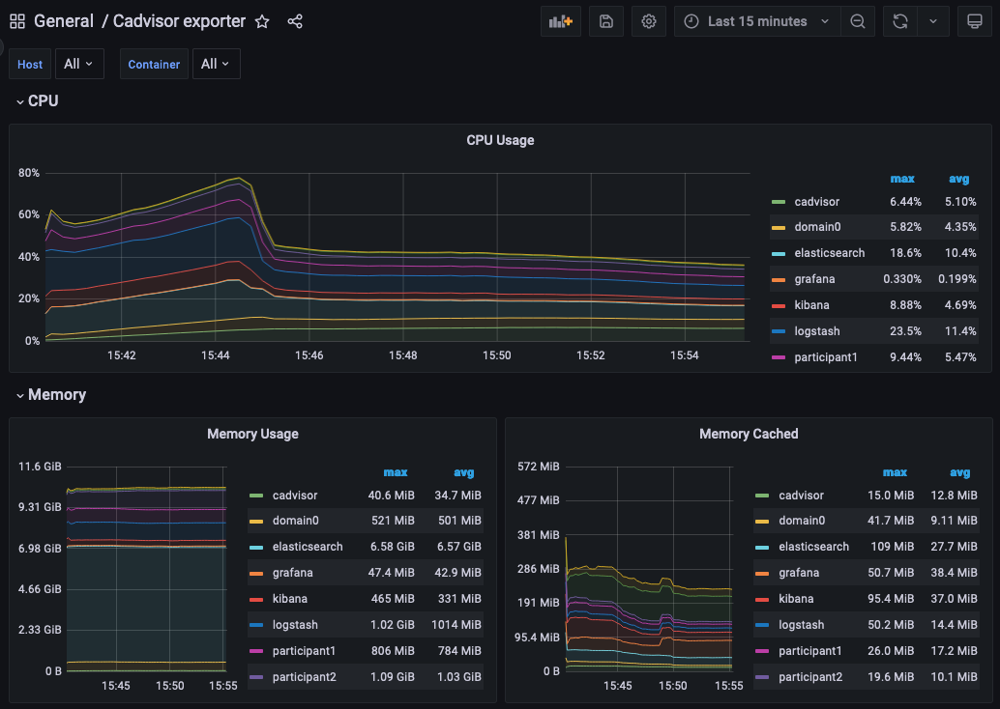

..
   Copyright (c) 2025 Digital Asset (Switzerland) GmbH and/or its affiliates. All rights reserved.
..
   SPDX-License-Identifier: Apache-2.0

.. wip::
    This guide and the scripts/configs are not tested, do they still work?
    Try to split this up into specific howtos and ensure the configs/scripts move to examples that are tested.

    how should this relate to the other observability docs that we have?
    we have the observability gh stuff plus the observability stuff in the quickstart

.. _example_monitoring_setup:

Example Monitoring Setup
========================

This section provides an example of how Canton can be run inside a connected network of Docker containers. The example also shows how you can monitor network activity. See the `monitoring glossary <https://docs.daml.com/canton/usermanual/monitoring_glossary.html>`_ for an explanation of the terms and the `Monitoring Choices`_ section for the reasoning behind the example monitoring setup.

Container Setup
---------------

To configure `Docker Compose <https://docs.docker.com/compose/>`_ to spin up the Docker container network shown in the diagram, use the information below. See the `compose` documentation for detailed information concerning the structure of the configuration files.

`compose` allows you to provide the overall configuration across multiple files. Each configuration file is described below, followed by information on how to bring them together in a running network.

.. image:: ./images/basic-canton-setup.svg
   :align: center
   :width: 100%
   :alt: A diagram showing an example Docker network setup

Intended Use
~~~~~~~~~~~~

This example is intended to demonstrate how to expose, aggregate, and observe monitoring information from Canton. It is not suitable for production without alterations. Note the following warnings:

 .. warning::

   Ports are exposed from the Docker network that are not necessary to support the UI. For example, the network can allow low-level interaction with the underlying service via a REST or similar interface. In a production system, the only ports that should be exposed are those required for the operation of the system.

 .. warning::

   Some of the services used in the example (for example, Postgres and Elasticsearch) persist data to disk. For this example, the volumes used for this persisted data are internal to the Docker container. This means that when the Docker network is torn down, all data is cleaned up along with the containers. In a production system, these volumes would be mounted onto permanent storage.

 .. warning::

   Passwords are stored in plaintext in configuration files. In a production system, passwords should be extracted from a secure keystore at runtime.

 .. warning::

   Network connections are not secured. In a production system, connections between services should be TLS-enabled, with a certificate authority (CA) provided.

 .. warning::

   The memory use of the containers is only suitable for light demonstration loads. In a production setup, containers need to be given sufficient memory based on memory profiling.

 .. warning::

   The versions of the Docker images used in the example may become outdated. In a production system, only the latest patched versions should be used.

Network Configuration
~~~~~~~~~~~~~~~~~~~~~
In this compose file, define the network that will be used to connect all the running containers:

.. literalinclude:: ./monitoring/etc/network-docker-compose.yml
   :language: yaml
   :caption: etc/network-docker-compose.yml

Postgres Setup
~~~~~~~~~~~~~~
Using only a single Postgres container, create databases for the synchronizer, along with Canton and index databases for each participant. To do this, mount `postgres-init.sql` into the Postgres-initialized directory. Note that in a production environment, passwords must not be inlined inside config.

.. literalinclude:: ./monitoring/etc/postgres-docker-compose.yml
   :language: yaml
   :caption: etc/postgres-docker-compose.yml

.. literalinclude:: ./monitoring/etc/postgres-init.sql
   :language: sql
   :caption: etc/postgres-init.sql

Synchronizer Setup
~~~~~~~~~~~~~~~~~~
Run the synchronizer with the `--log-profile container` that writes plain text to standard out at debug level.

.. todo::
   #. Add examples here <https://github.com/DACH-NY/canton/issues/23872>

Participant Setup
~~~~~~~~~~~~~~~~~
The participant container has two files mapped into it on container creation. The `.conf` file provides details of the synchronizer and database locations. An HTTP metrics endpoint is exposed that returns metrics in the `Prometheus Text Based Format <https://github.com/prometheus/docs/blob/main/content/docs/instrumenting/exposition_formats.md#text-based-format>`_. By default, participants do not connect to remote synchronizers, so a bootstrap script is provided to accomplish that.

.. literalinclude:: ./monitoring/etc/participant1-docker-compose.yml
   :language: yaml
   :caption: etc/participant1-docker-compose.yml

.. literalinclude:: ./monitoring/etc/participant1.bootstrap
   :language: scala
   :caption: etc/participant1.bootstrap

.. literalinclude:: ./monitoring/etc/participant1.conf
   :caption: etc/participant1.conf

The setup for participant2 is identical, except that the name and ports are changed.

.. literalinclude:: ./monitoring/etc/participant2-docker-compose.yml
   :language: yaml
   :caption: etc/participant2-docker-compose.yml

.. literalinclude:: ./monitoring/etc/participant1.bootstrap
   :language: scala
   :caption: etc/participant2.bootstrap

.. literalinclude:: ./monitoring/etc/participant1.conf
   :caption: etc/participant2.conf

Logstash
~~~~~~~~

Docker containers can specify a log driver to automatically export log information from the container to an aggregating service. The example exports log information in GELF, using Logstash as the aggregation point for all GELF streams. You can use Logstash to feed many downstream logging data stores, including Elasticsearch, Loki, and Graylog.

.. literalinclude:: ./monitoring/etc/logstash-docker-compose.yml
   :caption: etc/logstash-docker-compose.yml

Logstash reads the `pipeline.yml` to discover the locations of all pipelines.

.. literalinclude:: ./monitoring/etc/pipeline.yml
   :caption: etc/pipeline.yml

The configured pipeline reads GELF-formatted input, then outputs it to an Elasticsearch index prefixed with `logs-` and postfixed with the date.

.. literalinclude:: ./monitoring/etc/logstash.conf
   :caption: etc/logstash.conf

The default Logstash settings are used, with the HTTP port bound to all host IP addresses.

.. literalinclude:: ./monitoring/etc/logstash.yml
   :caption: etc/logstash.yml

Elasticsearch
~~~~~~~~~~~~~

Elasticsearch supports running in a clustered configuration with built-in resiliency. The example runs only a single Elasticsearch node.

.. literalinclude:: ./monitoring/etc/elasticsearch-docker-compose.yml
   :caption: etc/elasticsearch-docker-compose.yml

Kibana
~~~~~~

Kibana provides a UI that allows the Elasticsearch log index to be searched.

.. literalinclude:: ./monitoring/etc/kibana-docker-compose.yml
   :caption: etc/kibana-docker-compose.yml

You must manually configure a data view to view logs. See `Kibana Log Monitoring`_ for instructions.

cAdvisor
~~~~~~~~

cAdvisor exposes container system metrics (CPU, memory, disk, and network) to Prometheus. It also provides a UI to view these metrics.

.. literalinclude:: ./monitoring/etc/cadvisor-docker-compose.yml
   :caption: etc/cadvisor-docker-compose.yml

To view container metrics:

   1. Navigate to `http://localhost:8080/docker/ <http://localhost:8080/docker/>`_.
   2. Select a Docker container of interest.

You should now see a UI similar to the one shown.

.. image:: ./images/c-advisor.png
   :align: center
   :width: 100%
   :alt: An example cAdvisor UI

Prometheus-formatted metrics are available by default at `http://localhost:8080/metrics <http://localhost:8080/metrics>`_.

Prometheus
~~~~~~~~~~

Configure Prometheus with `prometheus.yml` to provide the endpoints from which metric data should be scraped. By default, port `9090` can query the stored metric data.

.. literalinclude:: ./monitoring/etc/prometheus-docker-compose.yml
   :caption: etc/prometheus-docker-compose.yml

.. literalinclude:: ./monitoring/etc/prometheus.yml
   :caption: etc/prometheus.yml

Grafana
~~~~~~~

Grafana is provided with:

* The connection details for the Prometheus metric store
* The username and password required to use the web UI
* The location of any externally provided dashboards
* The actual dashboards

Note that the `Metric Count` dashboard referenced in the docker-compose.yml file (`grafana-message-count-dashboard.json`) is not inlined below. The reason is that this is not hand-configured but built via the web UI and then exported. See `Grafana Metric Monitoring`_ for instructions to log into Grafana and display the dashboard.

.. literalinclude:: ./monitoring/etc/grafana-docker-compose.yml
   :caption: etc/grafana-docker-compose.yml

.. literalinclude:: ./monitoring/etc/grafana.ini
   :caption: etc/grafana.ini

.. literalinclude:: ./monitoring/etc/grafana-datasources.yml
   :caption: etc/grafana-datasources.yml

.. literalinclude:: ./monitoring/etc/grafana-dashboards.yml
   :caption: etc/grafana-dashboards.yml

Dependencies
~~~~~~~~~~~~

There are startup dependencies between the Docker containers. For example, the synchronizer needs to be running before the participant, and the database needs to run before the synchronizer.

The `yaml` anchor `x-logging` enabled GELF container logging and is duplicated across the containers where you want to capture logging output. Note that the host address is the host machine, not a network address (on OSX).

.. literalinclude:: ./monitoring/etc/dependency-docker-compose.yml
   :language: yaml
   :caption: etc/dependency-docker-compose.yml

Docker Images
~~~~~~~~~~~~~

The Docker images need to be pulled down before starting the network:

* digitalasset/canton-open-source:2.5.1
* docker.elastic.co/elasticsearch/elasticsearch:8.5.2
* docker.elastic.co/kibana/kibana:8.5.2
* docker.elastic.co/logstash/logstash:8.5.1
* gcr.io/cadvisor/cadvisor:v0.45.0
* grafana/grafana:9.3.1-ubuntu
* postgres:17.5-bullseye
* prom/prometheus:v2.40.6

Running Docker Compose
~~~~~~~~~~~~~~~~~~~~~~

Since running `docker compose` with all the compose files shown above creates a long command line, a helper script `dc.sh` is used.

A minimum of **12GB** of memory is recommended for Docker. To verify that Docker is not running short of memory, run `docker stats` and ensure the total `MEM%` is not too high.

.. literalinclude:: ./monitoring/dc.sh
   :language: bash
   :caption: dc.sh

**Useful commands**

.. code-block:: bash

     ./dc.sh up -d       # Spins up the network and runs it in the background

     ./dc.sh ps          # Shows the running containers

     ./dc.sh stop        # Stops the containers

     ./dc.sh start       # Starts the containers

     ./dc.sh down        # Stops and tears down the network, removing any created containers

Connecting to Nodes
-------------------

To interact with the running network, a Canton console can be used with a remote configuration. For example:

.. code-block:: bash

     bin/canton -c etc/remote-participant1.conf

Remote Configurations
~~~~~~~~~~~~~~~~~~~~~

.. literalinclude:: ./monitoring/etc/remote-participant1.conf
   :caption: etc/remote-participant1.conf

.. literalinclude:: ./monitoring/etc/remote-participant2.conf
   :caption: etc/remote-participant2.conf

Getting Started
~~~~~~~~~~~~~~~

Using the previous scripts, you can follow the examples provided in
the :externalref:`Getting Started <canton-getting-started>` guide.

Kibana log monitoring
---------------------

When Kibana is started for the first time, you must set up a data view to allow view the log data:

   1. Navigate to `http://localhost:5601/ <http://localhost:5601/>`_.
   2. Click **Explore on my own**.
   3. From the menu select **Analytics** > **Discover**.
   4. Click **Create data view**.
   5. Save a data view with the following properties:

      * Name: `Logs`
      * Index pattern: `logs-*`
      * Timestamp field: `@timestamp`

You should now see a UI similar to the one shown here:

.. image:: ./images/kibana.png
   :align: center
   :width: 100%
   :alt: An example Kibana UI

In the Kibana interface, you can:

   - Create a view based on selected fields
   - View log messages by logging timestamp
   - Filter by field value
   - Search for text
   - Query using either `KSQL` or `Lucene` query languages

For more details, see the Kibana documentation. Note that querying based on plain text for a wide time window likely results in poor UI performance. See `Logging Improvements`_ for ideas to improve it.

Grafana Metric Monitoring
-------------------------

You can log into the Grafana UI and set up a dashboard. The example imports a `GrafanaLabs community dashboard <https://grafana.com/grafana/dashboards/>`_ that has graphs for cAdvisor metrics. The `cAdvisor Export dashboard <https://grafana.com/grafana/dashboards/14282-cadvisor-exporter/>`_ imported below has an ID of **14282**.

   1. Navigate to `http://localhost:3000/login <http://localhost:3000/login>`_.
   2. Enter the username/password: `grafana/grafana`.
   3. In the side border, select **Dashboards** and then **Import**.
   4. Enter the dashboard ID `14282` and click **Load**.
   5. On the screen, select **Prometheus** as the data source and click **Import**.

You should see a container system metrics dashboard similar to the one shown here:

See the `Grafana documentation <https://grafana.com/grafana/>`_ for how to configure dashboards. For information about which metrics are available, see the Metrics documentation in the Monitoring section of this user manual.

Monitoring Choices
------------------
This section documents the reasoning behind the technology used in the example monitoring setup.

Use Docker Log Drivers
~~~~~~~~~~~~~~~~~~~~~~

**Reasons:**

- Most Docker containers can be configured to log all debug output to stdout.
- Containers can be run as supplied.
- No additional dockerfile layers need to be added to install and start log scrapers.
- There is no need to worry about local file naming, log rotation, and so on.

Use GELF Docker Log Driver
~~~~~~~~~~~~~~~~~~~~~~~~~~

**Reasons:**

- It is shipped with Docker.
- It has a decodable JSON payload.
- It does not have the size limitations of syslog.
- A UDP listener can be used to debug problems.

Use Logstash
~~~~~~~~~~~~

**Reasons:**

- It is a lightweight way to bridge the GELF output provided by the containers into Elasticsearch.
- It has a simple conceptual model (pipelines consisting of input/filter/output plugins).
- It has a large ecosystem of input/filter and output plugins.
- It externalizes the logic for mapping container logging output to a structures/ECS format.
- It can be run with `stdin`/`stdout` input/output plugins for use with testing.
- It can be used to feed Elasticsearch, Loki, or Graylog.
- It has support for the Elastic Common Schema (ECS) if needed.

Use Elasticsearch/Kibana
~~~~~~~~~~~~~~~~~~~~~~~~

**Reasons:**

- Using Logstash with Elasticsearch and Kibana, the ELK stack, is a mature way to set up a logging infrastructure.
- Good defaults for these products allow a basic setup to be started with almost zero configuration.
- The ELK setup acts as a good baseline as compared to other options such as Loki or Graylog.

Use Prometheus/Grafana
~~~~~~~~~~~~~~~~~~~~~~

**Reasons:**

- Prometheus defines and uses the OpenTelemetry reference file format.
- Exposing metrics via an HTTP endpoint allows easy direct inspection of metric values.
- The Prometheus approach of pulling metrics from the underlying system means that the running containers do not need infrastructure to store and push metric data.
- Grafana works very well with Prometheus.

Logging Improvements
--------------------
This version of the example only has the logging structure provided via GELF. It is possible to improve this by:

  - Extracting data from the underlying containers as a JSON stream.
  - Mapping fields in this JSON data onto the ECS so that the same name is used for commonly used field values (for example, log level).
  - Configuring Elasticsearch with a schema that allows certain fields to be quickly filtered (for example, log level).

