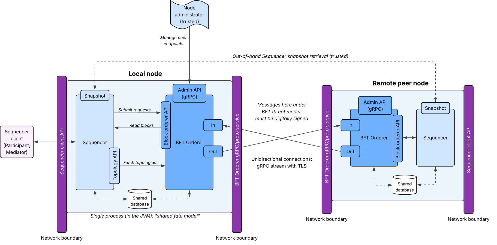
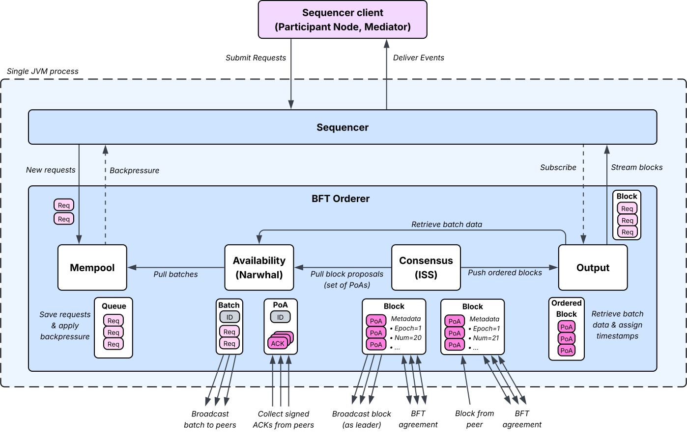

..
   Copyright (c) 2026 Digital Asset (Switzerland) GmbH and/or its affiliates. All rights reserved.
..
   SPDX-License-Identifier: Apache-2.0

.. _bft-orderer-arch:

BFT Orderer
===========

The BFT Orderer provides a Byzantine-fault tolerant (BFT) total-order broadcast service.
It ensures **safety** (consistency) and **liveness** (eventual progress) in the presence of
Byzantine failures. It also guarantees that all clients read an identical stream of messages.

The BFT Orderer runs within the Canton ecosystem and serves as one of the primary
:ref:`Sequencer backend<sequencer-backend>` options for Synchronizers. When active, the BFT Orderer runs as
part of the Canton Sequencer node in the same JVM and depends on the Sequencer for various functionalities,
including message signatures, message verification, key management, and decentralized governance.

Background
----------

.. _bft-iss-algorithm:

The BFT Orderer draws inspiration from two recently published BFT consensus algorithms. The primary
influence is `Insanely Scalable State-Machine Replication (ISS) <https://arxiv.org/pdf/2203.05681>`_, which
presents a parallel leader-based BFT replication protocol that achieves scalability and performance, even
in the presence of unavailable replicas. For the BFT Orderer, ISS inspires the core consensus subprotocol.

.. _bft-narwhal-algorithm:

The second inspiration is `Narwhal <https://arxiv.org/pdf/2105.11827>`_, a protocol that separates
data dissemination from data ordering into two separate phases of the ordering process. This decoupling
allows the BFT consensus protocol, which tends to be a bottleneck in most ordering services, to work
faster and more efficiently by simply ordering references to already-disseminated data. For the BFT Orderer,
Narwhal inspires the pre-consensus availability subprotocol.

Trust and threat model
----------------------

The BFT Orderer relies on the following assumptions:

* Less than one third of the total BFT Orderer nodes may simultaneously exhibit Byzantine failures. This is a standard and mandatory assumption for most BFT ordering protocols to ensure safety (consistency).
* Attackers can have large amounts of network bandwidth, memory, and computation, but not enough resources to circumvent standard cryptographic mechanisms, such as digital signatures and cryptographic hashes.
* Each BFT Orderer node and its associated Canton Sequencer node operate under a shared fate model; if a BFT Orderer node becomes compromised, its associated Sequencer should also be assumed compromised, and vice versa. This assumption is important to state due to the BFT Orderer’s dependency on certain features provided by its connected Sequencer.
* The decentralized governance process using several trusted (and often offline) system administrators correctly manage and configure the BFT Orderer.
* During the onboarding of new BFT Orderer nodes, node operators communicate out of band to obtain a snapshot of relevant onboarding state from peer Sequencer nodes; currently, the contents of the onboarding state must be correct.
* No data corruption in the underlying database storage system(s).

Architecture
------------

The following dataflow diagram illustrates the BFT Orderer APIs and network trust boundaries.
Note that the remote peer node contains fewer elements than the local node just to simplify the
illustration. In practice, all BFT Orderer nodes are identical.

.. https://lucid.app/lucidchart/26d87084-4502-4285-ac5a-e14c66ec6440/edit

APIs
----

The BFT Orderer provides several APIs across different trust boundaries. The above architecture diagram
illustrates the scope and location of each API.

Peer-to-peer service (untrusted)
^^^^^^^^^^^^^^^^^^^^^^^^^^^^^^^^

BFT Orderer nodes communicate directly with each other using peer-to-peer connections, which collectively
form the distributed ordering service. Each BFT Orderer node establishes a unidirectional gRPC/HTTP2 stream to
every other peer. This means that for a given pair of nodes, each node (i) initiates an outgoing connection
(as a client) to their peer (acting as a server), and (ii) accepts an incoming connection (as a server)
from their peer (acting as a client).

For network transport security, gRPC connections support Transport Layer Security (TLS) to provide point-to-point
message authentication and integrity. Typically, network access to the peer-to-peer API is restricted to
the other peers and not publicly accessible. For more information on peer-to-peer network
security and configuration, refer to the :ref:`Sequencer backend<sequencer-backend>` page.

Sequencer client (untrusted)
^^^^^^^^^^^^^^^^^^^^^^^^^^^^

Since the BFT Orderer is a backend ordering service for Sequencers, BFT Orderer nodes do not directly
receive ordering requests from Sequencer clients (Participant Nodes and Mediators). However, a BFT Orderer's
associated Sequencer *does* receive these requests. After the Sequencer validates and authenticates an ordering
request, it forwards (writes) that request (via the :ref:`BlockOrderer API<bft-block-orderer-api>` below) to
its colocated BFT Orderer to order the request using the underlying distributed service. Ultimately, the Sequencer
client API only indirectly impacts the BFT Orderer, but it is still an untrusted API due to where requests
originate (outside of the Sequencer).

.. _bft-block-orderer-api:

BlockOrderer API (trusted)
^^^^^^^^^^^^^^^^^^^^^^^^^^

Like all Sequencer backends, the BFT Orderer implements the BlockOrderer API. This API primarily allows
the colocated Sequencer to send (write) requests to the backend for ordering and subscribe to (read)
the global stream of transactions that contains all ordered transactions across all Sequencers in
the Synchronizer. Since the Sequencer and BFT Orderer run together in a single JVM process, this
BlockOrderer API is trusted.

Unlike other Sequencer backends, such as centralized databases, the cost and complexity
behind the send (write) functionality for the BFT Orderer backend tends to be much higher. Whereas a
centralized database simply assigns a sequence number to incoming requests in the received order,
the BFT Orderer executes a multi-stage distributed agreement protocol across many concurrent nodes.

Topology and crypto provider (trusted)
^^^^^^^^^^^^^^^^^^^^^^^^^^^^^^^^^^^^^^

While the BFT Orderer implements the :ref:`BlockOrderer API<bft-block-orderer-api>` to provide
ordering to its Sequencer, the Sequencer also implements APIs to provide critical
functionality to its BFT Orderer. These APIs extend the Sequencer's decentralized topology
management (governance) and cryptographic operations (message signing and verification) to
the BFT Orderer. By reusing this Sequencer-owned functionality, the BFT Orderer avoids the
need to reimplement a complex set of features and enables management of both a Sequencer and
its respective BFT Orderer simultaneously with the same topology transaction(s).

In terms of usage, the BFT Orderer frequently submits message signing and message
verification requests to its colocated Sequencer for all sent and received network messages,
respectively. For topology management, the BFT Orderer updates its view of the active topology
after completing discrete units of work (known as epochs). At each epoch boundary, the BFT Orderer
fetches the latest active topology from its Sequencer before it then resumes the ordering process.

Sequencer snapshot provider (trusted)
^^^^^^^^^^^^^^^^^^^^^^^^^^^^^^^^^^^^^

To dynamically :ref:`onboard a new Sequencer<dynamically_adding_sequencers>`, the Sequencer requires
a startup state to successfully join the network. The startup state includes both a recent topology
snapshot that reflects the new Sequencer as active and a timestamp for each Sequencer
client to maintain consistent event delivery. During onboarding, a new Sequencer obtains this
onboarding state snapshot by first communicating out of band with a trusted peer Sequencer. Then,
the new Sequencer uses the retrieved snapshot to startup and successfully bootstrap.

When active, the BFT Orderer also requires a startup state. In particular, the BFT Orderer needs
consensus protocol-specific metadata, such as a starting epoch number, starting block number,
and previously assigned BFT timestamp. This metadata enables the BFT Orderer to correctly
perform state transfer and eventually participate in the distributed ordering protocol.

To simplify onboarding, Sequencers bundle their BFT Orderer's additional startup state
inside their own onboarding state snapshot when asked by a new peer. This allows
Sequencers that use the BFT Orderer to reuse the existing out-of-band communication to
obtain all necessary startup state in a single package.

Node admin (trusted)
^^^^^^^^^^^^^^^^^^^^

For the most part, Sequencer management automatically extends to the BFT Orderer.
Any Sequencer-related topology command, such as adding a Sequencer, removing a Sequencer, or
rotating keys, applies to both the Sequencer and its associated BFT Orderer.

However, the BFT Orderer also connects and communicates directly wth peers. Beyond
the topology state (which includes public keys), the BFT Orderer needs to know
specific endpoint information, such as IP address and port, to connect with peers.

As a result, node administrators must separately manage endpoint information directly with
their BFT Orderer. The BFT Orderer exposes a small gRPC admin service that allows
node administrators to add, remove, or list the currently registered peer endpoints.
When adding a new BFT Orderer to the network, the new node's endpoint information must be
communicated to all peers (potentially out of band or via a lookup service) and then
added by each node administrator using the gRPC admin service.

Life of a transaction
---------------------

The BFT Orderer utilizes four main subprotocols, split into separate modules, to order
transactions across the distributed network of nodes. The following diagram
and subsequent sections explain the main responsibilities of each module and how
they contribute to the ordering process.

.. https://lucid.app/lucidchart/26d87084-4502-4285-ac5a-e14c66ec6440/edit

.. _bft-mempool-module:

Mempool
^^^^^^^

The mempool module receives ordering requests (transactions) submitted by the colocated
Sequencer using the BlockOrderer API. The mempool saves these ordering requests in memory in a
queue.

* If *sufficient* space exists, the mempool keeps the ordering request in the queue.
* If *insufficient* space exists, the mempool rejects the ordering request by sending back a negative response to the Sequencer, effectively applying backpressure.

The mempool queue regains space when the :ref:`availability module<bft-availability-module>`, the next
module downstream, asks for new ordering requests. When asked by availability, the mempool batches
together pending ordering requests and provides the resulting batch to availability to continue
data dissemination.

.. _bft-availability-module:

Availability
^^^^^^^^^^^^

Recall that the BFT Orderer draws inspiration from :ref:`Narwhal<bft-narwhal-algorithm>`, a
recent BFT consensus protocol that separates data dissemination from data ordering
into two separate phases to improve scalability. In the BFT Orderer, the availability module
implements data dissemination. It disseminates ordering request data to correct BFT Orderer
nodes *before* ordering of this data occurs. As a result, data ordering
in the :ref:`consensus module<bft-consensus-module>`, the next module downstream, can use
data references rather than the full request data. This strategy removes a major communication
overhead from the BFT consensus protocol's critical path by keeping consensus proposal
messages small and less expensive to transmit to peers.

To safely use references in BFT consensus proposals, nodes must guarantee that they either
already have or can retrieve the full requests once ordering completes. Otherwise, nodes could
become blocked indefinitely trying to fetch requests that they simply cannot obtain. For example,
an adversarial BFT Orderer node could try to block network-wide ordering progress by proposing
references to requests that do not exist at any correct node.

The BFT Orderer uses proofs of availability (PoAs) to guarantee that referenced requests exist
and can be retrieved, even after ordering completes. When availability pulls a batch of
requests from the :ref:`mempool<bft-mempool-module>`, it stores that batch in its local database.
This originating node's availability module then forwards the batch to all peer availability modules.
Upon receiving a valid batch, a peer also stores the request to its local database and then responds back
to the originating node with a signed availability acknowledgement (ACK). Once the originating node
collects a *sufficient* number of valid and distinct availability ACKs, it creates a PoA.

In a network with **f** tolerable Byzantine failures, at most **f** of the collected availability ACKs
can be illegitimate. All other ACKs must come from correct BFT Orderer nodes that promise to persist
and serve the referenced requests. Therefore, the PoA must contain at least **f+1** distinct
availability ACKs to ensure that at least one listed peer can serve the request to nodes that need it.
Alternatively, since up to *f* nodes may refuse to contribute an availability ACK,
the originating node can only wait for at most **N-f** ACKs, where **N** is the total
number of nodes in the network. In this latter case, the originating node may wait longer to complete
the PoA, but more correct nodes can serve the referenced requests upon request.

When the consensus module asks for a proposal, the availability module bundles completed PoAs
into an ordering block and forwards it downstream. These ordering blocks, plus additional metadata
and security measures added by consensus, is what the BFT consensus protocol orders.

.. _bft-consensus-module:

Consensus
^^^^^^^^^

The consensus module implements the data ordering phase. It draws inspiration from
:ref:`ISS<bft-iss-algorithm>` to provide a concurrent leader-driven BFT consensus
protocol. The consensus module separates ordering into discrete units of work
known as *epochs*. Consensus defines epoch length in terms of number of blocks,
and all consensus modules agree on the length of epochs using a network-wide parameter.

At the start of each epoch, all correct consensus modules agree on the current topology
and set of eligible leader (BFT Orderer) nodes. To achieve concurrency, consensus
deterministically assigns ordering responsibility of blocks in an epoch across
the eligible leaders. Each leader orders blocks in parallel using an independent
instance of a BFT ordering protocol for their blocks in that epoch. The BFT
Orderer (and ISS) uses Practical Byzantine Fault Tolerance (PBFT), a standard
BFT agreement protocol using three stages: *pre-prepare*, *prepare*, and *commit*.

A leader starts ordering each block by asking the local availability module for an
ordering block containing a set of PoAs. The leader broadcasts a pre-prepare
message containing the ordering block to all peer consensus modules in the network.
Upon receiving a valid pre-prepare for a block, all nodes (both the leader and followers)
send a prepare message acknowledging the pre-prepare. Once a node receives a valid
pre-prepare from the leader and a valid prepare from more than 2/3 of the network,
it sends a commit message. Finally, when a node receives a valid pre-prepare and
a valid commit message from more than 2/3 of the nodes, it considers the block
ordered and forwards the block downstream to the
:ref:`output module<bft-output-module>`.

Once the consensus module forwards all ordered blocks to the output module, it
waits for feedback from the output module containing the updated topology and
eligible leader set for the next epoch. This information allows the consensus
module to correctly start the new epoch in a way that is (or will be) consistent
will all correct peers.

.. _bft-output-module:

Output
^^^^^^

The output module receives ordered blocks from the :ref:`consensus<bft-consensus-module>`
module upstream. But before it can deliver the blocks to the colocated Sequencer, the output
module must perform three additional steps.

First, recall that ordered blocks contain only *references* to requests (via the PoAs),
and not actual request data. Upon receiving an ordered block, the output module communicates
with the local availability module to fetch the associated data for the requests in each PoA:

* If the requests' data is already stored locally in this BFT Orderer node, availability responds immediately to the output module with the data.
* If the requests' data is missing locally, availability reaches out to peers, based on the peers that contributed ACKs to the PoA, to fetch the missing data. Once fetched, availability stores the data locally and forwards the data to the output module.

Second, since consensus runs several independent instances of the BFT agreement
protocol in parallel, blocks can arrive at the output module out of order. The output
modules uses a queue to correct potential reorderings. For efficiency, this queue holds
ordered blocks *after* their data is fetched to allow fetching from the availability module
to happen concurrently.

Third, the output module assigns strictly-increasing BFT timestamps to the ordered
requests across all ordered blocks. The consensus module calculates a *candidate* BFT
timestamp for each block based on the timestamps of consensus messages used to
order blocks. However, final timestamp assignment cannot happen in consensus due
to the concurrent BFT agreement instances. Ultimately, the output module combines
all ordered blocks back into a single sequence. Using each block's candidate BFT
timestamp as input, the output module deterministically assigns timestamps to requests,
shifting values slightly into the future, as needed, to ensure strictly-increasing timestamps.

Once the output module completes the above steps, it streams blocks in order to the
colocated Sequencer using the :ref:`BlockOrderer API<bft-block-orderer-api>`.

Finally, at the end of each epoch, the output module fetches an updated topology
from the colocated Sequencer's topology manager that reflects all topology
changes up to that point in time. The output module sends this topology, along with
an updated set of eligible leaders, to consensus to correctly start the next epoch.
