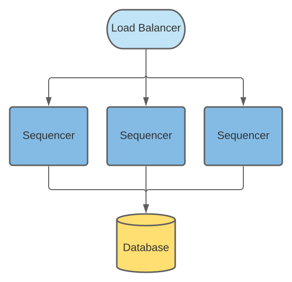

..
   Copyright (c) 2026 Digital Asset (Switzerland) GmbH and/or its affiliates. All rights reserved.
..
   SPDX-License-Identifier: Apache-2.0

HA on the Synchronizer
######################

The diagram shows a synchronizer containing the topology manager, mediator, and sequencer components.

.. _components-for-ha:
.. image:: images/ha/canton-components-for-ha-synchronizer.svg
   :align: center
   :width: 60%

A synchronizer is fully available only when all components are available. However, transaction processing still runs even when only the mediator and the sequencer are available.

As all of the synchronizer components run in separate processes, HA is architected per component. This means that in an HA deployment, the synchronizer is not deployed as a node (which would run the mediator, sequencer, and manager in a single process).

Sequencer
---------

Sequencer HA depends on the chosen implementation. For example, when using a ledger such as `Hyperledger Fabric <../../../../canton/usermanual/synchronizers/fabric.html>`_, HA is already set up. Multiple sequencer nodes must be deployed.

The synchronizer returns multiple sequenced endpoints, any of which can be used to interact with the underlying ledger.

Database Sequencer
~~~~~~~~~~~~~~~~~~

The database sequencer has an active-active setup over a shared database.

The sequencer relies on the database for both HA and consistency. The database ensures that events are sequenced in a consistent order.

.. https://lucid.app/lucidchart/7b20b586-4d34-4787-ac68-72eda44e3ba1


Many sequencer nodes can be deployed. Each node has concurrent read and write components when accessing the database. The load balancer evenly distributes requests between sequencer nodes.

.. NOTE::
   The system stops sending requests to an unhealthy node.

Consistency and the Database Sequencer
``````````````````````````````````````

Each node is assigned a distinct index from the total number of sequencer nodes. The index is included in event timestamps to ensure that sequencer nodes never use duplicate event IDs/timestamps.

Events are written to the ``events`` table in ascending timestamp order. Readers need to know the point at which events can be read without the risk of an earlier event being inserted by a write process.
To do this, writers regularly update a ``watermark`` table into which they publish their latest event timestamp. Readers take the minimum timestamp from the table as the point from which they can safely query events.

Failing Sequencer Nodes and the Database Sequencer
``````````````````````````````````````````````````

If a sequencer node fails, it stops updating its ``watermark`` value and, when the value reaches the minimum timestamp, all readers pause as they cannot read beyond this point.

When sequencer writers update their  ``watermark``, they also check that other sequencer watermarks are updated promptly. If a sequencer node has not updated its watermark within a configurable interval, it is marked as offline and the watermark is no longer included in the query for the minimum event timestamp. Future events from the offline sequencer are ignored after this timestamp.

.. NOTE::
   For this process to operate optimally, the clocks of the hosts of the sequencer nodes should be synchronized. This is considered reasonable for co-located sequencer hosts which use NTP.

Recovering Sequencer Nodes
~~~~~~~~~~~~~~~~~~~~~~~~~~

When a failed sequencer recovers and resumes operation, it deletes all events that arrived past
its last known watermark. This avoids incorrectly re-inserting them, as readers may have seen them already.

It is safe to do this and it does not affect events that have already been read. Any events written by the sequencer while it is offline are ignored by readers. The sequencer then replaces its old watermark with a new timestamp and resumes normal operation.

After resuming operation, there is a short pause in reading from other sequencers due to updates
to the watermark table. However, requests to the other sequencer nodes continue successfully, and any events written during this period are available for reading as soon as the pause is over.

The recovered sequencer has likely lost any send requests that were in process during failure. These can be safely retried, without the risk of creating duplicate events, once their ``max-sequencing-time`` is exceeded.

Mediator
--------

Like the :externalref:`Participant Node <ha_participant_arch>`, the Mediator is replicated and only one replica node is active.

All replicas of the same mediator node share the same database to access the state and coordinate with the active mediator node.
