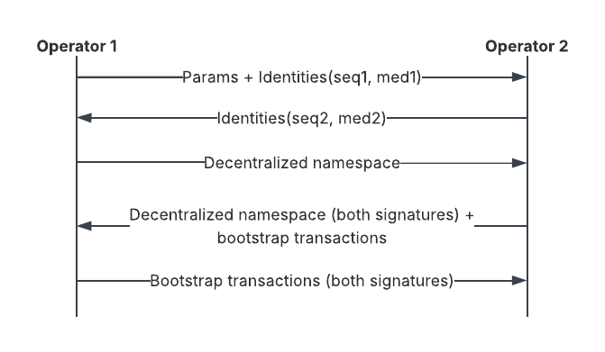

..
   Copyright (c) 2025 Digital Asset (Switzerland) GmbH and/or its affiliates. All rights reserved.
..
   SPDX-License-Identifier: Apache-2.0

.. _synchronizer-bootstrap:

Bootstrap a Synchronizer
========================

This howto assumes familiarity with general Synchronizer concepts.
Refer to the :externalref:`Canton overview<canton-overview>` for more information.

Set up a centralized Synchronizer
---------------------------------

In a **centralized** Synchronizer, the operator has access to all Sequencer and Mediator nodes.

A centralized Synchronizer is the simplest to set up and manage, but it assumes that a single fully trusted entity
owns and operates the Synchronizer.

You can bootstrap a centralized Synchronizer by specifying a single owner and a ``synchronizerThreshold`` of 1.
This respectively means that only that owner can authorize topology changes on the Synchronizer, and that
one signature is sufficient for that.

First, make sure that the nodes are fresh and haven't yet been initialized:

.. snippet:: centralized_synchronizer_install
    .. success:: mediator1.health.initialized()
    .. assert:: !RES
    .. success:: sequencer1.health.initialized()
    .. assert:: !RES

Now you can initialize the centralized Synchronizer as follows:

.. snippet:: centralized_synchronizer_install
    .. success:: bootstrap.synchronizer(
          synchronizerName = "mySynchronizer",
          sequencers = Seq(sequencer1),
          mediators = Seq(mediator1),
          synchronizerOwners = Seq(sequencer1),
          synchronizerThreshold = 1,
          staticSynchronizerParameters = StaticSynchronizerParameters.defaultsWithoutKMS(ProtocolVersion.latest),
        )

.. snippet:: centralized_synchronizer_install
    .. assert:: mediator1.health.initialized()
    .. assert:: sequencer1.health.initialized()

Instead of using the defaults, you can customize the static Synchronizer parameters. Refer to the
:externalref:`parameters configuration<parameters-configuration>` section for more information about which
static Synchronizer parameters are available and their value.

Now a Participant Node can connect to the Synchronizer via a Sequencer. Check that the Participant Node can use the
Synchronizer through a ``ping`` command:

.. snippet:: centralized_synchronizer_install
    .. success:: participant1.synchronizers.connect_local(sequencer1, "mySynchronizer")
    .. success:: participant1.health.ping(participant1)

.. _synchronizer_bootstrapping_separate_consoles:

Set up a decentralized Synchronizer
-----------------------------------

This subsection covers the most frequent case where distinct operators manage **decentralized** Synchronizer nodes
on behalf of the respective owners. This also means that they're managed from separate console environments.

In this case, the bootstrapping process must be coordinated in lockstep between the Synchronizer nodes,
with the coordination and exchange of data happening through secure communication channels.

As an overview, to bootstrap a decentralized Synchronizer with separate consoles, operators:

#. Fix the initial parameters.
#. Exchange Synchronizer identities.
#. Collectively create a decentralized namespace (see the :externalref:`Canton overview<canton-overview>` for more information);
   each operator:

   #. Signs the bootstrapping topology transactions.
   #. Exchanges the bootstrapping topology transactions with other operators.
   #. Initializes their Synchronizer nodes.

This how-to uses two Sequencer nodes and two Mediator nodes. The Sequencer nodes are Synchronizer
owners and are managed by distinct operators on behalf of the respective entities.

This diagram illustrates the exchange of information between the operators:

.. https://lucid.app/lucidchart/72c28bfe-c110-4922-9d19-93adaa35377f/edit?beaconFlowId=17067B091FED8E89&invitationId=inv_56f800da-54ae-49b8-af3f-ad690e74a0c5&page=0_0#

.. note::

    Before proceeding, ensure that all of the nodes in the decentralized Synchronizer are started.

All Synchronizer owners must agree on the :externalref:`static Synchronizer parameters<parameters-configuration>`
in advance. You can achieve that, for example, by exporting and sharing a file containing their definition:

.. snippet:: decentralized_synchronizer_install_separate_consoles
    .. success:: val synchronizerParameters = StaticSynchronizerParameters.defaultsWithoutKMS(ProtocolVersion.latest)
    .. success:: synchronizerParameters.writeToFile("tmp/synchronizer-bootstrapping-files/params.proto")

Now create temporary topology stores to bootstrap the Synchronizer's topology in both Sequencers' consoles:

.. snippet:: decentralized_synchronizer_install_separate_consoles
    .. success:: val sequencer1Id = sequencer1.id
    .. success:: val sequencer1TempStore = sequencer1.topology.stores.create_temporary_topology_store("sequencer1-synchronizer-setup", synchronizerParameters.protocolVersion)

.. snippet:: decentralized_synchronizer_install_separate_consoles
    .. success:: val sequencer2Id = sequencer2.id
    .. success:: val sequencer2TempStore = sequencer2.topology.stores.create_temporary_topology_store("sequencer2-synchronizer-setup", synchronizerParameters.protocolVersion)

Export the Sequencer and Mediator identities from both Sequencers' consoles:

.. snippet:: decentralized_synchronizer_install_separate_consoles
    .. success:: sequencer1.topology.transactions.export_identity_transactions("tmp/synchronizer-bootstrapping-files/sequencer1-identity.proto")
    .. success:: mediator1.topology.transactions.export_identity_transactions("tmp/synchronizer-bootstrapping-files/mediator1-identity.proto")

.. snippet:: decentralized_synchronizer_install_separate_consoles
    .. success:: sequencer2.topology.transactions.export_identity_transactions("tmp/synchronizer-bootstrapping-files/sequencer2-identity.proto")
    .. success:: mediator2.topology.transactions.export_identity_transactions("tmp/synchronizer-bootstrapping-files/mediator2-identity.proto")

Import the node identities into the respective temporary topology stores from the respective consoles:

.. snippet:: decentralized_synchronizer_install_separate_consoles
    .. success:: sequencer1.topology.transactions.import_topology_snapshot_from("tmp/synchronizer-bootstrapping-files/sequencer1-identity.proto", sequencer1TempStore)
    .. success:: sequencer1.topology.transactions.import_topology_snapshot_from("tmp/synchronizer-bootstrapping-files/sequencer2-identity.proto", sequencer1TempStore)
    .. success:: sequencer1.topology.transactions.import_topology_snapshot_from("tmp/synchronizer-bootstrapping-files/mediator1-identity.proto", sequencer1TempStore)
    .. success:: sequencer1.topology.transactions.import_topology_snapshot_from("tmp/synchronizer-bootstrapping-files/mediator2-identity.proto", sequencer1TempStore)

.. snippet:: decentralized_synchronizer_install_separate_consoles
    .. success:: sequencer2.topology.transactions.import_topology_snapshot_from("tmp/synchronizer-bootstrapping-files/sequencer1-identity.proto", sequencer2TempStore)
    .. success:: sequencer2.topology.transactions.import_topology_snapshot_from("tmp/synchronizer-bootstrapping-files/sequencer2-identity.proto", sequencer2TempStore)
    .. success:: sequencer2.topology.transactions.import_topology_snapshot_from("tmp/synchronizer-bootstrapping-files/mediator1-identity.proto", sequencer2TempStore)
    .. success:: sequencer2.topology.transactions.import_topology_snapshot_from("tmp/synchronizer-bootstrapping-files/mediator2-identity.proto", sequencer2TempStore)

Propose and export the decentralized namespace declaration with the first Sequencer's signature:

.. snippet:: decentralized_synchronizer_install_separate_consoles
    .. success:: val seq1DND = sequencer1.topology.decentralized_namespaces.propose_new(
            owners = Set(sequencer1Id.namespace, sequencer2Id.namespace),
            threshold = PositiveInt.two,
            store = sequencer1TempStore,
          )

.. snippet:: decentralized_synchronizer_install_separate_consoles
    .. success:: seq1DND.writeToFile("tmp/synchronizer-bootstrapping-files/decentralized-namespace.proto")
    .. success:: val synchronizerId = SynchronizerId(UniqueIdentifier.tryCreate("mySynchronizer", seq1DND.mapping.namespace.toProtoPrimitive))
    .. success:: val physicalSynchronizerId = PhysicalSynchronizerId(synchronizerId, synchronizerParameters.toInternal)

On the second Sequencer's console, load the first Sequencer's decentralized namespace declaration, sign it, and share it again:

.. snippet:: decentralized_synchronizer_install_separate_consoles
    .. success:: sequencer2.topology.transactions.load_single_from_file(
            "tmp/synchronizer-bootstrapping-files/decentralized-namespace.proto",
            sequencer2TempStore,
            ForceFlag.AlienMember,
          )

.. snippet:: decentralized_synchronizer_install_separate_consoles
    .. success:: val seq2DND = sequencer2.topology.decentralized_namespaces.propose_new(
            owners = Set(sequencer1Id.namespace, sequencer2Id.namespace),
            threshold = PositiveInt.two,
            store = sequencer2TempStore,
          )
    .. success:: seq2DND.writeToFile("tmp/synchronizer-bootstrapping-files/decentralized-namespace.proto")

Generate the Synchronizer bootstrap transactions with the second Sequencer's signature and share them
with the first Sequencer:

.. snippet:: decentralized_synchronizer_install_separate_consoles
    .. success:: val synchronizerBootstrap =
            sequencer2.topology.synchronizer_bootstrap.download_genesis_topology(
              physicalSynchronizerId,
              synchronizerOwners = Seq(sequencer1Id, sequencer2Id),
              sequencers = Seq(sequencer1Id, sequencer2Id),
              mediators = Seq(mediator1.id, mediator2.id),
              outputFile = "tmp/synchronizer-bootstrapping-files/synchronizer-bootstrap.proto",
              store = sequencer2TempStore,
            )

On the first Sequencer's console, load the second Sequencer's decentralized namespace declaration and
Synchronizer bootstrap transactions:

.. snippet:: decentralized_synchronizer_install_separate_consoles
    .. success:: sequencer1.topology.transactions.load_single_from_file(
            "tmp/synchronizer-bootstrapping-files/decentralized-namespace.proto",
            sequencer1TempStore,
            ForceFlag.AlienMember,
          )

.. snippet:: decentralized_synchronizer_install_separate_consoles
    .. success:: sequencer1.topology.transactions.load_multiple_from_file(
            "tmp/synchronizer-bootstrapping-files/synchronizer-bootstrap.proto",
            sequencer1TempStore,
            ForceFlag.AlienMember,
          )

Still on the first Sequencer's console, generate and re-export the genesis topology.
This also merges the signatures from both Sequencers:

.. snippet:: decentralized_synchronizer_install_separate_consoles
    .. success:: sequencer1.topology.synchronizer_bootstrap.download_genesis_topology(
            physicalSynchronizerId,
            synchronizerOwners = Seq(sequencer1Id, sequencer2Id),
            sequencers = Seq(sequencer1Id, sequencer2Id),
            mediators = Seq(mediator1.id, mediator2.id),
            outputFile = "tmp/synchronizer-bootstrapping-files/synchronizer-bootstrap.proto",
            store = sequencer1TempStore
          )

On the second Sequencer's console, load the first Sequencer's Synchronizer bootstrap transactions, which
contain both Sequencers' signatures:

.. snippet:: decentralized_synchronizer_install_separate_consoles
    .. success:: sequencer2.topology.transactions.load_multiple_from_file(
            "tmp/synchronizer-bootstrapping-files/synchronizer-bootstrap.proto",
            sequencer2TempStore,
            ForceFlag.AlienMember,
          )

Bootstrap both Sequencers with the fully authorized initial topology snapshot from the respective consoles:

.. snippet:: decentralized_synchronizer_install_separate_consoles
    .. success:: val initialSnapshot = sequencer1.topology.transactions.export_topology_snapshot(store = sequencer1TempStore)
    .. success:: val synchronizerParams = StaticSynchronizerParameters.tryReadFromFile("tmp/synchronizer-bootstrapping-files/params.proto")
    .. success:: sequencer1.setup.assign_from_genesis_state(initialSnapshot, synchronizerParams)

.. snippet:: decentralized_synchronizer_install_separate_consoles
    .. success:: val initialSnapshot = sequencer2.topology.transactions.export_topology_snapshot(store = sequencer2TempStore)
    .. success:: val synchronizerParams = StaticSynchronizerParameters.tryReadFromFile("tmp/synchronizer-bootstrapping-files/params.proto")
    .. success:: sequencer2.setup.assign_from_genesis_state(initialSnapshot, synchronizerParams)

Now that the Synchronizer has been successfully bootstrapped and the Sequencers initialized,
remove the temporary topology stores:

.. snippet:: decentralized_synchronizer_install_separate_consoles
    .. success:: sequencer1.topology.stores.drop_temporary_topology_store(sequencer1TempStore)

.. snippet:: decentralized_synchronizer_install_separate_consoles
    .. success:: sequencer2.topology.stores.drop_temporary_topology_store(sequencer2TempStore)

On both Sequencers' consoles, initialize the Mediators by connecting each of them to the associated Sequencer:

.. snippet:: decentralized_synchronizer_install_separate_consoles
    .. success::
          mediator1.setup.assign(
            physicalSynchronizerId,
            SequencerConnections.single(sequencer1.sequencerConnection),
          )
          mediator1.health.wait_for_initialized()

.. snippet:: decentralized_synchronizer_install_separate_consoles
    .. success::
          mediator2.setup.assign(
            physicalSynchronizerId,
            SequencerConnections.single(sequencer2.sequencerConnection),
          )
          mediator2.health.wait_for_initialized()

Now the decentralized Synchronizer is completely initialized and a Participant Node is able to operate
on this Synchronizer through its Sequencer connection:

.. snippet:: decentralized_synchronizer_install_separate_consoles
    .. success:: participant1.synchronizers.connect_local(sequencer1, alias = "mySynchronizer")
    .. success:: participant2.synchronizers.connect_local(sequencer2, alias = "mySynchronizer")
    .. success:: participant1.health.ping(participant2)

.. _synchronizer_bootstrapping_decentralized_and_subset_owners:

Set up a decentralized Synchronizer with a subset of Sequencers as owners
-------------------------------------------------------------------------

The :ref:`previous subsection<synchronizer_bootstrapping_separate_consoles>` describes how to
bootstrap a decentralized Synchronizer using multiple Sequencers that are all
Synchronizer owners. This subsection describes how to bootstrap a decentralized Synchronizer using
multiple Sequencers when only a subset of Sequencers are Synchronizer owners.

Similar to the previous subsection, distinct operators may manage different Synchronizer nodes from
separate console environments. The bootstrapping process must be coordinated in lockstep between
the Synchronizer nodes, with the coordination and exchange of data happening through secure communication
channels.

This how-to uses four Sequencer nodes and two Mediator nodes. Only **two** of the Sequencer nodes (the first
and second) are Synchronizer owners, and all four Sequencer nodes are managed by distinct operators.
Although this how-to shares many bootstrapping commands in common with the previous subsection, there are
subtle differences showing the commands that owner and non-owner Sequencer nodes should perform, respectively.

.. note::

    Before proceeding, ensure that all of the nodes in the decentralized Synchronizer are started.

All Synchronizer owners must agree on the :externalref:`static Synchronizer parameters<parameters-configuration>`
in advance. You can achieve that, for example, by exporting and sharing a file containing their definition:

.. snippet:: decentralized_synchronizer_install_subset_owners
    .. success:: val synchronizerParameters = StaticSynchronizerParameters.defaultsWithoutKMS(ProtocolVersion.latest)
    .. success:: synchronizerParameters.writeToFile("tmp/synchronizer-bootstrapping-files/params.proto")

Now create temporary topology stores to bootstrap the Synchronizer's topology in all four Sequencer nodes' consoles:

.. snippet:: decentralized_synchronizer_install_subset_owners
    .. success:: val sequencer1Id = sequencer1.id
    .. success:: val sequencer1TempStore = sequencer1.topology.stores.create_temporary_topology_store("sequencer1-synchronizer-setup", synchronizerParameters.protocolVersion)

.. snippet:: decentralized_synchronizer_install_subset_owners
    .. success:: val sequencer2Id = sequencer2.id
    .. success:: val sequencer2TempStore = sequencer2.topology.stores.create_temporary_topology_store("sequencer2-synchronizer-setup", synchronizerParameters.protocolVersion)

.. snippet:: decentralized_synchronizer_install_subset_owners
    .. success:: val sequencer3Id = sequencer3.id

.. snippet:: decentralized_synchronizer_install_subset_owners
    .. success:: val sequencer4Id = sequencer4.id

Export the Sequencer and Mediator identities from all four Sequencer nodes' consoles:

.. snippet:: decentralized_synchronizer_install_subset_owners
    .. success:: sequencer1.topology.transactions.export_identity_transactions("tmp/synchronizer-bootstrapping-files/sequencer1-identity.proto")
    .. success:: mediator1.topology.transactions.export_identity_transactions("tmp/synchronizer-bootstrapping-files/mediator1-identity.proto")

.. snippet:: decentralized_synchronizer_install_subset_owners
    .. success:: sequencer2.topology.transactions.export_identity_transactions("tmp/synchronizer-bootstrapping-files/sequencer2-identity.proto")
    .. success:: mediator2.topology.transactions.export_identity_transactions("tmp/synchronizer-bootstrapping-files/mediator2-identity.proto")

.. snippet:: decentralized_synchronizer_install_subset_owners
    .. success:: sequencer3.topology.transactions.export_identity_transactions("tmp/synchronizer-bootstrapping-files/sequencer3-identity.proto")

.. snippet:: decentralized_synchronizer_install_subset_owners
    .. success:: sequencer4.topology.transactions.export_identity_transactions("tmp/synchronizer-bootstrapping-files/sequencer4-identity.proto")

Import the node identities into the respective temporary topology stores from the respective consoles:

.. snippet:: decentralized_synchronizer_install_subset_owners
    .. success:: sequencer1.topology.transactions.import_topology_snapshot_from("tmp/synchronizer-bootstrapping-files/sequencer1-identity.proto", sequencer1TempStore)
    .. success:: sequencer1.topology.transactions.import_topology_snapshot_from("tmp/synchronizer-bootstrapping-files/sequencer2-identity.proto", sequencer1TempStore)
    .. success:: sequencer1.topology.transactions.import_topology_snapshot_from("tmp/synchronizer-bootstrapping-files/sequencer3-identity.proto", sequencer1TempStore)
    .. success:: sequencer1.topology.transactions.import_topology_snapshot_from("tmp/synchronizer-bootstrapping-files/sequencer4-identity.proto", sequencer1TempStore)
    .. success:: sequencer1.topology.transactions.import_topology_snapshot_from("tmp/synchronizer-bootstrapping-files/mediator1-identity.proto", sequencer1TempStore)
    .. success:: sequencer1.topology.transactions.import_topology_snapshot_from("tmp/synchronizer-bootstrapping-files/mediator2-identity.proto", sequencer1TempStore)

.. snippet:: decentralized_synchronizer_install_subset_owners
    .. success:: sequencer2.topology.transactions.import_topology_snapshot_from("tmp/synchronizer-bootstrapping-files/sequencer1-identity.proto", sequencer2TempStore)
    .. success:: sequencer2.topology.transactions.import_topology_snapshot_from("tmp/synchronizer-bootstrapping-files/sequencer2-identity.proto", sequencer2TempStore)
    .. success:: sequencer2.topology.transactions.import_topology_snapshot_from("tmp/synchronizer-bootstrapping-files/sequencer3-identity.proto", sequencer2TempStore)
    .. success:: sequencer2.topology.transactions.import_topology_snapshot_from("tmp/synchronizer-bootstrapping-files/sequencer4-identity.proto", sequencer2TempStore)
    .. success:: sequencer2.topology.transactions.import_topology_snapshot_from("tmp/synchronizer-bootstrapping-files/mediator1-identity.proto", sequencer2TempStore)
    .. success:: sequencer2.topology.transactions.import_topology_snapshot_from("tmp/synchronizer-bootstrapping-files/mediator2-identity.proto", sequencer2TempStore)

Propose and export the decentralized namespace declaration with the first Sequencer's signature:

.. snippet:: decentralized_synchronizer_install_subset_owners
    .. success:: val seq1DND = sequencer1.topology.decentralized_namespaces.propose_new(
            owners = Set(sequencer1Id.namespace, sequencer2Id.namespace),
            threshold = PositiveInt.two,
            store = sequencer1TempStore,
          )

.. snippet:: decentralized_synchronizer_install_subset_owners
    .. success:: seq1DND.writeToFile("tmp/synchronizer-bootstrapping-files/decentralized-namespace.proto")
    .. success:: val synchronizerId = SynchronizerId(UniqueIdentifier.tryCreate("mySynchronizer", seq1DND.mapping.namespace.toProtoPrimitive))
    .. success:: val physicalSynchronizerId = PhysicalSynchronizerId(synchronizerId, synchronizerParameters.toInternal)

On the second Sequencer's console, load the first Sequencer's decentralized namespace declaration, sign it, and share it again:

.. snippet:: decentralized_synchronizer_install_subset_owners
    .. success:: sequencer2.topology.transactions.load_single_from_file(
            "tmp/synchronizer-bootstrapping-files/decentralized-namespace.proto",
            sequencer2TempStore,
            ForceFlag.AlienMember,
          )

.. snippet:: decentralized_synchronizer_install_subset_owners
    .. success:: val seq2DND = sequencer2.topology.decentralized_namespaces.propose_new(
            owners = Set(sequencer1Id.namespace, sequencer2Id.namespace),
            threshold = PositiveInt.two,
            store = sequencer2TempStore,
          )
    .. success:: seq2DND.writeToFile("tmp/synchronizer-bootstrapping-files/decentralized-namespace.proto")

Generate the Synchronizer bootstrap transactions with the second Sequencer's signature and share them
with the first Sequencer:

.. snippet:: decentralized_synchronizer_install_subset_owners
    .. success:: val synchronizerBootstrap =
            sequencer2.topology.synchronizer_bootstrap.download_genesis_topology(
              physicalSynchronizerId,
              synchronizerOwners = Seq(sequencer1Id, sequencer2Id),
              sequencers = Seq(sequencer1Id, sequencer2Id, sequencer3Id, sequencer4Id),
              mediators = Seq(mediator1.id, mediator2.id),
              outputFile = "tmp/synchronizer-bootstrapping-files/synchronizer-bootstrap.proto",
              store = sequencer2TempStore,
            )

On the first Sequencer's console, load the second Sequencer's decentralized namespace declaration and
Synchronizer bootstrap transactions:

.. snippet:: decentralized_synchronizer_install_subset_owners
    .. success:: sequencer1.topology.transactions.load_single_from_file(
            "tmp/synchronizer-bootstrapping-files/decentralized-namespace.proto",
            sequencer1TempStore,
            ForceFlag.AlienMember,
          )

.. snippet:: decentralized_synchronizer_install_subset_owners
    .. success:: sequencer1.topology.transactions.load_multiple_from_file(
            "tmp/synchronizer-bootstrapping-files/synchronizer-bootstrap.proto",
            sequencer1TempStore,
            ForceFlag.AlienMember,
          )

Still on the first Sequencer's console, generate and re-export the genesis topology.
This also merges the signatures from both Sequencers:

.. snippet:: decentralized_synchronizer_install_subset_owners
    .. success:: sequencer1.topology.synchronizer_bootstrap.download_genesis_topology(
            physicalSynchronizerId,
            synchronizerOwners = Seq(sequencer1Id, sequencer2Id),
            sequencers = Seq(sequencer1Id, sequencer2Id, sequencer3Id, sequencer4Id),
            mediators = Seq(mediator1.id, mediator2.id),
            outputFile = "tmp/synchronizer-bootstrapping-files/synchronizer-bootstrap.proto",
            store = sequencer1TempStore
          )

On the second Sequencer's console, load the first Sequencer's Synchronizer bootstrap transactions, which
contain both Sequencers' signatures:

.. snippet:: decentralized_synchronizer_install_subset_owners
    .. success:: sequencer2.topology.transactions.load_multiple_from_file(
            "tmp/synchronizer-bootstrapping-files/synchronizer-bootstrap.proto",
            sequencer2TempStore,
            ForceFlag.AlienMember,
          )

Bootstrap all Sequencers with the fully authorized initial topology snapshot from the respective consoles.
For the two Sequencers that are Synchronizer owners, the initial snapshot already exists locally in their
respective temporary stores from the Synchronizer bootstrap process:

.. snippet:: decentralized_synchronizer_install_subset_owners
    .. success:: val initialSnapshot = sequencer1.topology.transactions.export_topology_snapshot(store = sequencer1TempStore)
    .. success:: utils.write_to_file(initialSnapshot, "tmp/synchronizer-bootstrapping-files/initial-snapshot.proto")
    .. success:: val synchronizerParams = StaticSynchronizerParameters.tryReadFromFile("tmp/synchronizer-bootstrapping-files/params.proto")
    .. success:: sequencer1.setup.assign_from_genesis_state(initialSnapshot, synchronizerParams)

.. snippet:: decentralized_synchronizer_install_subset_owners
    .. success:: val initialSnapshot = sequencer2.topology.transactions.export_topology_snapshot(store = sequencer2TempStore)
    .. success:: val synchronizerParams = StaticSynchronizerParameters.tryReadFromFile("tmp/synchronizer-bootstrapping-files/params.proto")
    .. success:: sequencer2.setup.assign_from_genesis_state(initialSnapshot, synchronizerParams)

For the non-owner Sequencers, externally share the initial topology snapshot to enable the
*assign from genesis state* command. In this example, assume the first Sequencer externally shares
the initial topology snapshot with the third and fourth Sequencers by sharing a written file:

.. snippet:: decentralized_synchronizer_install_subset_owners
    .. success:: val initialSnapshot = utils.read_byte_string_from_file("tmp/synchronizer-bootstrapping-files/initial-snapshot.proto")
    .. success:: val synchronizerParams = StaticSynchronizerParameters.tryReadFromFile("tmp/synchronizer-bootstrapping-files/params.proto")
    .. success:: sequencer3.setup.assign_from_genesis_state(initialSnapshot, synchronizerParams)
    .. success:: sequencer4.setup.assign_from_genesis_state(initialSnapshot, synchronizerParams)

Now that the Synchronizer has been successfully bootstrapped and the Sequencers initialized,
remove the temporary topology stores:

.. snippet:: decentralized_synchronizer_install_subset_owners
    .. success:: sequencer1.topology.stores.drop_temporary_topology_store(sequencer1TempStore)

.. snippet:: decentralized_synchronizer_install_subset_owners
    .. success:: sequencer2.topology.stores.drop_temporary_topology_store(sequencer2TempStore)

On both Sequencer owners' consoles, initialize the Mediators by connecting each of them to the associated Sequencer:

.. snippet:: decentralized_synchronizer_install_subset_owners
    .. success::
          mediator1.setup.assign(
            physicalSynchronizerId,
            SequencerConnections.single(sequencer1.sequencerConnection),
          )
          mediator1.health.wait_for_initialized()

.. snippet:: decentralized_synchronizer_install_subset_owners
    .. success::
          mediator2.setup.assign(
            physicalSynchronizerId,
            SequencerConnections.single(sequencer2.sequencerConnection),
          )
          mediator2.health.wait_for_initialized()

Now the decentralized Synchronizer is completely initialized and a Participant Node is able to operate
on this Synchronizer through its Sequencer connection:

.. snippet:: decentralized_synchronizer_install_subset_owners
    .. success:: participant1.synchronizers.connect_local(sequencer1, alias = "mySynchronizer")
    .. success:: participant2.synchronizers.connect_local(sequencer2, alias = "mySynchronizer")
    .. success:: participant1.health.ping(participant2)

.. _permissioned-synchronizer:

Bootstrap a permissioned Synchronizer
-------------------------------------

The first layer of Synchronizer security is restricting access to the Public API network endpoints of the Sequencers.
This can be done using standard network tools such as firewall rules and virtual private networks.

Individual Synchronizers can be **open**, allowing any Participant with a connection to a Sequencer node to join
and participate in the network, or **permissioned**, in which case the Synchronizer owners need to explicitly authorize
a Participant before it can register with the Synchronizer and use it.

While the Canton architecture is designed to be resilient against malicious Participant Nodes, explicitly restricting
which Participant Nodes can join the network constitutes an effective second line of defense.

This subsection explains how to make a decentralized Synchronizer permissioned. For simplicity, it assumes a single
trusted operator accessing all nodes from a single console environment.

First, let all Synchronizer owners set the ``onboardingRestriction``
:externalref:`dynamic Synchronizer parameter<dynamic-sync-params>` to ``RestrictedOpen``:

.. snippet:: permissioned_synchronizer
    .. hidden:: val synchronizerName = "mySynchronizer"
    .. hidden:: bootstrap.synchronizer(synchronizerName = synchronizerName, sequencers = Seq(sequencer1), mediators = Seq(mediator1), synchronizerOwners = Seq(sequencer1, mediator1), synchronizerThreshold = 2, staticSynchronizerParameters = StaticSynchronizerParameters.defaultsWithoutKMS(ProtocolVersion.latest))
    .. success:: val synchronizerId = sequencer1.synchronizer_id
    .. success:: sequencer1.topology.synchronizer_parameters.propose_update(synchronizerId, _.update(onboardingRestriction = OnboardingRestriction.RestrictedOpen))
    .. success:: mediator1.topology.synchronizer_parameters.propose_update(synchronizerId, _.update(onboardingRestriction = OnboardingRestriction.RestrictedOpen))
    .. hidden:: utils.retry_until_true(sequencer1.topology.synchronizer_parameters.list(store = synchronizerId).map(_.item.onboardingRestriction.name) == Seq("RestrictedOpen"))
    .. hidden:: utils.retry_until_true(mediator1.topology.synchronizer_parameters.list(store = synchronizerId).map(_.item.onboardingRestriction.name) == Seq("RestrictedOpen"))

Now, when a Participant Node attempts to join the Synchronizer, it's rejected because it's unknown:

.. snippet:: permissioned_synchronizer
    .. failure:: participant1.synchronizers.register(sequencer1, alias = synchronizerName, manualConnect = true)
    .. assert:: participant1.synchronizers.list_connected().isEmpty

To allow the Participant Node to join the Synchronizer, the Synchronizer owners must authorize it.

First, export the Participant Node's ID to a string:

:externalref:`Extract the ID of the Participant Node into a string<getting_started_extracting_ids>`:

.. snippet:: permissioned_synchronizer
    .. success:: val participantAsString = participant1.id.toProtoPrimitive

Communicate this string to the Synchronizer owners, who import it as follows:

.. snippet:: permissioned_synchronizer
    .. success:: val participantIdFromString = ParticipantId.tryFromProtoPrimitive(participantAsString)

Let all Synchronizer owners authorize the Participant Node:

.. snippet:: permissioned_synchronizer
    .. success:: sequencer1.topology.participant_synchronizer_permissions.propose(synchronizerId, participantIdFromString, ParticipantPermission.Submission, store = Some(synchronizerId))
    .. success:: mediator1.topology.participant_synchronizer_permissions.propose(synchronizerId, participantIdFromString, ParticipantPermission.Submission, store = Some(synchronizerId))

Check that the Participant Node isn't active yet:

.. snippet:: permissioned_synchronizer
    .. success:: participant1.synchronizers.active(synchronizerName)
    .. assert:: !participant1.synchronizers.active(synchronizerName)

When issuing the Participant Node Synchronizer permission for a given Participant Node, the Synchronizer
owners declare that they agree that the Participant Node joins the Synchronizer. Inspect this declaration:

.. snippet:: permissioned_synchronizer
    .. hidden:: utils.retry_until_true(sequencer1.topology.participant_synchronizer_permissions.list(synchronizerId).map(_.item.permission) == Seq(ParticipantPermission.Submission))
    .. success:: sequencer1.topology.participant_synchronizer_permissions.list(synchronizerId).map(_.item.permission)
    .. hidden:: utils.retry_until_true(mediator1.topology.participant_synchronizer_permissions.list(synchronizerId).map(_.item.permission) == Seq(ParticipantPermission.Submission))
    .. success:: mediator1.topology.participant_synchronizer_permissions.list(synchronizerId).map(_.item.permission)

.. note::

    Propagating and processing topology proposals may require some time, so you may have to retry before the
    submission authorization is visible.

To activate the Participant Node on the Synchronizer, register the signing keys and the "Synchronizer trust certificate"
of the Participant Node (the Participant Node generates this certificate automatically and sends it to the Synchronizer
during the initial handshake).

Trigger the handshake again by letting the Participant Node reconnect to the Synchronizer:

.. snippet:: permissioned_synchronizer
    .. success:: participant1.synchronizers.reconnect_all()
    .. assert:: participant1.synchronizers.list_connected().nonEmpty

Now, check that the Participant Node is active:

.. snippet:: permissioned_synchronizer
    .. success:: participant1.synchronizers.active(synchronizerName)
    .. assert:: participant1.synchronizers.active(synchronizerName)

You can also confirm that the Participant Node is active with:

.. snippet:: permissioned_synchronizer
    .. success:: sequencer1.topology.participant_synchronizer_states.active(synchronizerId, participantIdFromString)
    .. assert:: sequencer1.topology.participant_synchronizer_states.active(synchronizerId, participantIdFromString)
    .. success:: mediator1.topology.participant_synchronizer_states.active(synchronizerId, participantIdFromString)
    .. assert:: mediator1.topology.participant_synchronizer_states.active(synchronizerId, participantIdFromString)

Finally, check that the Participant Node is healthy and can use the Synchronizer:

.. snippet:: permissioned_synchronizer
    .. success:: participant1.health.ping(participant1)
