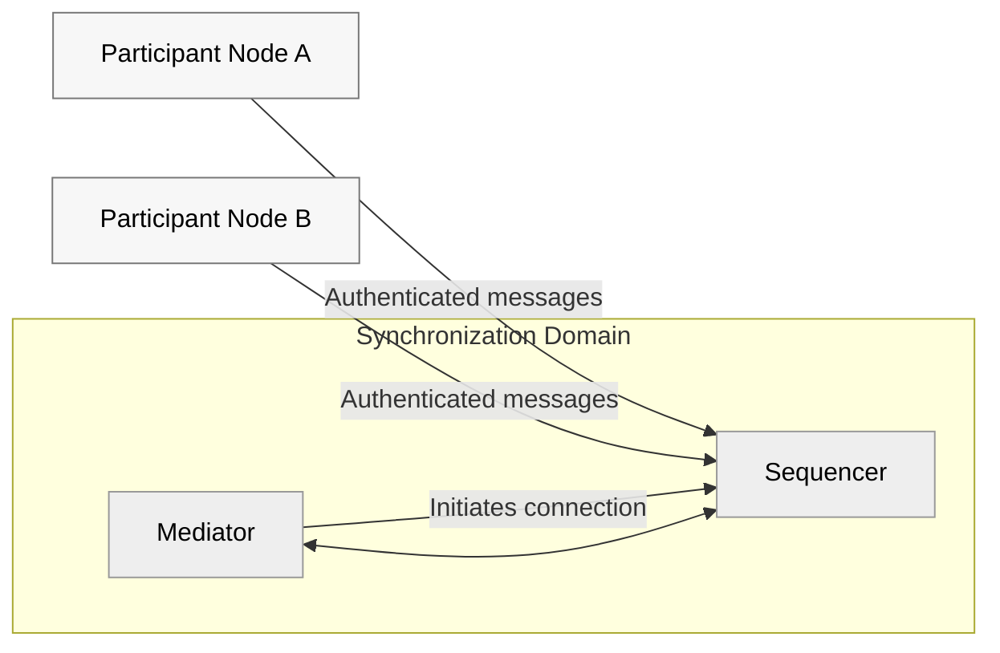

# Canton Architecture Overview

This page gives a high-level view of key components and how they interact.

**Notes**
- Participant nodes do **not** communicate directly; they interact through the sequencer.
- The **mediator** initiates the connection to the **sequencer**; once established, the flow becomes bidirectional.
- The **Topology Manager** is no longer part of Canton 3.x and is therefore omitted.
